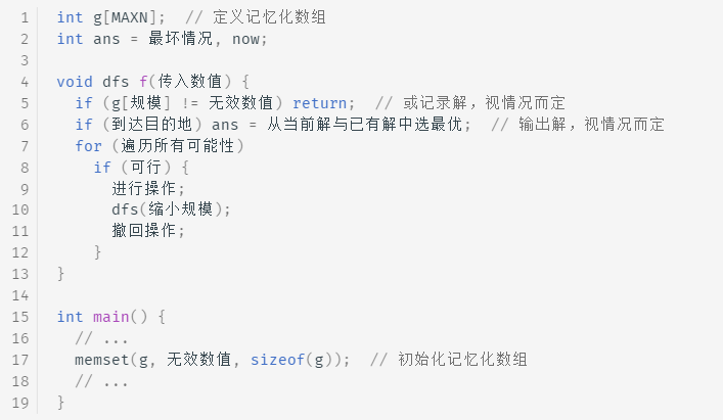

# 算法笔记（上）

## 注意事项

时间复杂度换算，1s=10^8^

先行判断思路代码是否会==超时==？！数据类型会不会==溢出==？！估算代码内存占用，==以防MLE==？！

遇到大量读写的题目时，及时==更换输入输出==方法，**以防TLE，MLE**

==合理选择输入输出==方法，`System.out.print`会进行频繁的io操作导致TLE，pw效率虽然更高，但因为缓存区的问题又很可能导致MLE，要仔细考虑数据问题，也可以考虑pw进行手动批量flush输出

用题目给定的==最大数据投喂测试代码==，检查是否报错，排除数据类型不合适，输入输出栈溢出，内存超出等等问题

==标记数组声明成`boolean`类型==，占用内存更少，避免MLE

## 枚举&暴力

### 枚举矩形

```java
//通过四重for循环，2个for循环定位子矩形左上角，2个for循环定位矩形右下角
for (int i = 1; i <=n; i++) {
	for (int j = 1; j <=m; j++) {
		for (int i1 = i; i1 <=n; i1++) {
			for (int j1 = j; j1 <=m; j1++) {
				//...
			}
		}
	}
}
```

### 求正方形，长方形形个数

原题`p2241`，固定正方形的右下角(i,j),此时正方形的个数就为Min(i,j)，所以可以枚举右下角，遍历每个坐标，计算此时答案，求和即可

算长方形并不常见，但算矩形经常遇到，所以答案就转化为 矩形个数-正方形个数。像求解正方形个数一样，固定矩形右下角(i,j),显然此时矩形个数为i*j。

### 时区问题

原题`p8665`，去程时间 =飞行时间 + 时差；回程时间 = 飞行时间 − 时差。注意第二天要＋24再进行计算

所以飞行时间 *x* 等于去程时间 t1 和 回程时间 t2 的平均值

## 前缀和&差分

==**谨记坐标，边界问题，别tm给老子口算，用笔！！**==

### 前缀和

前缀和可以简单理解为「数列的前 n 项的和」，是一种重要的预处理方式。

二维：B[i] [j]=A[1] [1]+...+A[i] [j];(即A[1] [1]到A[i] [j]对角所构成的矩形中所有数据的和)

==容斥原理==：先不考虑重叠的情况，把包含于某内容中的所有对象的数目先计算出来，然后再把计数时重复计算的数目排斥出去，使得计算的结果既无遗漏又无重复，这种计数的方法称为容斥原理。

```java
//已知数组a，求前缀和数组sum
  //一维
sum[1]=a[1];
for(int i=2;i<=n;i++){
    sum[i]=sum[i-1]+a[i];
}
  //二维
for(int i=1;i<=n;i++){
    for(int j=1;j<=m;j++){
        sum[i][j]=sum[i-1][j]+sum[i][j-1]-sum[i-1][j-1]+a[i][j];
    }
}
```

### 差分

差分是一种和前缀和相对的策略，可以当做是求和的逆运算。

```java
//已知前缀和数组sum，求数组a
  //一维
a[i]=sum[i]-sum[i-1];
  //二维
a[i][j]=sum[i][j]-sum[i-1][j]-sum[i][j-1]+sum[i-1][j-1];
```

==差分标记数组==：解决元素变化

```java
// 一维：
//对数组a进行如下m个操作，如 l，r，q：把[l,r]内的元素都+q
//设差分标记数组为b，对b进行如上m次操作，将b[l]+q，b[r+1]-q，再求出b的前缀和数组sumb，与数组a相加即得最终结果

// 二维：
//对数组a如下m个操作，
//x1 y1 x2 y2 q：把a[x1][y1]~~~a[x2][y2]这个矩形内的元素都加上q
//设差分数组b,再求出b的前缀和数组sumb，与数组a相加
b[x1][y1]+=q;
b[x2+1][y1]-=q;
b[x1][y2+1]-=q;
b[x2+1][y2+1]+=q;
a[i][j]+=sumb[i][j];
```

### 枚举方形

原题`P2004`，若给定遍历n*n的方形，仅枚举左上角即可，同时注意边界问题

```java
public class Main {
	public static void main(String[] args) throws IOException {
        //大量输入输出操作及时更换I/O方法，可用显著降低时间以及内存占用
		BufferedReader br=new BufferedReader(new InputStreamReader(System.in));
		StringTokenizer st=new StringTokenizer(br.readLine());
		int n = Integer.parseInt(st.nextToken());
		int m = Integer.parseInt(st.nextToken());
		int c = Integer.parseInt(st.nextToken());
		int x1, y1, x2, y2;
		int x = 0, y = 0;
		int max = Integer.MIN_VALUE;
		int[][] a = new int[n + 5][m + 5];
		for (int i = 1; i <= n; i++) {
			st=new StringTokenizer(br.readLine());
			for (int j = 1; j <= m; j++) {
				a[i][j] = Integer.parseInt(st.nextToken());
				a[i][j] += a[i][j - 1] + a[i - 1][j] - a[i - 1][j - 1];
			}
		}
        //核心代码
		for (int i = 1; (i + c - 1) <= n; i++) {
			for (int j = 1; (j + c - 1) <= m; j++) {
				x1 = i;
				y1 = j;
				x2 = x1 + c - 1;//右下角坐标
				y2 = y1 + c - 1;
				int tmp = a[x2][y2] - a[x2][y1 - 1] - a[x1 - 1][y2] + a[x1 - 1][y1 - 1];
				if (tmp > max) {
					max = tmp;
					x = x1;
					y = y1;
				}
			}
		}
		System.out.println(x + " " + y);
	}
}
```

## 尺取法（滑动窗口）

> 尺取法：一种利用双指针遍历获取满足条件的区间（滑动窗口）的算法。
>
> 其为一种线性算法。过程为：枚举r，不断得到合法区间。记(l, r)为一个序列内以r为终点的合法区间，然后枚举l，随着l的增大，区间不断缩小，直至不合法为止。<u>时间复杂度为O(n)</u>。
>
> 尺取法需要==满足的条件==： 区间权值大小满足随区间长度单调变化，即区间越长区间权值越小（或越大）。
>
> 尺取法的优点： 不会去枚举一定不满足条件的区间，以及满足条件但区间长度显然不满足的区间
>
> right 为右边界，所形成的有效子数组的个数==（right - left + 1）==

## 二分查找

前提：==有序==，注意循环的**边界条件**，避免死循环

```java
//查找不小于x的第一个位置(不大于同理)
int bs(int a[], int n, int x) {
    int l = 0, r = n-1, ans=-1;
    while(l <= r) {
        int mid = (l+r)/2;
        if(a[mid] >= x){
            ans=mid;
            r=mid-1;
        } else{
            l = mid+1;
        }
    }
    return ans;
}
```

### 应用（二分答案-猜答案）

```java
//1.最小化最大值
//2.最大化最小值
//3.其他的求最值问题，需要将O(n)降到O(logn)
//求谁就二分谁
```

## 质数筛法

> 质数概念：质数，又称素数，即约数只有1以及它本身的数。
>
> 0和1既不是质数也不是合数。

### 朴素筛法

根据定义，因为质数除了1和本身之外没有其他约数，所以判断n是否为质数，直接判断从2到n-1是否存在n的约数即可

```java
//O(n²)
Boolean isPrime (int i){
    for(int j= 2;j<=i-1; j++){
        if(i%j== 0){
            return false;
        }
    }
    return true;
}
//主函数,输出2---n所有的质数
for(int i=2;i<=n;i++){
    if(isPrime(i)==1) {
        printf(“%d ”，i);
    }
}
/**
由于因数成队出现，如16
1----16
2----8
4----4，分界点就是根号下那个数，所以只需要枚举根号下以前的数即可
函数isPrime的for循环判断条件可优化为j<=sqrt(i)，时间复杂度为O(n^3/2)
*/
```

### 埃氏筛法

基本原理：

一个合数总是可以分解成若干个质数的乘积，那么如果把质数（最初只知道2是质数）的倍数都去掉，那么剩下的就是质数了。

```java
//O(n*loglogn)--介于O(logn)与O(n)之间
int n;
boolean[] isPrime=new boolean[n+5];//true为质数，false为合数
int[] prime=new int[n/5];//存储质数
for(int i=2;i<=n;i++){
    isPrime[i]=true;//初始化所有数都是质数
}
int k=0;
for(int i=2;i<=n;i++){
    if(isPrime[i]){
        k++;
        prime[k]=i;//记录质数
        for(int j=i*2;j<=n;j+=i){
            isPrime[j]=false;
        }
    }
}
//可通过isPrime判断一个数是否为质数，也可打印出prime数组中所有的质数
```

### 欧拉筛法

算术基本定理（唯一分解定理）：**任何合数都能表示为若干质数的乘积**，且该分解因式是<u>唯一</u>的。（不考虑顺序性）

**原理：**规定每个合数只会被它==最小的质因数==筛去。（后面的质因数直接跳过），这个最小的质因式必定小于它本身。

```java
//O(n)
int n;
boolean[] isPrime=new boolean[n+5];//true为质数，false为合数
int[] prime=new int[n/5];
/**
 n一般为10^8，所以用int来存储每个数的状态占用内存较大，很可能遇到内存问题，因此将isPrime设置为bool类型
 或者使用更小的BitSet，相对于boolean更节省空间
 n以内质数占n的百分之几~百分之十几，n越小，素数占比就越大，可根据数据量合理设置prime数组范围
*/

for(int i=2;i<=n;i++){
    isPrime[i]=true;//初始化所有数都是质数
}
//也可用Arrays.fill(isPrime,true);

int k=0;
for(int i=2;i<=n;i++){//枚举每个数 + 枚举倍数
    if(isPrime[i]){
        k++;
        prime[k]=i;
    }
    for(int j=1;j<=k;j++){
        x=i*prime[j];//i枚举倍数，j枚举prime数组
        if(x>n){//超出范围，跳出
            break;
        }
        isPrime[x]=false;//把x标记为合数
        
        //质数是不走这里的，两个质数是不能整除的，只有最后一个自己与自己整除，然后break，
        //质数其实跳不跳无所谓哈，反正j都遍历完了，本来就结束了，这段代码主要就是为了保证合数
//保证每个合数i，被其最小质因数筛掉，由于prime数组是有序的，所以遇到第一个能被整除的质数后就直接break
        if(i%prime[j]==0){
            break;
        }
    }
}
```

## 快速幂

> 正常计算一个数n的x次幂，只需循环x次累乘即可，时间复杂度为O(x),但当x>=10^8^时就会超时
> 可将幂数拆分为2的幂次数，如5^10^-->5^(8+2)^，5^(2+2+2+4)^或5^(2+4+4)^……
> 算出5^2^后，可以5^2^\*5^2^直接到5^4^，进一步优化可以写成5^4^*5^4^\*5^2^没必要再一个一个乘，减少循环次数，那么上述这么多种组合，选哪个最好呢？
> 其中当属5^(8+2)^运算次数最小，==通过将幂数转化为2进制==，10-->1010-->2^3^+0+2^1^+0=8+2==选出最优组合==

```java
//快速幂，求n^x，时间复杂度为O(logx)，就是在10进制转2进制循环取余的代码上改造而来
int n,x;
int b;//存幂数x二进制的某一位
int ans=1;
while(x!=0){
    b=x%2;//除2取余，得二进制位数
    if(b==1){//为1参与计算，b--->2^i--->n^(2^i)
        ans*=n;//以5^(2+8)为例，只有n^2和n^8参与计算
    }
    n*=n;//n的值依次递增为n^2-->n^4-->n^8-->n^16……
    x/=2;
}
```

### 数值溢出问题

原题`P1226`，当数值过于大可用==取模==保证数值在最大数据类型如long以下，当然Java可用`BigInteger`类来存储

```java
//取模运算法则，**(a*b)%c={(a%c)*(b%c)}%c**，(a+b)%c={(a%c)+(b%c)}%c
//求n^x%p
while(x!=0){
    b=x%2;
    if(b==1){
        ans=(ans*n)%p;//每个乘数分别取余
    }
    n=(n*n)%p;//每个乘数分别取余
    x/=2;
}
System.out.println(ans%p);//再对取余之后相乘的结果取余，结果与直接对总体取余一致
```

## 高精度

大数：指计算的**数值非常大**或者对运算的**精度要求非常高**，用已知的数据类型无法精确表示的数值。

字符串输入，转换成对应的整数数组并==倒序存储==，数组的元素代表大数的某一位，通过数组元素的运算模拟大数的运算，最后将代表大数的数组倒序输出

`BigInteger`，`BigDecimal`相当好用，别给老子忘了哈

### 高精度加减法

```java
//正+正，a+b=c
public class Main {
	public static void main(String[] args) throws IOException {
		PrintWriter pw=new PrintWriter(System.out);
		int[] a=new int[105];
		int[] b=new int[105];
		int[] c=new int[105];
		int la=init(a);
		int lb=init(b);
		int lc=Math.max(la, lb);
		for (int i = 0; i < lc; i++) {
			c[i]+=a[i]+b[i];//+=是为了保证可能的进位导致c[i]的值增加
			if(c[i]>=10) {//进位处理
				c[i]-=10;
				c[i+1]++;
			}
		}
		if(c[lc]!=0) {//判断最后结果是否有进位，有则打印
			pw.print(c[lc]);
		}
		for (int i = lc-1; i >=0; i--) {
			pw.print(c[i]);
		}
		pw.println();
		pw.flush();
		pw.close();
	}
	
	public static int init(int[]x) throws IOException {
		BufferedReader br=new BufferedReader(new InputStreamReader(System.in));
		String[] strs = br.readLine().split("");
		int len=strs.length;
		for (int i = 0; i <len; i++) {
			x[i]=Integer.parseInt(strs[len-i-1]);//倒序存储，方便低位对齐进行运算
		}
		return len;
	}
}

//减法，a-b=c，正-正
public class Main {
	public static void main(String[] args) throws IOException {
		int[] a,b,c;
		String sa=br.readLine();
		String sb=br.readLine();
		int la=init(a,sa);
		int lb=init(b,sb);
		int lc=Math.max(la, lb);
		if(la<lb||(la==lb&&sa.compareTo(sb)<0)) {//如果a<b，加负号后再交换位置
			pw.print("-");
			int[] tmp=new int[105];
			tmp=a;
			a=b;
			b=tmp;
		}
		for (int i = 0; i < lc; i++) {
			if(a[i]<b[i]) {
				a[i]+=10;//不够借1
				a[i+1]--;
			}
			c[i]=a[i]-b[i];
		}
		lc--;//lc-1,第一个数
		while(c[lc]==0&&lc>0) lc--; //去前置零
		for (int i = lc; i >=0; i--) {//从第一个不为零的元素开始打印
			pw.print(c[i]);
		}
		pw.println();
	}
	public static int init(int[]x,String str) throws IOException {
		String[] strs = str.split("");
		int len=strs.length;
		for (int i = 0; i <len; i++) {
			x[i]=Integer.parseInt(strs[len-i-1]);
		}
		return len;
	}
}
```

## 贪心

> 用计算机来模拟一个「贪心」的人做出决策的过程。这个人十分贪婪，每一步行动总是按某种指标选取最优的操作。而且他目光短浅，总是只看眼前，并不考虑以后可能造成的影响。
>
> 可想而知，并不是所有的时候贪心法都能获得最优解，所以一般使用贪心法的时候，都要确保自己能证明其正确性。
>
> 题型：==求最值问题==（最优解问题）

原题`p1090`，可用`PriorityQueue`预处理排序问题，时间复杂度为`O(logn)`，要小于基于快排的`Arrays.sort()`即`O(nlogn)`，此时总的时间复杂度为`O(nlogn)`

```java
public class Main {
	public static void main(String[] args) throws IOException {
		BufferedReader br=new BufferedReader(new InputStreamReader(System.in));
		StringTokenizer st=new StringTokenizer(br.readLine());
		int n=Integer.parseInt(st.nextToken());
		st=new StringTokenizer(br.readLine());
        //默认小顶堆，通过new PriorityQueue<>(Comparator.reverseOrder())可切换为大顶堆
		PriorityQueue<Integer> queue=new PriorityQueue<>();
		while(st.hasMoreTokens()) {
			queue.add(Integer.parseInt(st.nextToken()));
		}
		int x,y,ans=0;
        //每次合并后排序（升序），最前面两个就是最小的,需要排n-1次
		for (int i = 0; i < n-1; i++) {
			x=queue.poll();//poll拿出并从队列中移除，peek只拿出
			y=queue.poll();
			ans+=(x+y);
			queue.add(x+y);
		}
		System.out.println(ans);
	}
}
```

## 递归&分治

### 递归

> 递归（Recursion），在数学和计算机科学中是指在函数的定义中使用函数自身的方法，在计算机科学中还额外指一种通过==重复将问题分解为同类的子问题==而解决问题的方法。
>
> 难点：**递归出口**
>
> 怎么写一个递归的代码：
>
> 1.找到递归出口
>
> 2.递归条件：用小范围数据用例先推一下，然后站在第 **i** 个问题的角度考虑怎么写

### 分治

> 分治（Divide and Conquer），字面上的解释是「分而治之」，就是把一个复杂的问题分成两个或更多的相同或相似的子问题，子问题相互独立，直到最后子问题可以简单的直接求解，原问题的解即子问题的解的合并。
>
> ​																																								------最优子结构性质。

原题：<u>https://leetcode.cn/problems/maximum-subarray/</u>

```java
class Solution {
	/*求最大子区间和可分为3部分
	 *取中心点m=(l+r)/2。 和最大的区间要么出现在中心点左边，要么出现在中心点右边，要么横跨中心点。所以问	 *题分解为求这三部分的最大区间和，然后取最大值。----利用分治的思想分成3个独立的小问题
	 *
	 *1.中心点左边的最大区间和：和原问题相同，递归。
	 *2.中心点右边的最大区间和：和原问题相同，递归。
	 *3.横跨中心点的最大区间和：贪心求解---从中心点往左右两边延申，分别记录左右两边的最大值，然后返回和
	 */
    public int maxSubArray(int[] nums) {
    	int n=nums.length;
    	int ret=getMax(nums,0,n-1);//递归开始
        return ret;
    }
    public int getMax(int[] nums,int l,int r) {
    	if(l==r) {
    		return nums[l];
    	}
    	int mid=(l+r)/2;
    	int lsum=getMax(nums, l, mid);//递归求中心点左边最大和
    	int rsum=getMax(nums, mid+1, r);//递归求中心点右边最大和
    	int midsum=getMidMax(nums,l,r,mid);//枚举求横跨中心点的最大和
		return Math.max(Math.max(lsum, rsum), midsum);//返回三者中的最大值
	}
    public int getMidMax(int[] nums,int l,int r,int mid) {
    	int lsum=Integer.MIN_VALUE;
    	int rsum=Integer.MIN_VALUE;
    	int sum=0;
    	for (int i = mid; i >=l; i--) {//从中心点到l累加，记录最大值
			sum+=nums[i];
			lsum=Math.max(lsum, sum);
		}
    	sum=0;
    	for (int i = mid+1; i<=r; i++) {//从中心点到r累加，记录最大值
			sum+=nums[i];
			rsum=Math.max(rsum, sum);
		}
    	return lsum+rsum;
    }
}
```

## 链表

做题**常用思路**：原地逆置，快慢指针，判环

### 静态链表(L)

> 用数组描述的链表，即称为静态链表。
>
> 分配一整片连续的内存空间，各个结点集中安置，逻辑结构上相邻的数据元素，存储在指定的一块内存空间中，数据元素只允许在这块内存空间中随机存放，这样的存储结构生成的链表称为静态链表。也就是说静态链表是用数组来实现链式存储结构，静态链表实际上就是一个结构体数组。

### 跳表(L)

> 又叫做跳跃表、跳跃列表，在有序链表的基础上增加了“跳跃”的功能
>
> 如果一个数组是有序的，查询的时候可以使用折半查找，时间复杂度可以降到 O(logn) 。但如果链表是有序的，我们仍然需要从前往后一个个查找，这样显然很慢，这个时候我们可以使用跳表（Skip list），跳表就是多层链表，每一层链表都是有序的，最下面一层是原始链表，包含所有数据，从下往上节点个数逐渐减少。
>
> 跳表的特性：
>
> 1. 一个跳表有若干层链表组成；
> 2. 每一层链表都是有序的；
> 3. 跳表最下面一层的链表包含所有数据；
> 4. 上一层的元素指向下层的元素必须是相同的；
> 5. 头指针 head 指向最上面一层的第一个元素；

## 栈和队列

栈常见题目：先进后出，左右匹配，队列单独出题较少，多用于辅助

```java
//stack常用方法
push//压栈
pop//弹栈
peek//弹栈但不移除元素
clear//清空栈
```

### 单调栈

> 栈中的元素是严格单调递增或者递减的，也就是说：从栈底到栈顶，元素的值逐渐增大或者减小。多用于求解元素的左右大小边界问题：
>
> 1：向左找第一个比自身大的数。
>
> 2：向左找第一个比自身小的数。
>
> 3：向右找第一个比自身大的数。
>
> 4：向右找第一个比自身小的数。
>
> 操作（以底到顶递增为例）：
>
> 1. 如果新的元素比栈顶元素大，就入栈
> 2. 如果新的元素较小，那就一直把栈内元素弹出来，直到栈顶比新元素小
>
>  元素间大小判断：（以底到顶递增为例）：
>
> 1. 当栈中已有元素需要出栈时（遇见了比它小的新元素），说明后续这个新元素是需要出栈的元素向后找第一个比其小的元素
> 2. 当元素出栈后，新栈顶元素是出栈元素向前找第一个比其小的元素

## 并查集

```java
//传统并查集，模板P3367
public class Main {
	static int[] f;
	public static void main(String[] args) throws Exception{
		BufferedReader br=new BufferedReader(new InputStreamReader(System.in));
		PrintWriter pw=new PrintWriter(System.out);
		StringTokenizer st=new StringTokenizer(br.readLine());
		int n=Integer.parseInt(st.nextToken());
		int m=Integer.parseInt(st.nextToken());
		int z,x,y;
		f=new int[n+5];
		//f[i]=x表示i节点的父亲是x
		for (int i = 1; i <=n; i++) {
			f[i]=i;//初始化父节点，自己指向自己
		}
		for (int i = 1; i <= m; i++) {
			st=new StringTokenizer(br.readLine());
			z=Integer.parseInt(st.nextToken());
			x=Integer.parseInt(st.nextToken());
			y=Integer.parseInt(st.nextToken());
			if(z==1) {
				int fx=find(x);//分别找出根节点
				int fy=find(y);
				f[fx]=fy;//再令其中一个根结点指向另一个根节点
				//简化写法
				//f[find(x)]=find(y);
			}
			if(z==2) {
				if(find(x)==find(y)) {
					pw.println("Y");
				}else {
					pw.println("N");
				}
			}
		}
		pw.flush();
		pw.close();
	}
	public static int find(int k) {
		if(f[k]==k) {
			return k;
		}
		f[k]=find(f[k]);//路径压缩，将k直接连到根节点上
		return f[k];
	}
}
```

### 种类并查集（扩展域并查集）

多用于维护一些对立关系，常见的做法是将原并查集扩大一倍规模，并划分为两个种类：其中[1，n]表示处于一个种类，[n+1,2n]表示处于另一个种类

```java
/**
*一个集合维护朋友关系，一个集合维护敌人关系
*敌人的敌人是朋友，敌人的朋友是敌人，朋友的朋友是朋友
*【1，n】，假设【1，n】的假想敌【n+1,2n】
*维护朋友关系：合并x，y所在树
*维护敌人关系，合并x与y的假想敌y+n，合并y与x的假想敌x+n
*/
//原题P1525
public class Main {
	static Crime[] x;
	static int[]f;
	public static void main(String[] args) throws Exception{
		BufferedReader br=new BufferedReader(new InputStreamReader(System.in));
		StringTokenizer st=new StringTokenizer(br.readLine());
		int n=Integer.parseInt(st.nextToken());
		int m=Integer.parseInt(st.nextToken());
		x=new Crime[100005];
		f=new int[40005];
		for (int i = 1; i <= n; i++) {//初始化并查集
			f[i]=i;
			f[i+n]=i+n;
		}
		for (int i = 1; i <=m; i++) {
			st=new StringTokenizer(br.readLine());
			x[i]=new Crime();//对象数组必须先初始化才能赋值或使用，否则会报空指针异常
			x[i].a=Integer.parseInt(st.nextToken());
			x[i].b=Integer.parseInt(st.nextToken());
			x[i].c=Integer.parseInt(st.nextToken());
		}
		Arrays.sort(x,1,m+1);//自定义排序，倒序排列
		int ans=0;
		for (int i = 1; i <=m; i++) {
			int fa=find(x[i].a);
			int ffa=find(x[i].a+n);//find假想敌根节点，判断是否在同一根节点下
			int fb=find(x[i].b);
			int ffb=find(x[i].b+n);
			if(fa==fb||ffa==ffb) {//如果a,b假想敌在一起，即ffa==ffb，则说明a,b肯定在一个监狱
				ans=x[i].c;//必然发生冲突，由于是逆序，所以第一个发生冲突的即为最大的最小值
				break;
			}else {
				f[fa]=ffb;
				f[fb]=ffa;
			}
		}
		System.out.println(ans);
	}
	public static int find(int k) {
		if(f[k]==k) {
			return k;
		}
		f[k]=find(f[k]);//路径压缩，将k直接连到根节点上
		return f[k];
	}
}
class Crime implements Comparable<Crime>{
	public int a,b,c;
	@Override
	public int compareTo(Crime o) {
		//当前对象属性-参数属性，升序排序，反过来则为逆序排列
		return o.c-c;
	}
}
```

## 搜索

### DFS

常常指利用递归函数方便地实现暴力枚举的算法，但时间复杂度==高==。常用于解决通过`dfs`找到/搜索到==所有可能的解==

DFS也常被用于在网格中搜索。搜索过程中考虑往4个或者8个方向搜索，同时要注意不要越过网格的边界

原题`P1036`

```java
public class Main {
	static int[] x;
	static int[] mark;
	static int[] ans;
	static int n,k,cnt;
	public static void main(String[] args) throws Exception{
		BufferedReader br=new BufferedReader(new InputStreamReader(System.in));
		StringTokenizer st=new StringTokenizer(br.readLine());
		n=Integer.parseInt(st.nextToken());
		k=Integer.parseInt(st.nextToken());
		x=new int[n+5];
		mark=new int[n+5];
		ans=new int[n+5];
		st=new StringTokenizer(br.readLine());
		for (int i = 1; i <=n; i++) {
			x[i]=Integer.parseInt(st.nextToken());
		}
		dfs(1);
        //结果应该为C组合数而非A排列数，所以要去除重复排列，因此要除以k的阶乘
		int ret=cnt/(fact(k));
		System.out.println(ret);
	}
	public static void dfs(int t) {
		if(t>k) {
			int tmp=0;
           //之所以不直接用ans累加而采用数组是因为，当递归 归的过程中，ans的值很难回溯，至少我没做出来
			for (int i = 1; i <=k; i++) {
				tmp+=ans[i];
			}
			if(isPrime(tmp)) cnt++;
			return;
		}
        //此为排列数A，从n中选出m个数，此题中k为m，t为计数器，当t==k时进行计算判断
		for (int i = 1; i <=n; i++) {
			if(mark[i]==0) {
				ans[t]=x[i];
				mark[i]=1;
				dfs(t+1);
				mark[i]=0;
			}
		}
	}
	public static boolean isPrime(int num) {
		int s=(int)Math.sqrt(num*1.0);
		for (int i = 2; i <=s; i++) {
			if(num%i==0) {
				return false;
			}
		}
		return true;
	}
	public static int fact(int n) { 
		int ans=1;
		for (int i = 1; i <=n; i++) {
			ans*=i;
		}
		return ans;
	}
}
```

### BFS

BFS常指利用队列实现广度优先搜索，从而寻找最短距离。通常用来解决寻找==最短距离的问题==。BFS也常被用于在**网格**中搜索，找最短距离。搜索过程中考虑往4个或者8个方向搜索，同时要注意不要越过网格的边界

使用`ArrayDeque`代替自带的队列

```java
//P1135
		Node sa=new Node();
		sa.p=a; sa.cnt=0;
		queue.offer(sa);
		mark[a]=1;
		Node now,next;
		while(!queue.isEmpty()) {
			now=queue.poll();
		/**
		    * 应该首先判断当前节点是否为答案，再判断up/down决定是否入队，
		    * 如果交换顺序，先判断up/down是否等于b，即(up==b||down==b)再决定是否入队
		    * 当队列中第一个就为答案时就会出错，此时并不对第一个节点进行判断，而是直接判断下一个
		 */
			if(now.p==b) {
				System.out.println(now.cnt);
				return;
			}
			int up=now.p+k[now.p];
			int down=now.p-k[now.p];
			int cnt=now.cnt+1;
			if(up<=n&&mark[up]==0) {
				mark[up]=1;
				next=new Node();
				next.p=up; next.cnt=cnt;
				queue.offer(next);
			}
			if(down>=1&&mark[down]==0) {
				mark[down]=1;
				next=new Node();
				next.p=down; next.cnt=cnt;
				queue.offer(next);
			}
		}
		if(queue.isEmpty()) {
			System.out.println(-1);
		}
	}
}
class Node{
	int p,cnt;//p为所在楼层，cnt为按按钮次数
}
```

### 剪枝

#### 最优性/可行性剪枝

原题`P1025`

```java
public class Main {
    static int n,k,ans;
  public static void main(String[] args) {
      Scanner sc=new Scanner(System.in);
      n=sc.nextInt();
      k=sc.nextInt();
      dfs(0,0,1);
      System.out.println(ans);
  }
  public static void dfs(int sum,int step,int last){
      if(k==step){
          if(sum==n){
             ans++; 
          }
          return;
      }
      /**
       *进行剪枝，只遍历last~sum+(k-step)*i<=n的元素
       *1.由于组合不考虑顺序性，所以只遍历递增序列，设置last记录上一个元素大小
       *2.由于递增，当剩余几个位置都为最小的last时，总和仍然大于n，此时结果肯定不成立，直接剪除
      */
      for(int i = last;sum+(k-step)*i<=n;i++) {
          dfs(sum+i,step+1,i);
      }
  }
}
```

#### 记忆化搜索

> 因为在搜索中，相同的传入值往往会带来相同的解，那我们就可以用数组来记忆已经遍历过的状态的信息，从而避免对同一状态重复遍历的搜索实现方式。确保了每个状态只访问一次，它也是一种常见的动态规划实现方式。



## 链式前向星

> 图的存储可以使用==邻接矩阵==或者==链式前向星==
>
> 邻接矩阵适用于点少边多的稠密图，不会浪费开辟的空间
>
> 链式前向星实际上是用静态链表实现的邻接表。建立链式前向星的过程实际上是模拟了头插法，不会浪费大量空间
>
> 二者都适用于无向图和有向图
>
> 邻接矩阵深搜的时间复杂度为==O(v^2^)==，链式前向星的时间复杂度为==O(v+e)==，v为顶点个数，e为边的个数

```java
 //链式前向星存储无向有权图+dfs
public class Main {
	static int n, m,cnt;//cnt为实际边的数目
	static int[] head,visit;
    //head头结点数组，head[x]存以x为起点的第一条边的下标
	static Edge[] e;
	public static void main(String[] args) {
		Scanner scanner=new Scanner(System.in);
		n=scanner.nextInt();
		m=scanner.nextInt();
		int maxn=(n*(n-1))/2+5;//无向图最大边数，有向图为n*(n-1)
		head=new int[n+5];
		visit=new int[n+5];
		Arrays.fill(head, -1);
		e=new Edge[maxn];
		int x,y,w;
		for (int i = 0; i < m; i++) {
			x=scanner.nextInt();
			y=scanner.nextInt();
			w=scanner.nextInt();
			add(x,y,w);
			add(y,x,w);
		}
		for (int i = 1; i <= n; i++) {
			if(visit[i]==0) {
				dfs(i);
			}
		}
	}
	public static void add(int x,int y,int w) {//添加一条边x----y
		e[cnt]=new Edge();//初始化
		e[cnt].to=x;//这里用x是因为头插法会导致dfs输出为逆序，所以改存入度边x，而不是出度边y
		e[cnt].w=w;
		e[cnt].next=head[x];
		head[x]=cnt++;
	}
	public static void dfs(int x) {
		if(visit[x]==1) return;
		System.out.print(x+" ");
		visit[x]=1;
		for (int i = head[x]; i!=-1; i=e[i].next) {
			int y=e[i].to;
			if(visit[y]==0) {
				dfs(y);
			}
		}
	}
}
class Edge {
	int to;//终点
	int w;//权值，无向图时删除即可
	int next;//具有相同起点的下一条边
}
```
