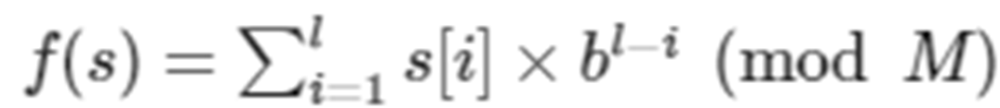
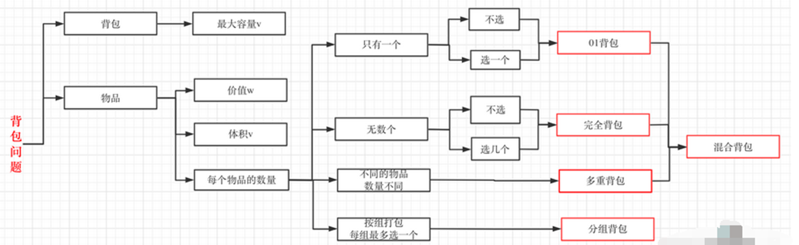

# 算法笔记（上）

## 最短路径

|        算法        |      时间复杂度      |              适用情况              |
| :----------------: | :------------------: | :--------------------------------: |
|     Floyd算法      | O(v^3^)，v为顶点个数 | 单源，多源，负边权，~~负边权回路~~ |
|    Dijkstra算法    |       O(v^2^)        |                单源                |
|  Bellman-Ford算法  |  O(ve)，e为边的个数  |            单源，负边权            |
| 堆优化Dijkstra算法 |    O((v+e)*logv)     |                单源                |
|      SPFA算法      |         玄学         |            单源，负边权            |

### Bellman–Ford算法

不断尝试对图中的每一条边进行松弛。每进行一轮循环，就对图上**所有的边都尝试进行一次松弛操作**，当一次循环中没有成功的松弛操作时，算法停止：==暴力遍历，无脑松驰==。

每次循环是 O(|E|) 的，在最短路存在的情况下，由于一次松弛操作会使最短路的边数至少 +1，而最短路的边数最多为 |v|-1，因此整个算法最多执行 |v|-1 轮松弛操作。故总时间复杂度为 ==O(|v||e|)==。

如果从起点S 出发，抵达一个负环时，**松弛操作会无休止地进行**下去。注意到前面的论证中已经说明了，对于最短路存在的图，松弛操作最多只会执行 n-1 轮，因此如果第 n 轮循环时仍然存在能松弛的边，说明从 S 点出发，能够抵达一个负环，因此福特算法==可以用来判断是否存在负权回路==

```java
public class Main {
	static int n, m;
	static int[] dis;
	static Edge[] e;
	public static void main(String[] args) {
		Scanner scanner = new Scanner(System.in);
		n = scanner.nextInt();
		m = scanner.nextInt();
		dis = new int[n + 5];
		e = new Edge[n * n + 5];
		for (int i = 0; i < m; i++) {
			e[i] = new Edge();
			e[i].x = scanner.nextInt();
			e[i].y = scanner.nextInt();
			e[i].w = scanner.nextInt();
		}
		int s = scanner.nextInt();//源点
        //设为int最大值一半，不用最大值是因为后面有+操作，以防溢出
		Arrays.fill(dis, Integer.MAX_VALUE/2);
		dis[s] = 0;
		ford();
		for (int i = 1; i <= n; i++) {
			System.out.print(dis[i] + " ");
		}
	}

	public static void ford() {
		int x, y, w;
		boolean flag;// 判断是否进行松弛操作
		for (int i = 1; i <= n - 1; i++) {
			flag = false;
			for (int j = 0; j < m; j++) {
				x = e[j].x;
				y = e[j].y;
				w = e[j].w;
				if (dis[x] + w < dis[y]) {
					dis[y] = dis[x] + w;
					flag = true;
				}
			}
			// flag仍为false，遍历m条边都未进行松弛操作，说明已无可松弛边，直接break跳出即可
			if (!flag) {
				break;
			}
		}
	}
}
class Edge {
	int x, y;// 边x---y
	int w;// 权值
}
```

### 堆优化Dijkstra算法

可用优先级队列`PriorityQueue`，快速找到dis[i]值最小的 i，即找出最小且未被访问的邻接点，同时用**链式前向星**（邻接表）存图，快速遍历 i 点的邻接点，需要注意，点可能重复入队。（可能具有多条最短路径）

```java
public class Main {
	static int n, m,s,cnt;
	static int[] head,visit,dis;
	static Edge[] e;
	static final int HALF_MAX=Integer.MAX_VALUE/2;
	static PriorityQueue<Pair> queue;
	public static void main(String[] args) {
		Scanner scanner=new Scanner(System.in);
		n=scanner.nextInt();m=scanner.nextInt();s=scanner.nextInt();
		head=new int[n+5];dis=new int[n+5];visit=new int[n+5];
		e=new Edge[n*m+5];
		Arrays.fill(head, -1);
		Arrays.fill(dis, HALF_MAX);
		int x,y,w;
		for (int i = 0; i < m; i++) {
			x=scanner.nextInt();
			y=scanner.nextInt();
			w=scanner.nextInt();
			add(x,y,w);
		}
		dijkstra();
		for (int i = 1; i <= n; i++) {
			System.out.print(dis[i]+" ");
		}
	}
	public static void add(int x,int y,int w) {
		e[cnt]=new Edge(y,w,head[x]);
		head[x]=cnt++;
	}
	public static void dijkstra() {
		queue=new PriorityQueue<>();
		dis[s]=0;
		queue.add(new Pair(dis[s], s));
		Pair pair;
		int x,y;
		while(!queue.isEmpty()) {
			pair=queue.poll();
			x=pair.second;
			if(visit[x]==1) continue;
			visit[x]=1;
			for (int i = head[x]; i!=-1; i=e[i].next) {
				y=e[i].to;
				if(visit[y]==0&&dis[y]>dis[x]+e[i].w) {
					dis[y]=dis[x]+e[i].w;
					queue.add(new Pair(dis[y], y));
				}
			}
		}
	}
}
class Edge{
	int to,w,next;
	public Edge(int to, int w, int next) {
		this.to = to;
		this.w = w;
		this.next = next;
	}
}
//(dis[i],i)，方便利用优先级队列找出最小且未被访问的邻接点
//自定义类要自行实现比较器
class Pair implements Comparable<Pair>{
	 int first,second;
	 public Pair(int first,int second) {
		 this.first=first;
		 this.second=second;
	 }
	@Override
	public int compareTo(Pair o) {
		return Integer.compare(this.first, o.first);
	}
}
```

### SPFA算法

队列优化Bellman-Ford算法，采用队列进行优化，将松弛的点入队，每次只找队列中点的邻接点进行松弛，仍使用链式前向星进行存图

```java
public class Main {
	static int n, m,s,cnt;
	static int[] head,visit,dis;
	static Edge[] e;
	static ArrayDeque<Integer> queue;
	static final int MAX=Integer.MAX_VALUE/2;
	public static void main(String[] args) {
		Scanner scanner=new Scanner(System.in);
		n=scanner.nextInt();m=scanner.nextInt();s=scanner.nextInt();
		head=new int[n+5];dis=new int[n+5];visit=new int[n+5];
		e=new Edge[n*m+5];
		Arrays.fill(head, -1);
		Arrays.fill(dis, MAX);
		int x,y,w;
		for (int i = 0; i < m; i++) {
			x=scanner.nextInt();
			y=scanner.nextInt();
			w=scanner.nextInt();
			add(x,y,w);
		}
		SPFA();
		for (int i = 1; i <= n; i++) {
			System.out.print(dis[i]+" ");
		}
	}
	public static void add(int x,int y,int w) {
		e[cnt]=new Edge(y,w,head[x]);
		head[x]=cnt++;
	}
	public static void SPFA() {
		queue=new ArrayDeque<>();
		dis[s]=0;
		visit[s]=1;
		queue.add(s);
		while(!queue.isEmpty()) {
			int x=queue.poll();
			visit[x]=0;
			for (int i = head[x]; i!=-1; i=e[i].next) {
				int y=e[i].to;
				if(visit[y]==0&&dis[y]>dis[x]+e[i].w) {
					dis[y]=dis[x]+e[i].w;
					queue.add(y);
					visit[y]=1;
				}
			}
		}
	}
}
class Edge{
	int to,w,next;
	public Edge(int to, int w, int next) {
		this.to = to;
		this.w = w;
		this.next = next;
	}
}
```

## 最小生成树

### Kruskal算法

==时间复杂度 O（ElogE）==，适用于**稀疏图**

```java
//原题P1194
public class Main {
    static int a,b,cnt,ans;
    static int[] fa;
    static Edge[]e;
  public static void main(String[] args) throws Exception {
      Scanner sc=new Scanner(System.in);
      StringTokenizer st;
      a=sc.nextInt();
      b=sc.nextInt();
      sc.nextLine();
      fa=new int[b+5];
      e=new Edge[b*b+5];
      //引入虚点，到各点需花费a元
      for(int i = 1;i <=b;i++) {
          cnt++;
          e[cnt]=new Edge();
          e[cnt].u=0;//虚点正好设在0位置
          e[cnt].v=i;
          e[cnt].w=a;
      }
      for(int i = 1;i <=b;i++) {
          st=new StringTokenizer(sc.nextLine());
          for(int j = 1;j <=b;j++) {
              int num=Integer.parseInt(st.nextToken());
              if(num==0) continue;
              cnt++;
              e[cnt]=new Edge();
              e[cnt].u=i;
              e[cnt].v=j;
              e[cnt].w=num;
            }
      }
      for(int i = 0;i <=b;i++) {
          fa[i]=i;
      }
      Arrays.sort(e,1,cnt+1);
      for(int i = 1;i <=cnt;i++) {
          int u=find(e[i].u);
          int v=find(e[i].v);
          if(u!=v) {
        	  ans+=e[i].w;
        	  fa[u]=v;
          }
      }
      System.out.println(ans);
  }
  public static int find(int x){
      if(x==fa[x]){
          return x;
      }
      return fa[x]=find(fa[x]);
  }
}
class Edge implements Comparable<Edge>{
    int u,v,w;
    @Override
    public int compareTo(Edge o){
        return Integer.compare(this.w,o.w);
    }
}
```

### Prim算法

==时间复杂度 O（V^2）==，根据题目合理选用存图方式，适用于**稠密图**

```java
//原题P1265
public class Main {
	static int n;
	static double ans;
	static boolean[] visit;//后面都改用boolean哈，节省内存
	static double[] dis;
	static Node[] nodes;
	public static void main(String[] args) throws Exception {
		Scanner sc = new Scanner(System.in);
		StringTokenizer st;
		n = sc.nextInt();
		sc.nextLine();
		visit = new boolean[n + 5];
		dis = new double[n + 5];
		nodes = new Node[n + 5];
		for (int i = 1; i <= n; i++) {
			st = new StringTokenizer(sc.nextLine());
			nodes[i] = new Node();
			nodes[i].x = Integer.parseInt(st.nextToken());
			nodes[i].y = Integer.parseInt(st.nextToken());
		}
		Arrays.fill(dis, Integer.MAX_VALUE*1.0);
		//加入第一个节点并更新其到各结点的距离
		dis[1]=0;
		visit[1]=true;
		for (int i = 2; i <=n; i++) {
			double w=dist(1, i);
			if(dis[i]>w) {
				dis[i]=w;
			}
		}
		//依次激活更新剩余n-1个节点
		for (int i = 1; i <=n-1; i++) {
			int minj=0;
			double mindis=Integer.MAX_VALUE*1.0;
			//遍历到各节点的最小距离，并激活该点
			for (int j = 1; j <=n; j++) {
				if(!visit[j]&&dis[j]<mindis) {
					minj=j;
					mindis=dis[j];
				}
			}
			ans+=mindis;
			visit[minj]=true;//标识已激活
			//更新激活该点后，到剩余节点的距离dis
			for (int j = 1; j <=n; j++) {
				if(!visit[j]&&dis[j]>dist(minj,j)) {
					dis[j]=dist(minj, j);
				}
			}
		}
		System.out.printf("%.2f",ans);
	}
	public static double dist(int u,int v) {
		int x1=nodes[u].x;int y1=nodes[u].y;
		int x2=nodes[v].x;int y2=nodes[v].y;
		//int运算溢出发生在类型提升之前，导致数据损坏，所以手动强转提升到double解决溢出问题
		return Math.sqrt((double)(x1-x2)*(x1-x2)+(double)(y1-y2)*(y1-y2));
	}
}
//不要直接使用边集数组存各点间距离，使用过程中动态求取，n*n的边集数组开辟空间过大，会导致MLE
class Node {
	int x, y;
}
```

## 字符串

### 字符串哈希

> 字符串：匹配，比较，子串
>
> **字符串哈希**：==通过哈希函数，将字符串转为整数==。
>
> 对于一个超长的字符串，如果我们能够把他转成用整数存储，需要的时候再把它转回字符串，这样就极大地节省了空间。
>
> （1）在 Hash 函数值不一样的时候，两个字符串一定不一样；
>
> （2）在 Hash 函数值一样的时候，两个字符串**不一定**一样（哈希碰撞）。
>
> 
>
> 对于一个长度为 l 的字符串 s 来说，我们可以这样定义多项式 Hash 函数：其中，M需要选择一个素数（至少要比最大的字符要大），b 是一个比最大字符大的整数。（字符看成ASCII码值）
>
> 实际上可将字符串看成 ==b进制数==，展开为  **f(s)=s[1]\*b^l-1^+s[2]\*b^l-2^+s[3]\*b^l-3^+...+s[l]*b^l-l=0^**(此处取模省略)
>
> ==求前缀子串==：s[0],s[0,1],s[0\~2],...,s[0~n-1]的哈希值：
>
> **hash[0]=s[0]，i>0时：hash[i]=hash[i-1]*base+s[i]**，如果从1开始，初始化hash[0]=0，hash[1]=hash[0]*base+s[1]=s[1]
>
> ==求任意一子串==s[ l~r ]的哈希值h：**h=hash[r]-hash[l]*base^(r-l+1)^**
>
> #### 降低哈希碰撞：
>
> （1）将b和M尽量取大即可,越大值域越大，冲突越小。取最大值：2^63-1。---自然取余法
>
> （2）双Hash法：一个字符串用不同的Base和MOD，hash两次，将这两个结果用一个二元组表示，作为一个总的Hash结果。
>
> 关于进制的选择实际上非常自由，大于所有字符对应的数字的最大值，不要含有模数的质因子(那还模什么)，比如一个字符集是a到z的题目，选择27、131、19260817都是可以的。（==131比较好用==）
>
> 双哈希法可以选择两个10^8^级别的质数，==mod1=19260817，mod2=19660813==，==mod3=20060809==（自己想的哈）

原题`P3370`，双哈希法求解

```java
public class Main {
	static final long base=131;
	static final long mod1=19260817;
	static final long mod2=19660813;
	public static void main(String[] args) throws Exception {
		BufferedReader br=new BufferedReader(new InputStreamReader(System.in));
		int n=Integer.parseInt(br.readLine());
		Data[] a=new Data[n+5];
		for (int i = 1; i <= n; i++) {
			char[] s=br.readLine().toCharArray();
			a[i]=new Data();
			a[i].x=hash1(s);
			a[i].y=hash2(s);
		}
        //本题要求不同字符串个数，转换成整数后，可通过排序将相同的元素排到一起，再通过for循环遍历当前元素和上一个元素是否相等，如果不相等就加一
		Arrays.sort(a,1,n+1);
		int ans=1;
		for (int i = 2; i <=n; i++) {
            //双哈希法，只要有一个不相等，两个字符串肯定不同
			if(a[i].x!=a[i-1].x||a[i].y!=a[i-1].y) {
				ans++;
			}
		}
		System.out.println(ans);
	}
	public static long hash1(char[] s) {
		long ans=0;
		for (int i = 0; i < s.length; i++) {
			ans=(ans*base+(long)s[i])%mod1;
		}
		return ans;
	}
	public static long hash2(char[] s) {
		long ans=0;
		for (int i = 0; i < s.length; i++) {
			ans=(ans*base+(long)s[i])%mod2;
		}
		return ans;
	}
}
class Data implements Comparable<Data>{
	long x,y;//取模后的哈希值
	@Override
	public int compareTo(Data o) {
		return Long.compare(x, o.x);
	}
}
```

### KMP

> #### 解决字符串匹配问题。设主串s，模式串为p
>
> ##### 对next数组的理解：next[i]=x;(令字符串a=p[0]~~p[i-1])
>
> （1）模式串p的前缀子串a 的最长相同前后缀的长度为x
>
> （2）当p[i]与x中字符失配时，应回退到next[i]位置(即p[x]),进行匹配。

```java
//KMP模板，O(n+m)
public class Main {
	static int[] next;
	public static void main(String[] args) {
		Scanner scanner=new Scanner(System.in);
		char[]s=scanner.nextLine().toCharArray();
		char[]p=scanner.nextLine().toCharArray();
		next=new int[1000005];
		getNext(p);
        //KMP
		int ls=s.length;
		int lp=p.length;
		int i=0,j=0;
		while(i<ls&&j<lp) {
			if(j==-1||s[i]==p[j]) {
				i++;
				j++;
			}else {
				j=next[j];
			}
		}
		if(j>=lp) {
            //下标从0开始
			System.out.println(i-j);
		}else {
			System.out.println("失配");
		}
	}
	public static void getNext(char[] p) {
		next[0]=-1;next[1]=0;
		int i=1,j=0;
		while(i<p.length) {//next[0--p.length]
			if(j==-1||p[i]==p[j]) {
				i++;
				j++;
				next[i]=j;
			}else {
				j=next[j];
			}
		}
	}
}
```

原题`P4391`，求最短长度，答案是周期的长度：n-next[n]，别管原理，你这脑子也听不懂

```java
public class Main {
	static int[] next;
	public static void main(String[] args) {
		Scanner scanner=new Scanner(System.in);
		int L=Integer.parseInt(scanner.nextLine());
		char[]s=scanner.nextLine().toCharArray();
		next=new int[1000005];
		getNext(s);
		System.out.println(L-next[L]);
	}
	public static void getNext(char[] s) {
		next[0]=-1;next[1]=0;
		int i=1,j=0;
		while(i<s.length) {
			if(j==-1||s[i]==s[j]) {
				i++;
				j++;
				next[i]=j;
			}else {
				j=next[j];
			}
		}
	}
}
```

## 动态规划（DP）

> 动态规划有「==选或不选==」和「==枚举选哪个==」两种基本思考方式
>
> 具体选择哪种方式可以分成两类问题：
>
> 1. 相邻无关子序列问题（如 0-1 背包），适合「选或不选」。每个元素互相独立，只需依次考虑每个物品选或不选。
> 2. 相邻相关子序列问题（如 LIS），适合「枚举选哪个」。我们需要知道子序列中的相邻两个数的关系。
>
> 通常适用于满足以下两个条件的问题：
>
> 1. **最优子结构**
> 	问题的最优解包含其子问题的最优解。换句话说，整体最优解可以由子问题的最优解组合而成。
> 2. **重叠子问题**
> 	在求解过程中，许多子问题会被重复计算多次。动态规划通过**记忆化**或**制表**来存储已解决的子问题结果，避免重复计算。
>
> **做题步骤**：
>
> 1.确定状态：即找状态数组。（可以尝试用一句话来描述问题，其中涉及到的参数就是状态数组的下标）
>
> 2.确定状态转移方程。找第 i 个状态，默认前面 1~ i-1 已经求出
>
> 3.初始化状态数组：即找初始状态。
>
> 4.写状态转移部分代码。
>
> 5.输出题目要求的状态(大部分是最终状态)
>
> 刚开始可以从寻找子问题--->递归怎么写--->递归  + 记录返回值 = 记忆化搜索--->1:1 翻译成递推一步步优化理解

### 线性DP

即具有线性阶段划分的动态规划算法。若状态包含多个维度，则每个维度都是线性划分的阶段，也属于线性DP，其是在线性结构上进行状态转移，这类问题没有有固定的模板。

**经典例题**：1.序列问题：最长上升子序列、最长公共子序列，2.最短编辑距离问题，3.......

原题`P3637`，最长上升子序列问题

```java
public class Main {
	public static void main(String[] args) {
		Scanner scanner=new Scanner(System.in);
		int n=scanner.nextInt();
		int[] a=new int[n+5];
        //定义dp[i]=x：表示以a[i]结尾的最长上升子序列的长度为x
		int[] dp=new int[n+5];
		int ans=0;
		for (int i = 1; i <=n; i++) {
			a[i]=scanner.nextInt();
			dp[i]=1;//初始化为1，自己本身就为一个上升子序列
		}
		for (int i = 2; i <=n; i++) {
			for (int j = 1; j <=i-1; j++) {
				if(a[i]>a[j]) {//循环在以j结尾的序列后面加上i
					dp[i]=Math.max(dp[i], dp[j]+1);
					ans=Math.max(ans, dp[i]);
				}
			}
		}
		System.out.println(ans);
	}
}
```

`https://leetcode.cn/problems/qJnOS7/description/`，最长公共子序列问题(LCS)

```java
public int longestCommonSubsequence(String text1, String text2) {
		int n=text1.length();
		int m=text2.length();
		char[]a1=text1.toCharArray();
		char[]a2=text2.toCharArray();
        //初始状态为0：一开始认为没有LCS
        //dp[i][j]=x :来表示第一个串的前i位，第二个串的前j位的LCS的长度
		int[][]dp=new int[n+5][m+5];
		char a,b;
		for (int i = 1; i <=n; i++) {
			for (int j = 1; j <=m; j++) {
				a=a1[i-1];
				b=a2[j-1];
				if(a==b) {//如果相等，则公共子序列长度+1，和原值比较，取最大值
					dp[i][j]=Math.max(dp[i][j], dp[i-1][j-1]+1);
				}else {//不相等则继承
					dp[i][j]=Math.max(dp[i-1][j], dp[i][j-1]);
				}
			}
		}
		return dp[n][m];
    }
```

原题`P2758`，最短编辑距离问题

```java
/**
 求串A到串B编辑距离。即将串A[1~~n]最少经过多少次操作可以变成串B[1~~m]。
 则状态数组：dp[i][j]=x：将串A[1~~i]最少经过x操作可以变成串B[1~~j] 。
*/
public class Main {
	public static void main(String[] args) {
		Scanner scanner=new Scanner(System.in);
		char[]a=scanner.nextLine().toCharArray();
		char[]b=scanner.nextLine().toCharArray();
		int n=a.length;
		int m=b.length;
		int[][] dp=new int[n+5][m+5];
		for (int i = 1; i <=n; i++) {
			dp[i][0]=i;//若b为空串，则a执行i次删除操作可以转换成b
		}
		for (int i = 1; i <=m; i++) {
			dp[0][i]=i;//若a为空串，则a执行i次插入操作可以转换成b
		}
		char ca,cb;
		for (int i = 1; i <=n; i++) {
			for (int j = 1; j <=m; j++) {
				ca=a[i-1];
				cb=b[j-1];
				if(ca==cb) {//如果相等，则无需操作，结果就等于dp[i-1][j-1]执行的操作次数
					dp[i][j]=dp[i-1][j-1];
				}else {
/**
 不相等则分三种进行操作，取最小操作次数
          1.经过dp[i][j-1]次操作将a的前i个字符变成b的前j-1个字符，再对a再进行一次添加操作即可变成b
             a:a b c        b:a b d
             a[i]=c, b[j]=d, a[i]!=b[j]
             字符串a：a b c---经过dp[i][j-1]次操作-->a b---再进行一次添加操作--->a b d
          2.dp[i-1][j]，删除第i个
          3.dp[i-1][j-1]，将第i个改为第j个  */
					dp[i][j]=Math.min(Math.min(dp[i][j-1], dp[i-1][j]), dp[i-1][j-1])+1;
				}
			}
		}
		System.out.println(dp[n][m]);
	}
}
```

### 区间DP

就是对于区间的一种动态规划，它将问题划分为若干个子区间，并通过定义状态和状态转移方程来**求解每个子区间**的最优解，最终得到整个区间的==最优解==。

对于某个区间，它的合并方式可能有很多种，我们需要去枚举所有的方式，通常是去枚举区间的分割点，找到最优的方式(一般是找最少消耗)

通常都是先枚举**区间长度**，区间长度为1就不用合并，所以从2开始枚举，然后**枚举左端点**，那么右端点就为左端点加区间长度-1，**再枚举分割点 k**（即子区间的终点和起点），最后计算不同分割点 k 的情况下，合并区间的消耗，dp\[i][j]选择其中的最小消耗。（需要注意的是要记得==根据题意给上初值==）

长区间肯定由短区间转移得到，所以先算短区间。（分割点k:是从i到j-1,因为k+1≤j)。

```java
//原题P1775
public class Main {
    public static void main(String[] args) {
        Scanner sc=new Scanner(System.in);
        int n=Integer.parseInt(sc.nextLine());
        int[] s=new int[n+5];
        int[][] dp=new int[n+5][n+5];
        for(int i = 1;i <=n;i++) {
            for(int j = 1;j <=n;j++) {
                dp[i][j]=Integer.MAX_VALUE/3;//初始化为最大值三分之一，因为后面有加法运算
            }
        }
        StringTokenizer st=new StringTokenizer(sc.nextLine());
        for(int i = 1;i <=n;i++) {
            s[i]=s[i-1]+Integer.parseInt(st.nextToken());
            dp[i][i]=0;//自己和自己不用合并，花费体力为0
        }
        for(int len = 2;len <=n;len++) {
            for(int i = 1;i+len-1 <=n;i++) {
                int j=i+len-1;
                for(int k = i;k < j;k++) {
                    dp[i][j]=Math.min(dp[i][j],dp[i][k]+dp[k+1][j]+s[j]-s[i-1]);
                }
            }
        }
        System.out.println(dp[1][n]);
    }
}
```

### 背包DP

给定一组物品，每种物品都有自己的重量和价格，在限定的总重量内，我们如何选择，才能使得物品的总价格最高。



#### 01背包

> 有n种物品，每种物品只有一个。第i（i从1开始编号）件物品的重量为w[i]，价值为v[i]。有一个给定容量为 c 的背包，问这个背包最多能装的**最大价值**是多少
>
> 因为每种物品只有1个，那么在最终装好的背包中，所以我们只需要考虑每个物品要不要装入背包中即可
>
> 状态：**dp\[ i ][ j ]=x **从前 i个物品中任选，装入容量为 j 的背包的最大价值为 x 
>
> 此时认为 **dp\[i][j]**之前的值已经算出：==dp[i-1]\[?]已知==
>
> （1）如果第 i个物品<span style="color:red">不选入</span>背包。那么背包只能从前 i-1个物品中选。价值就为从前 i-1个物品中任选，装入容量为j的背包，即 ==dp\[ i ][ j ]=dp\[ i-1 ][ j ]==。
>
> （2）如果第i个物品<span style="color:red">选入</span>背包，那么 j 这么多容量中一定有一部分是 i 的重量w[i]，剩下的(j-w[i])容量来放前i-1个物品中选中的物品。从前i-1个物品中任选，装入容量为(j-w[i])的背包，再加上第 i个物品的价值;
>
> 即==dp\[ i ][ j ]=dp\[ i-1 ][  j-w[i] ]+v[i]==。（注意此时**j>=w[i]**,否则数组越界），两种情况取max。
>
> 状态转移公式：**dp \[ i ][ j ] = max( dp\[ i - 1 ][ j ],  dp\[ i - 1 ][  j - w[ i ]  ] + value[ i ] ) **
>
> 初始状态：dp数组的值全==初始化为0==，最终结果为**dp\[n][m]**

```java
for (int i = 1; i <= n; i++) {
	for (int j = 1; j <=m; j++) {
		if(j>=w[i]) {
			dp[i][j]=Math.max(dp[i-1][j], dp[i-1][j-w[i]]+v[i]);
		}else {
			dp[i][j]=dp[i-1][j];
		}
	}
}
System.out.println(dp[n][m]);
```

> #### 降维优化
>
> 在二维数组中，dp\[i][j]总是从dp\[i-1][…]也就是上一行推导出来， 在算第 i 行时除了第 i-1行之外的其他行都是没有用的，所以可以用一个一维数组，每次计算是把 i-1行复制到当前行进行计算，这样可以**优化空间复杂度**。每次计算都更新这一行，看起来像是在滚动一样，所以也被称作**滚动数组**。
>
> 则状态dp[j]：**从前 i个物品中任选，装满容量为 j的背包的最大价值**。
>
> 转移公式：**dp[j] = max( dp[j], dp[ j-w[i] ] + v[i] )**，最终结果为==dp[m]==
>
> 一定要==倒着枚举==，如果正着枚举，同一个物品会被重复放入背包，显然不符合01背包问题（但却适用于完全背包）

```java
for (int i = 1; i <= n; i++) {
	for (int j = m; j >= w[i]; j--) {
        dp[j]=Math.max(dp[j], dp[j-w[i]]+v[i]);
	}
}
System.out.println(dp[m]);
```

#### 完全背包

> 给你 n 种物品，每种物品都具有两个属性（价值v[ i ]和重量w[ i ]），每种物品都有无限多个，将他们放入容量为m 的背包中（可以重复放入同一个物品），怎么放才能让背包的价值最大
>
> 与 01背包的区别：**完全背包是可以重复**取物品，01背包不可以重复取物品
>
> 同01背包，状态dp\[i][j]表示：在前 i 种物品中任取物品，放进容量为j的背包中，背包所能装的最大价值。
>
> 相较于前一种情况，有==不放==第 i种物品和==放 k 个==第 i 种物品两种情况，**1<=k<=(m/w[i])**
>
> 状态转移公式：**dp \[ i ][ j ] = max( dp\[ i - 1 ][ j ],  dp\[ i - 1 ][  j -k* w[ i ]  ] +k* v[ i ] ) **
>
> 代码应该是一个三重循环遍历，多一个枚举k，复杂度贼高O(n^3)。
>
> 因此也考虑进行**降维优化**，只需照搬01背包的优化代码，==改为正着枚举==即可

```java
for (int i = 1; i <= n; i++) {
	for (int j = w[i]; j <= m; j++) {
        dp[j]=Math.max(dp[j], dp[j-w[i]]+v[i]);
	}
}
System.out.println(dp[m]);
```
