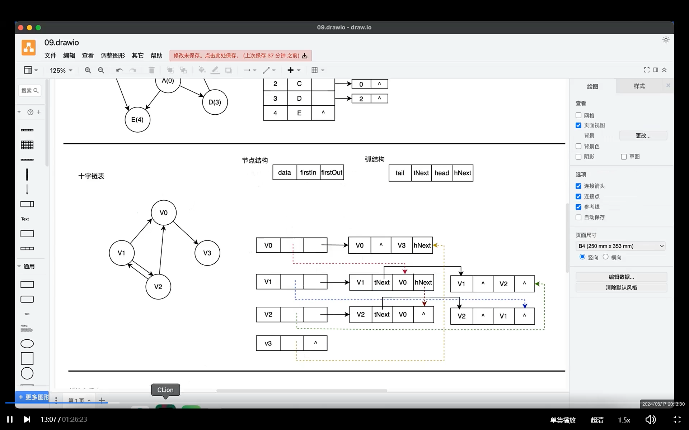
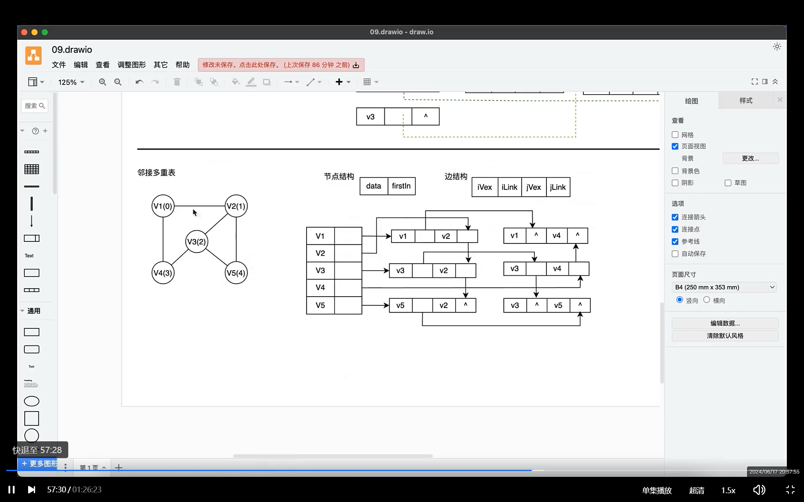
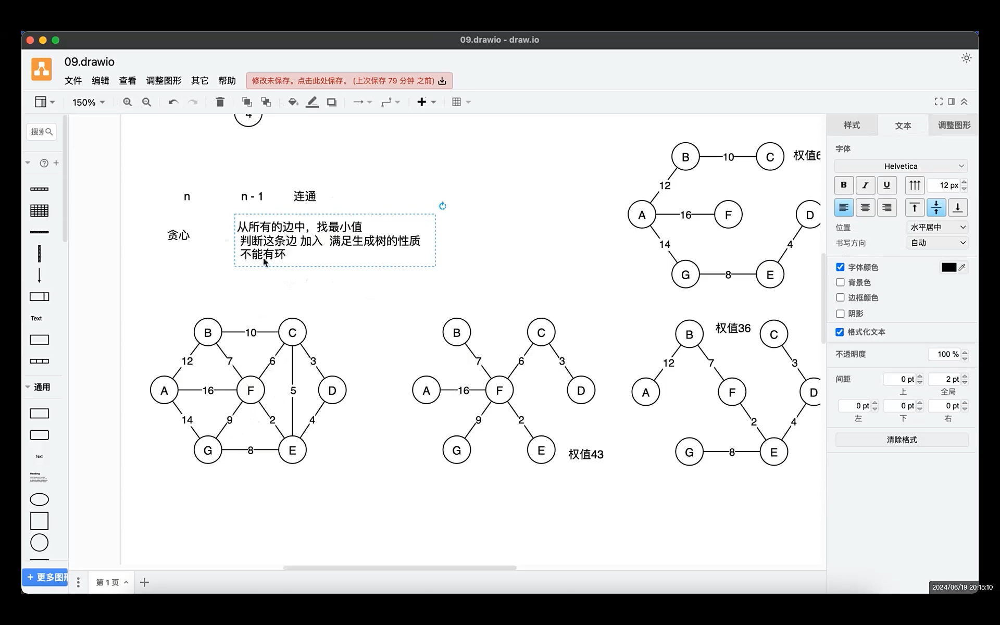
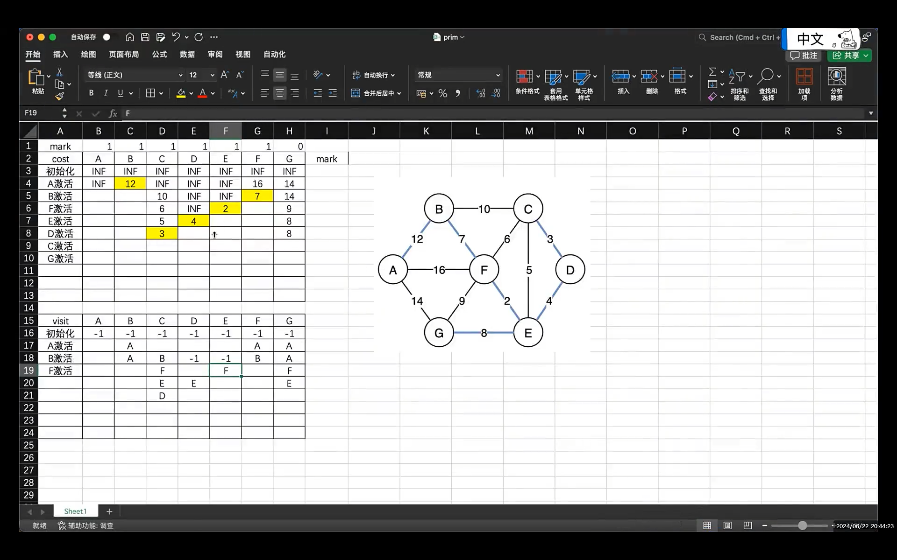
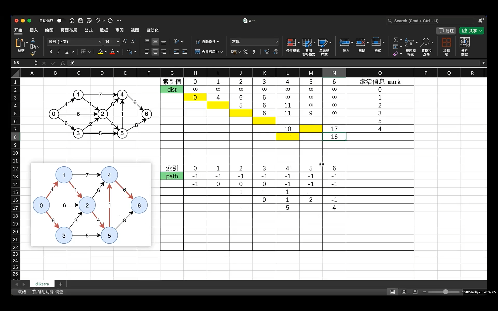

# 数据结构笔记（上）

## C语言指针

### 描述二元含义

> 以变量名为中心，先右后左，有东西就结合，结合后看作一个整体，再次先右后左，以此类推直至处理完
>
> 第一个结合为数据类型（数组，指针或函数名），第二个是有多少个元素（或容器有多大），再看指针的指向或数组内存储的数据类型，第三个是元素大小（或指针指向空间如何访问）
>
> 变量名右边紧跟小括号表示函数名，再看函数二要素（输入参数，返回值）

## 复杂度

### 时间复杂度

时间频度：⼀个算法中的语句执⾏次数称为语句频度或时间频度。记为T(n)。

时间复杂度：

可以忽略所有低次幂和最⾼次幂的系数

Ο(1)表示基本语句的执⾏次数是⼀个常数，⼀般来说，只要算法中不存在循环语句，其时间复杂度就是Ο(1)。

==求和法则：==

若算法的2个部分时间复杂度分别为 T1(n)=O(f(n))和 T2(n)=O(g(n)),则 T1(n)+T2(n)=O(max(f(n), g(n)))。 特别地,若T1(m)=O(f(m)), T2(n)=O(g(n)),则 T1(m)+T2(n)=O(f(m) + g(n))。

> eg:
>
> 一算法两部分时间复杂度分别为O(m^2^)，O(n^2^)。如果m，n为相互独立的变量，该算法的总时间复杂度为O(m^2^+n^2^)，若m，n是同量级(`m=ɑn`，ɑ是常数)，则为O(n^2^+(ɑn)^2^)--->O(n^2^)

==乘法法则：==

对于循环结构,循环语句的运⾏时间主要体现在多次迭代中执⾏循环体以及检验循环条件的时间耗费,⼀般可⽤⼤O下"乘法法则"。乘法法则: 是指若算法的2个部分时间复杂度分别为 T1(n)=O(f(n))和  T2(n)=O(g(n)),则 T1 * T2=O(f(n) * g(n))

## 单向链表

> 在执行插入或删除操作时，要站在操作节点的前一个结点进行插入和删除操作，因此编写代码时需要一个前置节点
>
> 单向链表⽆法往回⾛，所以核心思想：备份，先处理新节点，再处理老节点

### 链表的三种遍历方法

```c
// 链式结构的遍历，查找操作
ListNode* p = linkList->header.next;//指向第一个元素
while (p) {
	printf("%d\t", p->val);
	p = p->next;
}


//插入，删除操作
ListNode* p = &linkList->header;//指向头节点
while (p->next) {
	p = p->next;
}


//释放操作，p指向待删除节点的位置，因为最终释放所有节点，不关心前驱，只关心后继
//写法偏小众
ListNode* p = linkList->header.next;//从第一个节点开始
ListNode* tmp;
while (p) {
		tmp = p;
		p = p->next;
		free(tmp);
		--linkList->num;
}
printf("link have %d node!\n", linkList->num);
free(linkList);
```

### 习题讲解

> 解决头指针方法：引入dummy节点（虚拟节点），把只含有头指针的结构变换成带头节点的结构

```c
//leetcode206（反转链表）
struct ListNode* reverseList(struct ListNode* head) {
	struct ListNode dummy;
	struct ListNode *tmp;
	dummy.next = NULL;      // 先让头节点指向空，有一个空链表
	// 利用head指针充当原链表的遍历辅助指针，每拿到一个元素，向dummy链表里头插法
	while (head) {
		tmp = head->next;
		head->next = dummy.next;
		dummy.next = head;
		head = tmp;
        //不能直接写成head = head->next进行遍历原链表，因为head->next在第9行被改变
	}
	// 把dummy.next返回给原来的链表的头指针
	return dummy.next;
}


//leetcode21(合并链表)
 struct ListNode* mergeTwoLists(struct ListNode* list1, struct ListNode* list2) {
	 struct ListNode dummy;
	 struct ListNode *res;
	 dummy.next = NULL;
	 res = &dummy;
	 // 遍历链表1和链表2
	 while (list1 && list2) {
		 if (list1->val < list2->val) {
			 res->next = list1;
			 list1 = list1->next;
		 } else {
			 res->next = list2;
			 list2 = list2->next;
		 }
		 res = res->next;
	 }
	 // 至少有一条链表遍历完成
     //注意：因为两条链表是有序的，所以哪一条链表先遍历完成不是看哪一条链表短，
     //而是哪条链表的最后一个数据最大
	 if (list1) {
		 res->next = list1;//然后直接指向剩余的那条链表即可
	 } else {
		 res->next = list2;
	 }
	 return dummy.next;
 }
```

## 单向循环链表

### 约瑟夫环

```c
//头指针遍历
Node* p = game->head;//从第一个元素开始遍历，先执行再判断
do {
	printf("%d\t", p->data);
	p = p->next;
} while (p!=game->head);
printf("\n");
}

/* Joseph环的节点结构 */
typedef struct node {
	int data;
	struct node* next;
}Node;
/* Joseph环的表头结构，只保留头尾指针 */
typedef struct {
	Node* head;
	Node* tail;
} JosephHeader;

//尾随法
void startJosephGame(JosephHeader* game, int m) {
	Node* pre = NULL;			// 指向待删除节点的前一个位置
	Node* cur = game->head;		// 指向正在报数的人
	while (cur->next != cur) {		// 还有别人，报数，删除一个人后，再次进入这个循环
		// 按照m值进行报数，只需要找报到m - 1时，就可以触发删除操作
		pre = cur;
		for (int i = 1; i < m; ++i) {
			pre = cur;
			cur = cur->next;
		}
		// 删除后继节点
		pre->next = cur->next;//找到之后，备份，使pre指向待删除结点的下一个元素
		printf("%d\t", cur->data);
		free(cur);
		cur = pre->next;再令cur指向pre指向的下一个元素
	}
	printf("\nthe last person: %d\n", cur->data);
	game->head = game->tail = cur;
}
```

## 双向循环链表

### 插入节点

先处理新节点和后节点的关系，再处理新节点和前节点的关系

```c
//后节点，next
next->prev=new_node;//只需要关心后节点的prev
new_node->next=next;

//前节点，prev
new_node->prev=prev;//只需要关心前节点的next
prev->next=new_node;
```

## 循环顺序队列

队满和队空的判断（==牺牲一个空间==）

```c
// 队空时，约定
rear == front
// 队满时，约定
(rear + 1) % maxSize == front；
    
//每次更新完毕后，front指向的是空元素（无效空间)，rear指向已插入元素的空间
//再进行下一次插入或取出操作时，front+1 再取出（取出后为空，front仍指向无效空间，符合），rear+1 再存放   

//插入操作
rear = (rear + 1) % MaxQueueSize;// +1指向待插入的空间
data[rear] = e;  //赋值，此时rear指向的空间有值

//取出操作
front = (front + 1) % MaxQueueSize;//（从一开始指向的无效空间）+1指向要取出元素的位置
*e = data[front];//取出，此空间变为无效空间
```

## 二叉树的遍历

> 遍历思想：⼆叉树是⾮线性结构
>
> 按层次，⽗⼦关系，知道了⽗，那么就把其所有的⼦结点都看⼀遍 （队列）
>
> 按深度，⼀条道⾛到⿊，然后再返回⾛另⼀条道，递归写法，非递归写法（栈)

> 二叉树性质： 在⼀棵⼆叉树中，叶结点的数⽬⽐度为2的结点数⽬多⼀个。
>
> 如果有⼀棵n个结点的完全⼆叉树，其结点编号按照层次排序（从上到下，从左到右），则除根结点外， 满⾜[i/2 , i, 2i, 2i+1]的规则，即[⽗、⾃⼰、左孩、右孩]的索引关系。

### 深度遍历

#### 递归写法

1. 先序遍历

	```c
	// 使用递归来实现遍历任务的3进宫，分离任务体，该任务的核心是遍历节点
	static void preOrderNode(TreeNode* node) {
		if (node) {
			visitTreeNode(node);
			preOrderNode(node->left);
			preOrderNode(node->right);
		}
	}
	```

2. 中序遍历

	```c
	static void inOrderNode(TreeNode* node) {
		if (node) {
			inOrderNode(node->left);
			visitTreeNode(node);
			inOrderNode(node->right);
		}
	}
	```

3. 后序遍历

	```c
	static void postOrderNode(TreeNode* node) {
		if (node) {
			postOrderNode(node->left);
			postOrderNode(node->right);
			visitTreeNode(node);
		}
	}
	
	
	//利用后序进行删除元素
	static void destroyNode(BinaryTree* tree, TreeNode* node) {
		if (node) {
			destroyNode(tree, node->left);
			destroyNode(tree, node->right);
			free(node);
			tree->count--;
		}
	}
	```

#### 非递归写法

```c
/* 非递归先序遍历：
 * 基本思想：
 *	递归先看节点，再左，后右，把栈当做任务暂存的反序结构
 *	一旦处理一个任务时，先把他的右任务放入栈中，可以保证右边最后处理，然后再入左任务
 * 基本步骤：
 *	1. 将根节点压入栈
 *	2. 弹栈，先访问，节点有右先压右，有左再压左
 *	3. 循环出栈，直到栈内没有元素
 */
void preOrderBTreeNoRecur(const BinaryTree* tree) {
	TreeNode* node;
	if (tree) {
		ArrayStack* stack = createArrayStack();
		pushArrayStack(stack, tree->root);
		while (popArrayStack(stack, (void**)&node) != -1 && node) {
			visitTreeNode(node);
			if (node->right) {
				pushArrayStack(stack, node->right);
			}
			if (node->left) {
				pushArrayStack(stack, node->left);
			}
		}
		releaseArrayStack(stack);
		printf("\n");
	}
}

/* 非递归的中序遍历，以根节点为开始，整条左边进栈
 * 从栈中弹出节点，开始访问，然后将这个节点的右孩子作为新节点，再次按照整条左进栈，再弹栈
 */
void inOrderBTreeNoRecur(const BinaryTree* tree) {
	TreeNode* node;
	if (tree) {
		ArrayStack* stack = createArrayStack();
		node = tree->root;
		while (stack->top >= 0 || node) {			// 栈非空
			if (node) {
				pushArrayStack(stack, node);
				node = node->left;
			}
			else {
				popArrayStack(stack, (void**)&node);
				visitTreeNode(node);
				node = node->right;
			}
		}
		releaseArrayStack(stack);
		printf("\n");
	}
}
```

### 广度遍历（层次遍历）

> 层次遍历，又叫广度遍历，需要引入队列，快速的发现任务，但是处理任务的速度慢
>
> 基本步骤思想：
>
> 1.初始化
>
> 把根节点入队，存这个根节点的索引，如果是顺序存储，那么索引就是下标，如果是链式存储，那么索引就是地址
>
> 2.循环
>
> ​	2.1 出队，访问出队的节点
>
> ​	2.2 把该任务能访问的孩子节点，有孩子的节点索引入队
>
> ​	2.3 只要队列不空，继续出队，出队就进入2.2
>
> ​	2.4 直到队列为空，返回退出
>
> 由于队列只存在层次遍历，当遍历完成后，就可以释放，推荐存放到栈上

```c
void levelOrderBTree(const BinaryTree* tree) {
#define	MAX_QUEUE_SIZE	8
	TreeNode* queue[MAX_QUEUE_SIZE];//定义队列
	int front = 0; int rear = 0;
	TreeNode* node = NULL;

	// 初始化
	queue[rear] = tree->root;
	rear = (rear + 1) % MAX_QUEUE_SIZE;
	// 循环
	while (front != rear) {
		node = queue[front];//先取出该节点，再放入该节点的孩子节点
		front = (front + 1) % MAX_QUEUE_SIZE;
		visitTreeNode(node);
        //两个if判断该节点有无孩子节点，有则放入队尾，无则结束这次循环，
        //并开始下一次循环，进行取出，判断，直到循环结束
		if (node->left) {
			queue[rear] = node->left;
			rear = (rear + 1) % MAX_QUEUE_SIZE;
		}
		if (node->right) {
			queue[rear] = node->right;
			rear = (rear + 1) % MAX_QUEUE_SIZE;
		}
	}
	printf("\n");
}
```

## 线索二叉树

> ⼀棵结点数⽬为 n 的⼆叉树，则⼆叉链表中存在 n + 1 个空指针域

### 线索化

```c
/* 中序线索化过程：
 * 考虑到left会指向前驱节点，那么就定义一个pre指针存储进入这个节点的之前的状态
 * 使用中序遍历，当回到访问节点时，判断该节点是否有左孩子，如果没有，当前阶段的left就可以保存pre的值
 */
static TBTNode* pre = NULL;
static void inOrderThreading(TBTNode* node) {
	if (node) {
		inOrderThreading(node->left);
		// 更新当前节点的left
		if (node->left == NULL) {
			node->lTag = 1;
			node->left = pre;
		}
		if (pre && pre->right == NULL) {
			pre->right = node;
			pre->rTag = 1;
		}
		pre = node;
		inOrderThreading(node->right);
	}
}
```

### 遍历

```c
/* 中序线索化后，遍历二叉树
 * 中序遍历，访问到某一个节点，此时不能访问，必须找到一个左索引标记的节点
 */
void inOrderTBTree(ThreadedBTree* tree) {
	TBTNode* node = tree->root;
	while (node) {
		// 当左边一直有节点，一直向左线索化
		while (node->lTag == 0) {
			node = node->left;
		}
		visitTBTNode(node);
		// 根据这个线索化的节点，继续向右找
		while (node->rTag && node->right) {
			node = node->right;
			visitTBTNode(node);
		}
		node = node->right;
	}
}
```

## 二叉搜索树

### 递归写法

#### 插入

```c
static BSNode* createBSNode(Element e) {	//创建节点
	BSNode* node = malloc(sizeof(BSNode));
	node->left = node->right = NULL;
	node->data = e;
	return node;
}

//插入，与根节点比较，大于去右边，再与当前节点比较，大于再去右边，右边为空，插入节点
static BSNode* insertBSNodeRecur(BSTree* tree, BSNode* node, Element e) {
	if (node == NULL) {
		tree->count++;
		return createBSNode(e);
	}
	if (e < node->data) {
		node->left = insertBSNodeRecur(tree, node->left, e);
	}
	else if (e > node->data) {
		node->right = insertBSNodeRecur(tree, node->right, e);
	}
	return node;
}

//每次插入都从头节点开始判断
void insertBSTreeRecur(BSTree* tree, Element e) {
	tree->root = insertBSNodeRecur(tree, tree->root, e);
}
```

#### 查找 / 树的高度

```c
//查找
BSNode* searchBSTree(const BSTree* tree, Element e) {
	BSNode* node = tree->root;
	while (node) {
		if (e < node->data) {
			node = node->left;
		}
		else if (e > node->data) {
			node = node->right;
		}
		else {
			return node;
		}
	}
	return NULL;
}


//高度
//先求出根节点左节点的高度，再算出右节点的高度，比较大小后+1 即为树的高度
int heightBSNode(BSNode* node) {
	if (node == NULL) {
		return 0;
	}
	int leftHeight = heightBSNode(node->left);
	int rightHeight = heightBSNode(node->right);
	if (leftHeight > rightHeight) {
		return ++leftHeight;
	}
	else {
		return ++rightHeight;
	}
}
```

#### 删除

```c
//用于删除度为2的节点node时，找出该节点的后继节点，即在node的右子树中找出最小的元素
static BSNode* miniValueBSTree(BSNode* node) {
	while (node && node->left) {
		node = node->left;
	}
	return node;
}

//从传进来的节点位置开始查找元素并删除
static BSNode* deleteBSNode(BSTree* tree, BSNode* node, Element e) {
	if (node == NULL) {
		return NULL;
	}
	// 1. 递 找到和e相等的点
	if (e < node->data) {
		node->left = deleteBSNode(tree, node->left, e);
	}
	else if (e > node->data) {
		node->right = deleteBSNode(tree, node->right, e);
	}
	else {
		BSNode* tmp = NULL;
		if (node->left == NULL) {
			tmp = node->right;
			free(node);
			--tree->count;
			return tmp;
		}
		if (node->right == NULL) {
			tmp = node->left;
			free(node);
			--tree->count;
			return tmp;
		}
		// 此时，说明待删除的点，度为2，找后继/前驱的节点值进行覆盖，然后再处理后继/前驱的节点
		tmp = miniValueBSTree(node->right);
		node->data = tmp->data;					// 后继节点的值更新到node处
		node->right = deleteBSNode(tree, node->right, tmp->data);
	}
	return node;
}
```

### 非递归写法

```c
// 按照BST的规则，进行节点的非递归插入
void insertBSTreeNoRecur(BSTree* tree, Element e) {
	BSNode* pre = NULL;
	BSNode* cur = tree->root;
	while (cur) {
		pre = cur;
		if (e < cur->data) {
			cur = cur->left;
		}
		else if (e > cur->data) {
			cur = cur->right;
		}
		else {
			return;
		}
	}
	BSNode* node = createBSNode(e);
	if (pre) {
		if (e < pre->data) {
			pre->left = node;
		}
		else if (e > pre->data) {
			pre->right = node;
		}
	}
	else {
		tree->root = node;
	}
	++tree->count;
}


// 删除BST树中的一个元素（非递归方式）

static void deleteMiniNode(BSNode* node) {
	BSNode* mini = node->right;
	BSNode* pre = node;
	while (mini && mini->left) {	//找出最小节点
		pre = mini;
		mini = mini->left;
	}
	//此时找出最小节点，令前置节点等于最小节点的right，去衔接mini的右子树可能存在的值
	//令前置节点等于mini->right是因为，如果mini有left那他就不是最小值，还要向下遍历所以要等于最小节点的right

	//此处if判断是为了避免，如果前置节点值等于删除节点的值，那么说明没有向左的最小值（即最开始的mini，即node->right为最小值
	if (pre->data == node->data) {
		pre->right = mini->right;
	}
	else {
		pre->left = mini->right;
	}
	node->data = mini->data;
}

void deleteBSTreeNoRecur(BSTree* tree, Element e) {
	BSNode* pre = NULL;
	BSNode* node = tree->root;
	// 找元素e，定位pre，node指向了该节点
	while (node) {
		if (e < node->data) {
			pre = node;
			node = node->left;
		}
		else if (e > node->data) {
			pre = node;
			node = node->right;
		}
		else {
			break;
		}
	}
	BSNode* tmp = NULL;
	// 删除非根节点
	if (node && pre) {
		if (node->left == NULL) {		// 度为1或0
			tmp = node->right;
		}
		else if (node->right == NULL) {
			tmp = node->left;
		}
		else {
			deleteMiniNode(node);	//度为2
			--tree->count;
			return;
		}
		if (node->data < pre->data) {	//绕过删除节点，前后衔接
			pre->left = tmp;
		}
		else {
			pre->right = tmp;
		}
		free(node);
		--tree->count;
		return;
	}
	if (node && pre == NULL) {		// 根节点
		if (node->left == NULL) {
			tmp = node->right;
		}
		else if (node->right == NULL) {
			tmp = node->left;
		}
		else {
			deleteMiniNode(node);
			--tree->count;
			return;
		}
		tree->root = tmp;
		free(node);
		--tree->count;
	}
	if (pre && node == NULL) {
		printf("no such elements\n");
	}
}
```

## 二叉平衡树

### 性质

> **平衡因⼦**
>
> 左⼦树与右⼦树的⾼度差即为该节点的平衡因⼦（BF,Balance Factor） 
>
> 平衡⼆叉树中不存在平衡因⼦⼤于 1 的节点。
>
> 在⼀棵平衡⼆叉树中，节点的平衡因⼦只能取 0 、1 或者 -1 ，分别对应着左右⼦树等⾼，左⼦树⽐较 ⾼，右⼦树⽐较⾼。

### 左旋右旋

> LL ：失衡节点左边⾼，新插⼊节点是在失衡节点左孩⼦的左边。直接对失衡节点进⾏右旋即可。 
>
> RR：失衡节点右边⾼，新插⼊节点是在失衡节点右孩⼦的右边。直接对失衡节点进⾏左旋即可。 
>
> LR：失衡节点左边⾼，新插⼊节点是在失衡节点左孩⼦的右边。先对左孩⼦进⾏左旋，再对失衡节 点进⾏右旋。
>
> RL：失衡节点右边⾼，新插⼊节点是在失衡节点右孩⼦的左边。先对右孩⼦进⾏右旋，再对失衡节 点进⾏左旋。

```c
/* 左旋操作，	RR
 *     px			
 *     |				     
 *     x				     y
 *   /  \				   /  \
 * lx    y				  x    ry
 *      / \				 / \
 *     ly ry			lx ly
 * */
static AVLNode* leftRotate(AVLNode* x) {
	AVLNode* y = x->right;
	x->right = y->left;
	y->left = x;
	// 更新左旋后的有变化的节点高度
	x->height = maxNum(h(x->left), h(x->right)) + 1;
	y->height = maxNum(h(y->left), h(y->right)) + 1;
	return y;
}

/* 右旋操作
 *       py				       
 *       |				       
 *       y				       x
 *     /  \				     /  \
 *    x   ry			    x    y
 *   / \				   / 	/ \
 * lx  rx				 lx    rx ry
 * */
static AVLNode* rightRotate(AVLNode* y) {
	AVLNode* x = y->left;
	y->left = x->right;
	x->right = y;
	y->height = maxNum(h(y->left), h(y->right)) + 1;
	x->height = maxNum(h(x->left), h(x->right)) + 1;
	return x;
}
```

### 插入

```c
//前半部分递的过程同于搜索树	
	// 2. 归的开始
	// 2.1 更新归中的节点信息
	node->height = 1 + maxNum(h((node->left)), h(node->right));
	// 2.1 计算平衡因子，当前节点
	// 2.2 计算当前节点的平衡因子
	int balance = getBlance(node);
	if (balance > 1) {			// 左边的高度大了
		// 判读失衡节点属于LL还是LR		// L
		if (e > node->left->data) {		// R
			node->left = leftRotate(node->left);
		}
		return rightRotate(node);
	}
	else if (balance < -1) {					// R
		// RL ===> RR
		if (e < node->right->data) {
			node->right = rightRotate(node->right);
		}
		return leftRotate(node);
	}
	return node;
}
```

### 删除

```c
	else {	//判读度的情况并删除的不同写法
		// 判读度的情况  1 or 0
		AVLNode* tmp;
		if (node->left == NULL || node->right == NULL) {
			tmp = node->left ? node->left : node->right;
			if (tmp == NULL) {		// 度为0，直接删除node，归回NULL
				--tree->count;
				free(node);
				return NULL;
			}
			else {		//将tmp覆盖到node节点，再将tmp的左右子树转交给tmp，随后释放tmp
				node->data = tmp->data;
				node->left = tmp->left;		node->right = tmp->right;
				--tree->count;
				free(tmp);
			}
		}
		else {
			// 找前驱节点
			tmp = node->left;
			while (tmp->right) {
				tmp = tmp->right;
			}
			node->data = tmp->data;
			node->left = deleteAVLNode(tree, node->left, tmp->data);
		}
	}
	// 2. 更新平衡因子
	node->height = 1 + maxNum(h(node->left), h(node->right));
	int balance = getBalance(node);
	if (balance > 1) {						// L
		if (getBalance(node->left) < 0) {	// R
			node->left = leftRotate(node->left);
		}
		return rightRotate(node);
	}
	else if (balance < -1) {				// R
		if (getBalance(node->right) > 0) {	// L
			node->right = rightRotate(node->right);
		}
		return leftRotate(node->right);
	}
	return node;
}
```

## 并查集

### Quick Find

```c
//find		查找效率：O(1)
static int findIndex(QuickFindSet* setQF, Element a) {
	for (int i = 0; i < setQF->n; ++i) {
		if (setQF->data[i] == a) {
			return i;
		}
	}
	return -1;
}

int isSameQF(QuickFindSet* setQF, Element a, Element b) {
	int aIndex = findIndex(setQF, a);
	int bIndex = findIndex(setQF, b);
	if (aIndex == -1 || bIndex == -1) {
		return 0;
	}
	return setQF->groupID[aIndex] == setQF->groupID[bIndex];
}

//union		合并效率：O(N)
void unionQF(QuickFindSet* setQF, Element a, Element b) {
	int aIndex = findIndex(setQF, a);
	int bIndex = findIndex(setQF, b);

	int gID = setQF->groupID[bIndex];
	for (int i = 0; i < setQF->n; ++i) {
		if (setQF->groupID[i] == gID) {
			setQF->groupID[i] = setQF->groupID[aIndex];			
            // b元素的组ID管的元素，都替换成a元素的组ID, b--->a
		}
	}
}
```

### Quick Union

#### 基于size的算法改进

```c
//查找效率：O（logN）
static int findRootIndex(const QuickUnionSet* setQU, Element e) {
	int curIndex = findIndex(setQU, e);
	if (curIndex == -1) {
		return -1;
	}
	// 找根节点的索引号，等价于QuickFind中的groupID
	while (setQU->parentID[curIndex] != curIndex) {
		curIndex = setQU->parentID[curIndex];
	}
	return curIndex;
}

int isSameQU(QuickUnionSet* setQU, Element a, Element b) {
	int aRoot = findRootIndex(setQU, a);
	int bRoot = findRootIndex(setQU, b);

	if (aRoot == -1 || bRoot == -1) {
		return 0;
	}
	return aRoot == bRoot;
}


//合并效率：O（logN）
void unionQU(QuickUnionSet* setQU, Element a, Element b) {
	int aRoot = findRootIndex(setQU, a);
	int bRoot = findRootIndex(setQU, b);
	if (aRoot == -1 || bRoot == -1) {
		return;
	}
	if (aRoot != bRoot) {
		// a元素和b元素不在一个集合里，那么就可以合并 a --> b ?    b --> a ?
		//size指的是元素个数多少
		//基于size的算法改进,将元素少的树，嫁接到元素多的树，元素少的指向元素多的
		int aSize = setQU->size[aRoot];
		int bSize = setQU->size[bRoot];
		if (aSize >= bSize) {
			setQU->parentID[bRoot] = aRoot;
			setQU->size[aRoot] += bSize;
		}
		else {
			setQU->parentID[aRoot] = bRoot;
			setQU->size[bRoot] += aSize;
		}
	}
}
```

#### 路径压缩

```c
//在find时使路径上的所有节点都指向根节点，从⽽降低树的⾼度
typedef struct setNode {	//利用栈存储各节点信息
	int index;
	struct setNode* next;
} SetNode;
//链式栈，头插法
static SetNode* push(SetNode* stack, int index) {
	SetNode* node = malloc(sizeof(SetNode));
	node->index = index;
	node->next = stack;
	return node;
}

static SetNode* pop(SetNode* stack, int* index) {
	SetNode* tmp = stack;

	*index = stack->index;
	stack = stack->next;
	free(tmp);
	return stack;
}

static int findRootIndex(const QuickUnionSet* setQU, Element e) {
	int curIndex = findIndex(setQU, e);
	if (curIndex == -1) {
		return -1;
	}
	SetNode* path = NULL;
	while (setQU->parentID[curIndex] != curIndex) {
		path = push(path, curIndex);				// 记录信息
		curIndex = setQU->parentID[curIndex];
	}
	// 已经找到了根节点，恢复记录的信息，把这些节点的父节点关系进行更新
	while (path) {
		int pos;
		path = pop(path, &pos);
		setQU->parentID[pos] = curIndex;
	}
	return curIndex;
}
```

## 哈夫曼树

> 在一棵二叉树中，叶子结点的数目为 n，度为2的节点数 = n-1
>
> Huffman树的总结点数就为  = 2n-1

### 构造Huffman树

```c
HuffmanTree createHuffmanTree(const int* w, int n) {
	int m = 2 * n - 1;	//m-->总节点数
	HuffmanTree tree = malloc(sizeof(HuffmanNode) * (m + 1));
	//实际节点是2n-1个，由于下标是从1开始，所以多申请一位，作为第一个节点，其下标为0，但实际并不使用（注意，整篇使用的都是顺序存储）
	if (tree == NULL) {
		return NULL;
	}
	// 填充表，初始化为0，0是无效下标，从1开始存入数据
	memset(tree, 0, sizeof(HuffmanNode) * (m + 1));
	// 填充叶子信息
	for (int i = 1; i <= n; ++i) {
		tree[i].weight = w[i - 1];
	}
	// --------- 构建Huffman树 -------------
	int s1, s2;//下标
	for (int i = n + 1; i <= m; ++i) {
		// 找[1...i-1]两个权值最小的节点，还要保证没有父节点
		selectNode(tree, i - 1, &s1, &s2);
		// 可以填充i的节点信息
		tree[i].weight = tree[s1].weight + tree[s2].weight;
		tree[i].lChild = s1;		tree[i].rChild = s2;
		tree[s1].parent = tree[s2].parent = i;
	}
	return tree;
}
```

### Huffman编码

```c
huffmanCode* createHuffmanCode(HuffmanTree tree, int n) {
	// 生成n个字符的编码表，每个表项里保存这个编码结果的空间首地址
	huffmanCode* codes = malloc(sizeof(huffmanCode) * n);
	if (codes == NULL) {
		return NULL;
	}
	memset(codes, 0, sizeof(huffmanCode) * n);
	char* temp = malloc(sizeof(char) * n);
	int start;				// 指向临时空间的起始位置，从后向前进行编码
	int p;					// 存放当前节点的父节点编号
	int pos;				// 当前编码的符号位置
	// 逐个求出每个字符的Huffman编码
	for (int i = 1; i <= n; ++i) {				// 遍历每个叶子节点
		start = n - 1;				// 临时空间的最后位置
		temp[start] = '\0';
		pos = i;
		p = tree[i].parent;
		while (p) {
			--start;
            //左0右1原则
			temp[start] = tree[p].lChild == pos ? '0' : '1';
			pos = p;
			p = tree[p].parent;
		}
		// 将临时空间拷贝到第i个字符编码空间
        // codes保存的是n个元素编码结果的空间首地址
		codes[i - 1] = malloc(sizeof(char) * (n - start));//先申请空间
		strcpy(codes[i - 1], &temp[start]);//将从start开始到'\0'的编码拷贝到codes[i-1]的位置上
	}
	free(temp);
	return codes;
}
```

## 图的存储

### 邻接矩阵

```c
/* 图的邻接矩阵
 * - 顶点集合、边的集合
 * - 顶点用一维数组描述，边用二维数组表示
 */
#define	MaxNodeNUM		20
#define INF				1E4
 // 描述顶点结构
typedef struct {
	int no;				// 顶点编号 索引
	char* show;			// 顶点的显示数据
} MatrixVertex;
// 邻接矩阵边的类型
typedef int MatrixEdge;
// 邻接矩阵表示的图头
typedef struct {
	MatrixVertex vex[MaxNodeNUM];			// 存储顶点信息
	int nodeNum;							// 约束实际顶点的数量
	MatrixEdge edges[MaxNodeNUM][MaxNodeNUM];		// 矩阵来描述i和j之间的边的关系
	int directed;							// 是否是有向图
	int edgeNum;							// 定义边的个数
} MGraph;

//判断当前情况是否有边
static int isEdge(int weight) {
	if (weight > 0 && weight < INF) {
		return 1;
	}
	return 0;
}
// 初始化顶点集合
void initMGraph(MGraph* graph, char* names[], int num, int directed, int edgeValue) {
	graph->directed = directed;
	graph->edgeNum = 0;
	graph->nodeNum = num;

	memset(graph->vex, 0, sizeof(graph->vex));
	memset(graph->edges, 0, sizeof(graph->edges));
	for (int i = 0; i < num; ++i) {
		// 顶点的初始化
		graph->vex[i].no = i;
		graph->vex[i].show = names[i];
		// 每当一个顶点初始化了
		for (int j = 0; j < num; ++j) {
			graph->edges[i][j] = edgeValue;
		}
	}
}
// 设置顶点和顶点之间边的关系
void addMGraphEdge(MGraph* graph, int x, int y, int w) {
	if (x < 0 || x > graph->nodeNum)
		return;
	if (y < 0 || y > graph->nodeNum)
		return;
	if (!isEdge(graph->edges[x][y])) {
		graph->edges[x][y] = w;
		if (graph->directed == 0) {
			graph->edges[y][x] = w;
		}
		graph->edgeNum++;
	}
}
```

### 邻接表

```c
// 边的节点结构定义
typedef struct arcEdge {
	int no;					// 邻接表，以某个顶点为出发点，到no编号了
	int weight;				// 边的权重
	struct arcEdge* next;
} ArcEdge;
// 顶点结构
typedef struct {
	int no;
	char* show;
	ArcEdge* firstEdge;
} ArcNode;
// 使用邻接表来描述图的结构
typedef struct {
	ArcNode* nodes;				// 图中顶点的集合，邻接
	int nodeNum;				// 顶点的访问边界
	int edgeNum;
	int directed;
	int* vistited;				// 以访问点的标记
} AGraph;

// 产生n个节点的邻接表的图
AGraph* createAGraph(int n) {
	AGraph* graph = malloc(sizeof(AGraph));
	if (graph == NULL) {
		return NULL;
	}
	graph->edgeNum = 0;
	graph->nodeNum = n;
	graph->nodes = malloc(sizeof(ArcNode) * n);
	graph->vistited = malloc(sizeof(int) * n);
	memset(graph->nodes, 0, sizeof(ArcNode) * n);
	memset(graph->vistited, 0, sizeof(int) * n);
	return graph;
}

void initAGrpah(AGraph* graph, char* names[], int num, int direct) {
	graph->directed = direct;
	for (int i = 0; i < num; ++i) {
		graph->nodes[i].no = i;
		graph->nodes[i].show = names[i];
		graph->nodes[i].firstEdge = NULL;
	}
}

static ArcEdge* createArcEdge(int v, int w) {
	ArcEdge* edge = malloc(sizeof(ArcEdge));
	if (edge == NULL) {
		return NULL;
	}
	edge->no = v;
	edge->weight = w;
	edge->next = NULL;
	return edge;
}

void addAGraphEdge(AGraph* graph, int x, int y, int w) {//x--->y,出度
	if (x < 0 || x > graph->nodeNum || y < 0 || y > graph->nodeNum) {
		return;
	}
	if (x == y) {
		return;
	}
	// 采用头插法
	ArcEdge* edge = createArcEdge(y, w);
	edge->next = graph->nodes[x].firstEdge;
	graph->nodes[x].firstEdge = edge;
	graph->edgeNum++;
	if (graph->directed == 0) {
		edge = createArcEdge(x, w);
		edge->next = graph->nodes[y].firstEdge;
		graph->nodes[y].firstEdge = edge;
		++graph->edgeNum;
	}
}
```

### 十字链表



```c
//主要适用于有向图

// 边的结构
//tailNext，headNext，相当于头指针，存在的意义就是连接各个出度和入度关系的边
//分别备份指向的上一个边，方便下一次头插法和进行遍历
typedef struct arcBox {
	int tailVertex;					// 弧尾顶点编号，出度
	struct arcBox* tailNext;		
	int headVertex;					// 弧头顶点编号，入度
	struct arcBox* headNext;		
	int weight;						// 弧的权重
} ArcBox;

// 十字链表的顶点结构 每个顶点
typedef struct {
	int no;
	char* show;
	ArcBox* firstIn;			// 指向由该节点所有入度关系的边组成的链表的第一条边，头插法依次添加
	ArcBox* firstOut;			// 指向由该节点所有出度关系的边组成的链表的第一条边，头插法依次添加
} CrossVertex;

// 整个十字链表实现
typedef struct {
	CrossVertex* nodes;
	int numVertex;
	int numEdge;
} CrossGraph;


// 添加有向图，从tail走向head，权值是w
void addCrossArc(CrossGraph* graph, int tail, int head, int w) {
	ArcBox* box = malloc(sizeof(ArcBox));
	if (box == NULL) {
		return;
	}
	box->weight = w;
	// 出度关系
	box->tailVertex = tail;	//确定该边的弧尾
	box->tailNext = graph->nodes[tail].firstOut;
    // 指向下一个出度的边（头插法，即指向上次保存的边，即firstout所指向的边
	
    graph->nodes[tail].firstOut = box;//firstout指向该顶点出度关系的边box
    
    
	// 入度关系
	box->headVertex = head;	//确定该边的弧头
	box->headNext = graph->nodes[head].firstIn;
    // 指向下一个入度的边（头插法，即指向上次保存的边，即firstin指向的边
    
	graph->nodes[head].firstIn = box;//更新firstin，指向该顶点入度关系的边box
}


// 计算no编号节点的入度、出度
int inDegreeCrossGraph(CrossGraph* graph, int no) {
	int count = 0;
	ArcBox* box = graph->nodes[no].firstIn;
	while (box) {
		++count;
		box = box->headNext;
	}
	return count;
}

int outDegreeCrossGraph(CrossGraph* graph, int no) {
	int count = 0;
	ArcBox* box = graph->nodes[no].firstOut;
	while (box) {
		++count;
		box = box->tailNext;
	}
	return count;
}


void releaseCrossGraph(CrossGraph* graph) {
	if (graph && graph->nodes) {
		int numEdge = 0;
		for (int i = 0; i < graph->numVertex; ++i) {
			ArcBox* box = graph->nodes[i].firstOut;
			ArcBox* tmp;
			while (box) {
				tmp = box;
				box = box->tailNext;
				free(tmp);
				++numEdge;
			}
		}
	printf("release %d edge!\n", numEdge);
	free(graph->nodes);
}
	free(graph);
}
```

### 邻接多重表



```c
/* 邻接多重表，适用于无向图
 * 无向图如果使用邻接表存储，一条边会被处理2次，删除较为复杂 */
 // 邻接多重表的边结构
typedef struct amlEdge {
	int iVex;					// 边的顶点i编号
	struct amlEdge* iNext;		// 顶点i编号的下一条边
	int jVex;					// 边的顶点j编号
	struct amlEdge* jNext;		// 顶点j编号的下一条边
	int weight;
	int mark;					// 是否已经显示图的边
}MultiListEdge;
// 邻接多重表的顶点结构
typedef struct {
	int no;						// 顶点编号
	char* show;					// 顶点显示值
	MultiListEdge* firstEdge;	// 该顶点的边头节点
}MultiListVertex;
// 邻接多重表
typedef struct {
	MultiListVertex* nodes;		// 顶点空间
	int vertexNum;				// 约束顶点空间的数量
	int edgeNum;				// 图中边的个数
}AdjacencyMultiList;

AdjacencyMultiList* createMultiList(int n);				// 产生n个节点的邻接多重表
void releaseMultiList(AdjacencyMultiList* graph);
void initMultiList(AdjacencyMultiList* graph, int n, char* names[]);	// 初始化邻接多重表的顶点值
// 插入边
int insertMultiListEdge(AdjacencyMultiList* graph, int a, int b, int w);
// 显示无向图
void showMultiList(AdjacencyMultiList* graph);
// 删除边
int deleteMultiListEdge(AdjacencyMultiList* graph, int a, int b);
```

## 图的遍历

### 深度优先搜索(DFS)

```c
//邻接矩阵
static void visitMGraphNode(const MatrixVertex* node) {
	printf("\t%s", node->show);
}

/* 邻接矩阵的深度遍历
 * 1. 访问第v个节点，v节点所包含的所有的边都要看一遍，A1 看完  A2
 * 2. 看的过程实际是一个节点数量的遍历
 */
static int MGraphVisited[MaxNodeNUM];//记录已访问节点

void DFSGraphTravel(const MGraph* graph, int v) {
	visitMGraphNode(&graph->vex[v]);
	MGraphVisited[v] = 1;//标记找过节点
	// 从v节点开始，找到一个边的节点，通过这个节点再进行DFS，一旦子任务返回，处理下一个v节点的值
	for (int i = 0; i < graph->nodeNum; ++i) {
		if (isEdge(graph->edges[v][i]) && MGraphVisited[i] == 0) {
			DFSGraphTravel(graph, i);
		}
	}
}
//邻接表
static void visitAGraphNode(const ArcNode* node) {
	printf("\t%s", node->show);
}

void DFSAGraphTravel(const AGraph* graph, int v) {
	ArcEdge* p;
	visitAGraphNode(&graph->nodes[v]);
	graph->vistited[v] = 1;
	p = graph->nodes[v].firstEdge;
	while (p) {
		if (graph->vistited[p->no] == 0) {
			DFSAGraphTravel(graph, p->no);
		}
		p = p->next;
	}
}
```

### 广度优先搜索(BFS)

```c
//邻接矩阵
/* 图的广度遍历，引入队列，采用顺序存储，临时空间（栈）
 * 队列这个数据结构，放栈上
 */
void BFSGraphTravel(const MGraph* graph, int v) {
	int que[MaxNodeNUM];			// 描述的是上一个节点激活后，还剩余的任务的暂存器
	int rear = 0, front = 0;
	int cur;

	rear = (rear + 1) % MaxNodeNUM;
	que[rear] = v;
	MGraphVisited[v] = 1;
	while (front != rear) {			// 说明有任务
		front = (front + 1) % MaxNodeNUM;
		cur = que[front];

		visitMGraphNode(&graph->vex[cur]);
		for (int i = 0; i < graph->nodeNum; ++i) {
			if (isEdge(graph->edges[cur][i] && !MGraphVisited[i])) {
				rear = (rear + 1) % MaxNodeNUM;
				que[rear] = i;
				MGraphVisited[i] = 1;
			}
		}
	}
}
//邻接表
void BFSAGraphTravel(const AGraph* graph, int v) {
	int* que = malloc(sizeof(int) * graph->nodeNum);
	int front = 0, rear = 0;
	int cur;
	ArcEdge* p;
	rear = (rear + 1) % graph->nodeNum;
	que[rear] = v;
	graph->vistited[v] = 1;
	while (rear != front) {
		front = (front + 1) % graph->nodeNum;
		cur = que[front];
		visitAGraphNode(&graph->nodes[cur]);
		p = graph->nodes[cur].firstEdge;
		while (p) {
			if (graph->vistited[p->no] == 0) {
				rear = (rear + 1) % graph->nodeNum;
				que[rear] = p->no;
				graph->vistited[p->no] = 1;
			}
			p = p->next;
		}
	}
	free(que);
}
```

## 最小生成树

### 克鲁斯卡尔（Kruskal）算法



```c
//边集数组
typedef struct {
	int begin;
	int end;
	int weight;
} EdgeSet;

/* Kruskal算法：
 * 算法思想：
 *   a. 把其他存储结构的图转换成边集数组的结构，把权值进行大小排序
 *   b. 选择其中一个最小的边，判断这个边一旦加入后，有可能出现环，如果没有环，就写入，否则就放弃
 *   c. 找n个定点的n - 1条边
 */

 // 使用邻接矩阵，转换成边集数组
int initEdgeSet(const MGraph* graph, EdgeSet* edges) {
	int k = 0;												//计数器，边的个数
	for (int i = 0; i < graph->nodeNum; ++i) {				// 每个点
		for (int j = i + 1; j < graph->nodeNum; ++j) {		// 遍历上三角区间
			if (graph->edges[i][j] > 0) {					// 边的权值大于0，说明有边
				edges[k].begin = i;
				edges[k].end = j;
				edges[k].weight = graph->edges[i][j];
				++k;
			}
		}
	}
	return k;
}

// 排序边集数组
void sortEdgeSet(EdgeSet* edges, int num) {
	EdgeSet tmp;
	for (int i = 0; i < num; ++i) {
		for (int j = i + 1; j < num; ++j) {
			if (edges[j].weight < edges[i].weight) {
				memcpy(&tmp, &edges[i], sizeof(EdgeSet));
				memcpy(&edges[i], &edges[j], sizeof(EdgeSet));
				memcpy(&edges[j], &tmp, sizeof(EdgeSet));
			}
		}
	}
}

static int getRoot(const int* uSet, int a) {
	while (a != uSet[a]) {
		a = uSet[a];
	}
	return a;
}
// 从边集数组里挑选最小的边，但要满足这个边的出现，不会导致出现环
// 引入并查集结构，判断边的两个顶点是否在一个集合里
int KruskalMGrap(const MGraph* graph, const EdgeSet* edges, int num, EdgeSet* result) {
	// 申请和初始化并查集，每一个节点的编号就是自己
	int* uSet = malloc(sizeof(int) * graph->nodeNum);
	if (uSet == NULL) {
		return 0;
	}
	for (int i = 0; i < graph->nodeNum; ++i) {
		uSet[i] = i;
	}
	// 从以排序好的集合中，找最小的边，当这个边接入后，不能形成环
	int a, b;
	int count = 0;
	int sum = 0;
	for (int i = 0; i < num; ++i) {
		a = getRoot(uSet, edges[i].begin);
		b = getRoot(uSet, edges[i].end);
		if (a != b) {			// 没有环
			uSet[a] = b;
			result[count].begin = edges[i].begin;
			result[count].end = edges[i].end;
			result[count].weight = edges[i].weight;
			sum += edges[i].weight;
			count++;
			if (count == graph->nodeNum - 1) {
				break;
			}
		}
	}
	free(uSet);
	return sum;
}

```

### 普里姆（Prim）算法



```c
//贪心算法，激活某个点，首先看已激活的各点到待激活点的边的权值，选择最小的那条作为边,依次激活所有节点

/* Prim算法：引入3个数组空间cost, visit, mark
 * cost : 最小生成树中各个顶点对应的边的的权值，不包含从哪里来
 * visit: 保存这个顶点是从哪个顶点激活的边
 * mark: 保存哪些顶点还未激活，Prim算法核心就是不断的激活顶点，直到全部顶点都激活
 */

int PrimMGraph(const MGraph* graph, int startV, EdgeSet* result) {
	int* cost = malloc(sizeof(int) * graph->nodeNum);
	int* visit = malloc(sizeof(int) * graph->nodeNum);
	int* mark = malloc(sizeof(int) * graph->nodeNum);
	if (cost == NULL || visit == NULL || mark == NULL) {
		return 0;
	}
	int sum = 0;
	// 1. 更新第一个节点激活后的状态
	for (int i = 0; i < graph->nodeNum; ++i) {
		cost[i] = graph->edges[startV][i];
		mark[i] = 0;
		// 1.1 更新visit数组，说明在当前激活顶点情况下，从哪个节点可以访问第i顶点
		if (cost[i] < INF) {
			visit[i] = startV;
		}
		else {
			visit[i] = -1;
		}
	}
	mark[startV] = 1;
	// 2. 动态激活节点，查找cost中有最小的值，查找出n-1条最小生成树的边
	for (int i = 0; i < graph->nodeNum - 1; ++i) {	// i描述的是n-1个边
		// 2.1 查找cost数组里的最小值和对应索引
		int min = INF;//打擂台
		int k = -1;//最小值对应索引
		for (int j = 0; j < graph->nodeNum; ++j) {	// j描述的是辅助遍历索引
			if (mark[j] == 0 && cost[j] < min) {
				min = cost[j];
				k = j;
			}
		}
		if (k == -1) {
			break;
		}
		mark[k] = 1;			// 激活最小值的那个点
		// 2.2 更新result数组
		result[i].begin = visit[k];
		result[i].end = k;
		result[i].weight = min;
		sum += min;
		// 2.3 将这个k对应的最小值点激活，更新cost数组，条件满足时visit数组对应位置就更新为k
		for (int j = 0; j < graph->nodeNum; ++j) {
			if (mark[j] == 0 && graph->edges[k][j] < cost[j]) {
				cost[j] = graph->edges[k][j];
				visit[j] = k;
			}
		}
	}

	free(cost);
	free(visit);
	free(mark);
	return sum;
}
```

## 最短路径Dijkstra算法



```c
/* Dijkstra算法概述：
 * 单源最短路径，引入3个数组：
 * dist[源点到其他节点的距离]
 * mark[在运算过程中，标记是否已经激活该节点]
 * path[对应节点的上一个节点索引号]
 *
 * 注意事项：
 * 1. 可以适用于有向图和无向图
 * 2. 不能处理边有负数的场景
 */

void DijkstraMGraph(const MGraph* graph, int start, int* dist, int* path) {
	int* mark = malloc(sizeof(int) * graph->nodeNum);				// 访问标识
	if (mark == NULL) {
		return;
	}
	// 1. 初始化，激活start后，节点距离dist更新，path中对应的编号也可以更新
	for (int i = 0; i < graph->nodeNum; ++i) {
		dist[i] = graph->edges[start][i];
		mark[i] = 0;
		if (dist[i] < INF) {
			path[i] = start;
		}
		else {
			path[i] = -1;
		}
	}
	// 1.1 微调
	mark[start] = 1;
	path[start] = -1;
	dist[start] = 0;
	// 2. 从dist中找最小值
	int mini;
	int tmpIndex = 0;
	for (int i = 0; i < graph->nodeNum - 1; ++i) {		// 查找n-1次各个事件的情况
		// 从未激活节点中，找一个到源点的最短路径
		mini = INF;
		for (int j = 0; j < graph->nodeNum; ++j) {
			if (mark[j] == 0 && dist[j] < mini) {
				mini = dist[j];
				tmpIndex = j;
			}
		}
		mark[tmpIndex] = 1;
		// 以刚刚激活的节点，更新到其他节点的距离
		for (int j = 0; j < graph->nodeNum; ++j) {
			if (mark[j] == 0 && dist[tmpIndex] + graph->edges[tmpIndex][j] < dist[j]) {
				dist[j] = dist[tmpIndex] + graph->edges[tmpIndex][j];
				path[j] = tmpIndex;
			}
		}

	}
	free(mark);
}

void showShortPath(const int path[], int num, int pos) {
	int* stack;				// 栈结构 链式栈
	int top = -1;			// top有效位置 满递增栈
	stack = malloc(sizeof(int) * num);
	if (stack == NULL) {
		return;
	}
	// 将上一个状态入栈
	while (path[pos] != -1) {
		stack[++top] = pos;
		pos = path[pos];
	}
	// 弹栈打印
	while (top != -1) {
		printf("\t%d ", stack[top--]);
	}
	printf("\n");

	free(stack);
}
```
