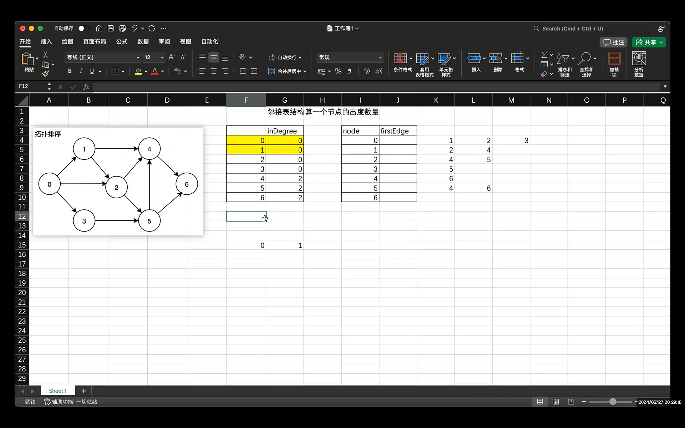
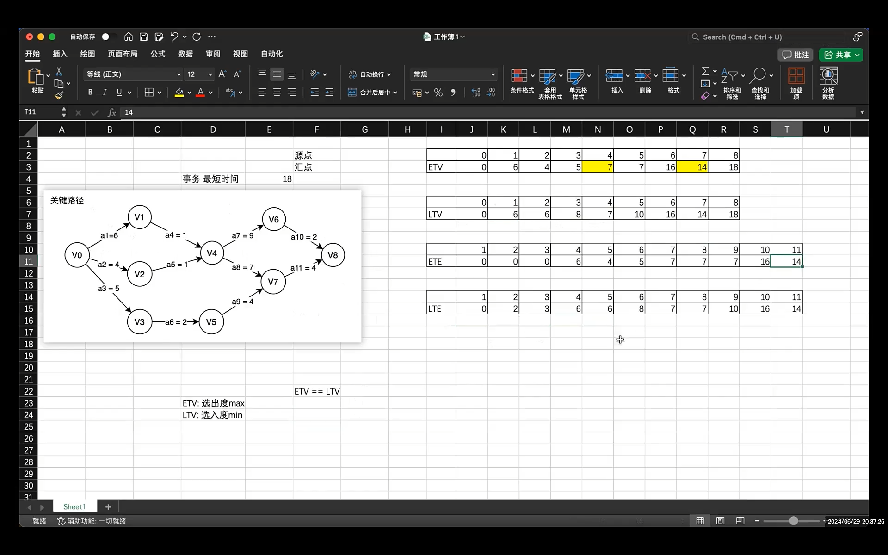
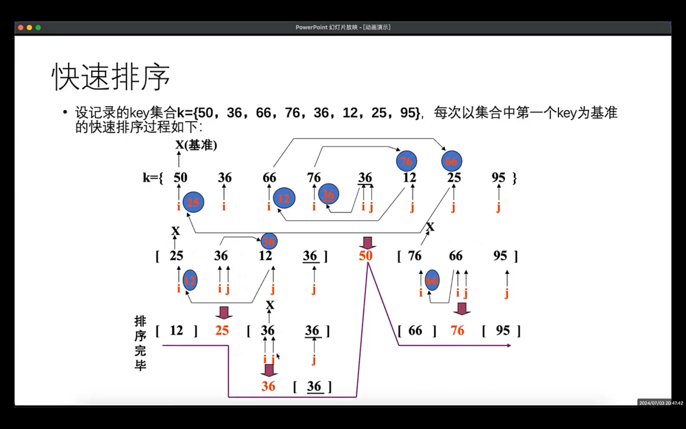
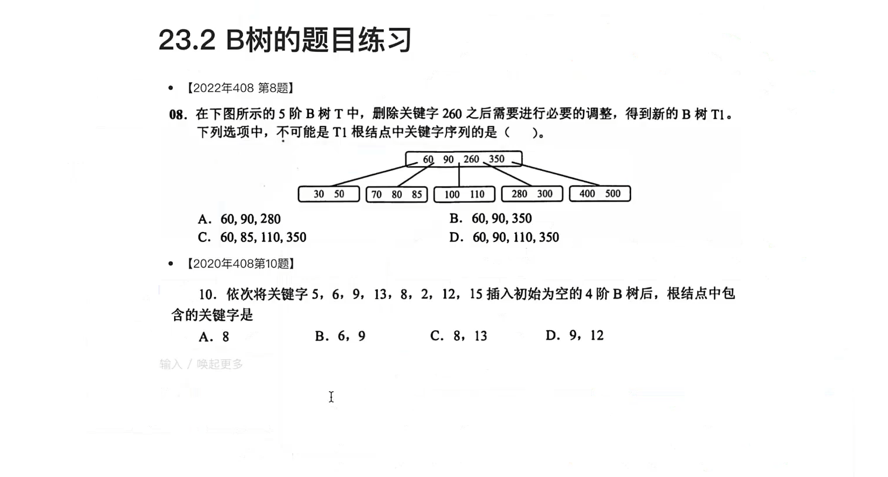
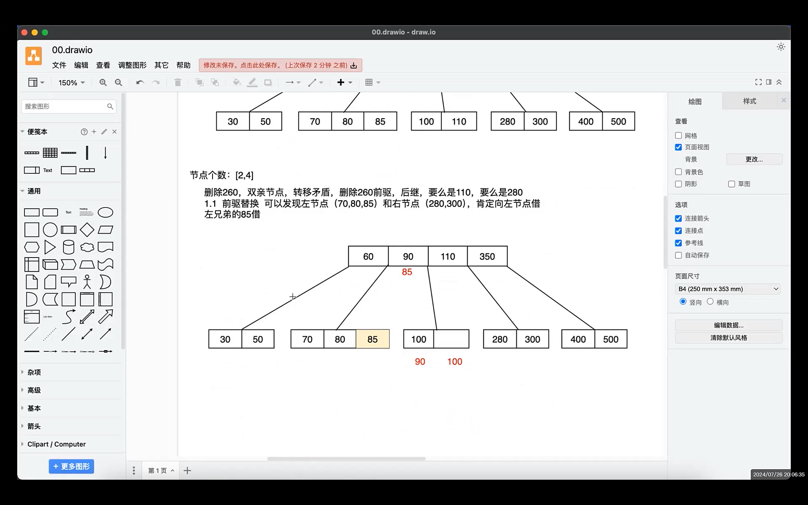
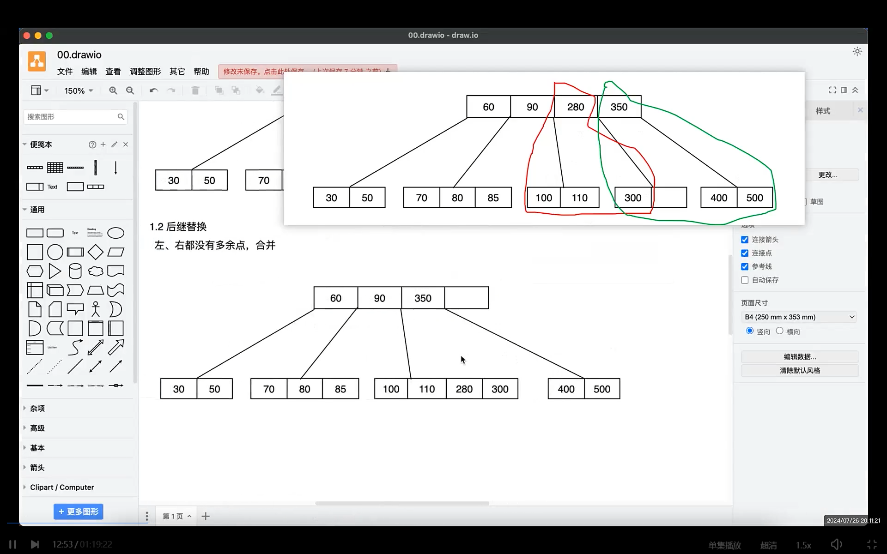
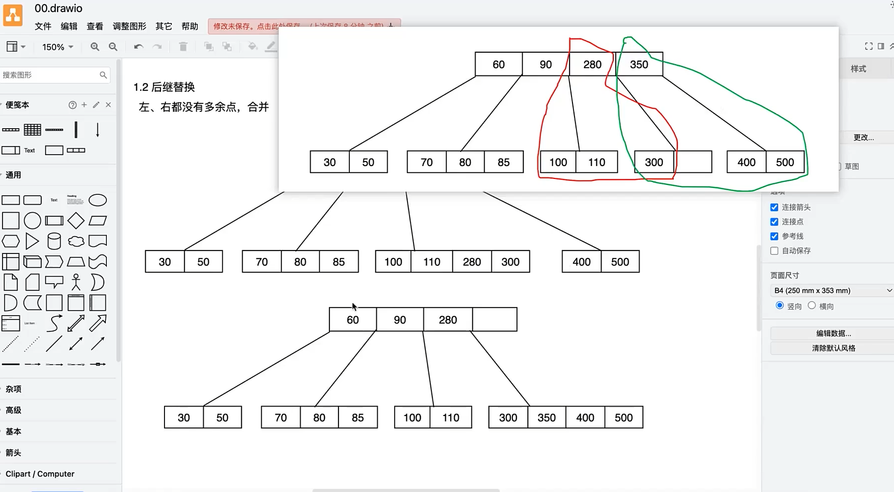
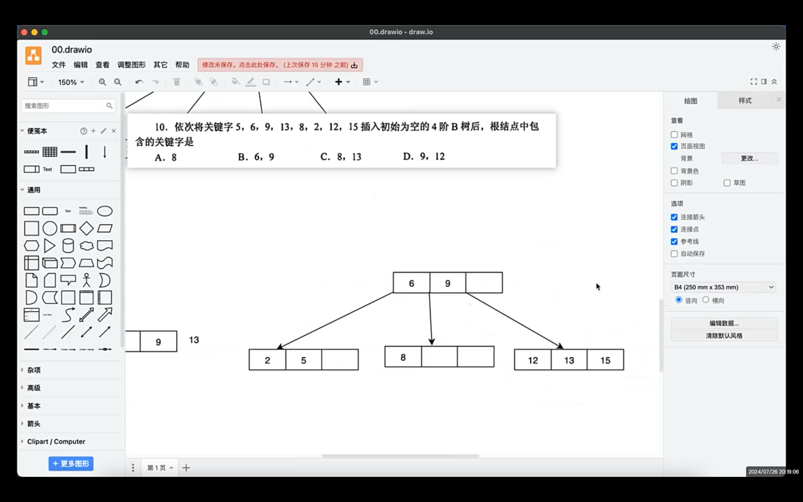
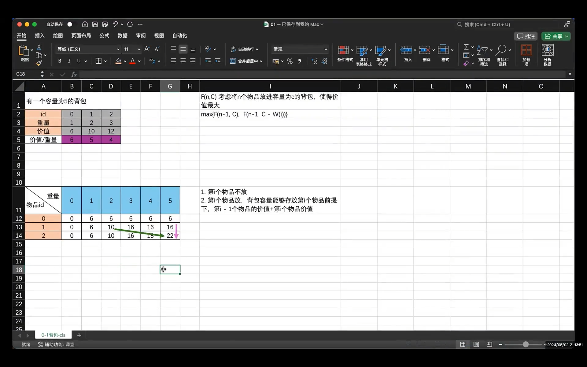
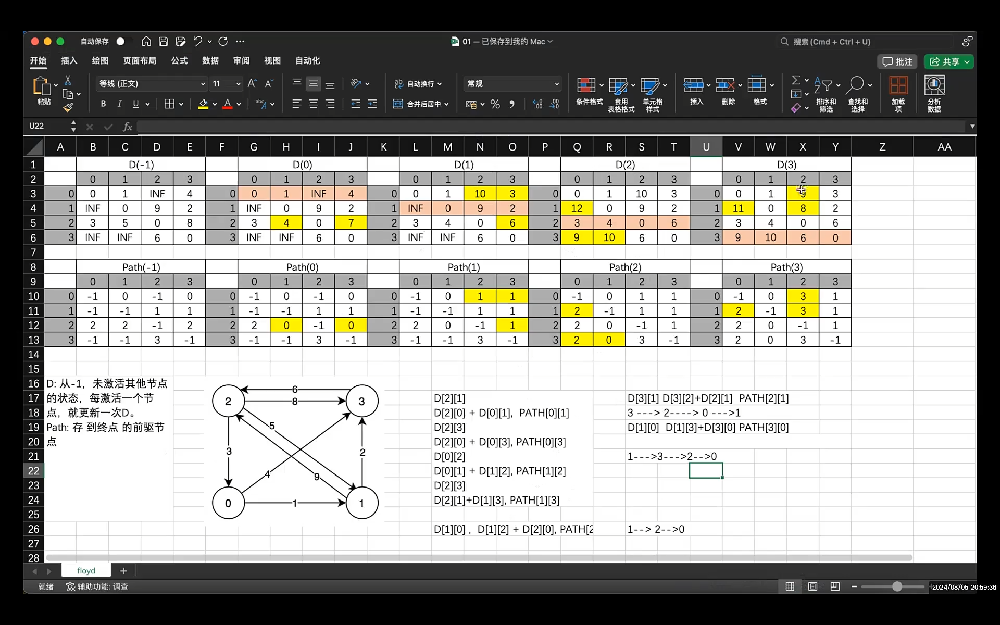

# 数据结构笔记（下）

## 拓扑排序



```c
/* 拓扑排序，AOV网，顶点表示活动，弧表示活动和活动之间的先后关系
 *  拓扑排序可以判断有向图是否有环
 * 算法：
 * 1. 从有向图中选择一个没有前驱（入度为0）的顶点，输出
 * 2. 删除从1的顶点对应的输出边，更新入度统计表，再找到度为0的顶点
 * 3. 重复上述2个步骤，直到没有顶点
 */

int TopologicalSortAGrap(AGraph* graph) {
	int count = 0;
	int* inDegree = malloc(sizeof(int) * graph->nodeNum);
	if (inDegree == NULL) {
		return -1;
	}
	memset(inDegree, 0, sizeof(int) * graph->nodeNum);
	// 1. 将有向图的所有入度边更新到入度记录表中
	for (int i = 0; i < graph->nodeNum; ++i) {
		if (graph->nodes[i].firstEdge) {
			ArcEdge* edge = graph->nodes[i].firstEdge;
			while (edge) {
				++inDegree[edge->no];
				edge = edge->next;
			}
		}
	}
	// 2. 查找入度记录表，度为0的顶点，入栈（也可以入队列），更新入度表，发现0，就放任务栈
	int* stack;
	int top = -1;
	stack = malloc(sizeof(int) * graph->nodeNum);
	if (stack == NULL) {
		free(inDegree);
		return -1;
	}
	// 2.1 找到入度为0的事务
	for (int i = 0; i < graph->nodeNum; ++i) {
		if (inDegree[i] == 0) {
			stack[++top] = i;
		}
	}
	// 3. 根据任务栈里的数据，弹出第一个任务，把这个任务当做将删除的节点，对应入度记录表更新
	// 直到没有任务，栈为空
	int index;
	while (top != -1) {
		index = stack[top--];
		count++;
		visitAGraphNode(&graph->nodes[index]);
		// 更新入度信息
		ArcEdge* edge = graph->nodes[index].firstEdge;
		while (edge) {
			--inDegree[edge->no];
			if (inDegree[edge->no] == 0) {
				stack[++top] = edge->no;
			}
			edge = edge->next;
		}
	}
	free(inDegree);
	free(stack);
	if (count == graph->nodeNum) {
		return 0;
	}
	return 1;
}
```

## 关键路径



```c
static int topologicalOrder(const AGraph* graph, int* ETV, int* LTV) {
	int* inDegree = malloc(sizeof(int) * graph->nodeNum);
	int* topOut = malloc(sizeof(int) * graph->nodeNum);
	if (inDegree == NULL) {
		return -1;
	}
	// 1. 初始化图中顶点的入度记录表
	memset(inDegree, 0, sizeof(int) * graph->nodeNum);
	for (int i = 0; i < graph->nodeNum; ++i) {
		if (graph->nodes[i].firstEdge) {
			ArcEdge* edge = graph->nodes[i].firstEdge;
			while (edge) {
				++inDegree[edge->no];
				edge = edge->next;
			}
		}
	}
	// 2. 将入度为0的节点入栈，以便后续任务的获取
	int top = -1;
	int* stack = malloc(sizeof(int) * graph->nodeNum);

	// 2.1 将初始化的入队为0的顶点编号入栈
	for (int i = 0; i < graph->nodeNum; ++i) {
		if (inDegree[i] == 0) {
			stack[++top] = i;
		}
	}
	// 2.2 不断弹栈，更新入度记录
	int tmp = 0;
	int index = 0;				// 拓扑排序的结果索引
	while (top != -1) {
		tmp = stack[top--];
		topOut[index++] = tmp;
		ArcEdge* edge = graph->nodes[tmp].firstEdge;
		while (edge) {
			--inDegree[edge->no];
			if (inDegree[edge->no] == 0) {
				stack[++top] = edge->no;
			}
			// 因为引入新的节点，入度的顶点发生变化，判断最大值，再更新ETV
			if (ETV[tmp] + edge->weight > ETV[edge->no]) {
				ETV[edge->no] = ETV[tmp] + edge->weight;
			}
			edge = edge->next;
		}
	}
	free(inDegree);
	free(stack);
	if (index < graph->nodeNum) {//有环
		free(topOut);
		free(inDegree);
		return -1;
	}
	tmp = topOut[--index];
	// 3. 更新LTV
	for (int i = 0; i < graph->nodeNum; ++i) {
		LTV[i] = ETV[tmp];
	}
	while (index) {
		int getTopNo = topOut[--index];
		ArcEdge* edge = graph->nodes[getTopNo].firstEdge;
		while (edge) {
			if (LTV[edge->no] - edge->weight < LTV[getTopNo]) {
				LTV[getTopNo] = LTV[edge->no] - edge->weight;
			}
			edge = edge->next;
		}
	}
	free(topOut);
	return 0;
}

static void showTable(int* table, int n, const char* name) {
	printf("%s", name);
	for (int i = 0; i < n; ++i) {
		printf("\t%d", table[i]);
	}
	printf("\n");
}

/* 为了算出AOE网关键路径，需要4个统计量：
 * ETV : 事件的最早发生时间		LTV ：事件的最晚发生时间
 * ETE : 活动最早发生时间		LTE ：活动最晚发生时间
 */
void keyPath(const AGraph* graph) {
	// 1. 计算顶点的ETV和LTV
	int* ETV = malloc(sizeof(int) * graph->nodeNum);
	int* LTV = malloc(sizeof(int) * graph->nodeNum);
	if (ETV == NULL || LTV == NULL) {
		printf("ETV LTV malloc failed!\n");
		return;
	}
	memset(ETV, 0, sizeof(int) * graph->nodeNum);
	memset(LTV, 0, sizeof(int) * graph->nodeNum);
	topologicalOrder(graph, ETV, LTV);
	showTable(ETV, graph->nodeNum, "ETV: ");
	showTable(LTV, graph->nodeNum, "LTV: ");
	// 2. 计算边的ETE和LTE，算关键路径，直接判断ETE和LTE是否相等
    	//ETE = 边对应弧尾位置顶点的ETV, LTE = 边对应弧头位置顶点的LTV-边的权值
		//比较ETE==LTE ---> 边对应弧尾位置顶点的ETV == 边对应弧头位置顶点的LTV-边的权值
		//整理可得，即判断顶点的ETV == 该顶点出度关系的边对应弧头位置顶点的LTV - 该边的权值
	for (int i = 0; i < graph->nodeNum; ++i) {
		ArcEdge* edge = graph->nodes[i].firstEdge;
		while (edge) {
			if (ETV[i] == LTV[edge->no] - edge->weight) {
				printf("<%s> --- %d ---- <%s>\n", graph->nodes[i].show, edge->weight, graph->nodes[edge->no].show);
			}
			edge = edge->next;
		}
	}
	free(ETV);
	free(LTV);
}
```

## 插⼊排序

### 直接插⼊排序

```c
/* 直接插入排序：
 * 1. 第一个元素有序，从第二个元素开始和前面有序的区域进行比较
 * 2. 待插入的元素i，和已经有序的区域从后往前依次确定位置
 *		若插入的元素 < 以有序区域的值，则有序区域往后移动一位
 *		插入查找范围[0, ~ i - 1]
 */

//普通写法
void insertSort(SortTable* table) {
	// 有多少个未被排序
	for (int i = 1; i < table->length; ++i) {
		if (table->data[i].key < table->data[i - 1].key) {
			// 用j作为辅助指针，查找到待插入的位置
			int j = i - 1;	//有序位置索引（有序区末索引）
			Element temp = table->data[i];	//将要插入的数据备份，便于下面比较大小
			// 查找索引从[0 ... i - 1]的位置
			while (j > -1 && temp.key < table->data[j].key) {	//遍历有序区，从后往前
				table->data[j + 1] = table->data[j];	
				//索引j+1处的data == tmp，因为tmp已备份，所以此处将j处数据向后挪，覆盖tmp的值				
				j--;	//接着往前遍历，比较大小
			}
			//相当于比待插入元素小的全向后挪一位（本质上是覆盖了后一个元素），此时j位置的值小于tmp，将tmp放置j+1位置即可
			table->data[j + 1] = temp;
		}
	}
}

// 类似扑克牌写法
void insertSortV1(SortTable* table) {
	for (int i = 1; i < table->length; ++i) {	//从第二个元素开始
		Element e = table->data[i];//备份
		int j;
		for (j = i; j > 0 && e.key < table->data[j - 1].key; --j) {
			table->data[j] = table->data[j - 1];
		}
		table->data[j] = e;
	}
}
```

### 希尔排序(shell 排序)

```c
void shellSort(SortTable* table) {
	int gap;
	for (gap = table->length / 2; gap > 0; gap /= 2) {
		// 共有gap个组，每一个组都执行插入排序
		for (int i = 0; i < gap; ++i) {
			for (int j = i + gap; j < table->length; j += gap) {
				if (table->data[j].key < table->data[j - gap].key) {
					//插入排序
					Element tmp = table->data[j];
					int k = j - gap;
					while (k > -1 && table->data[k].key > tmp.key) {
						table->data[k + gap] = table->data[k];
						k -= gap;
					}
                    table->data[k + gap] = tmp;
				}
			}
		}
	}
}
```

## 交换排序

### 冒泡排序

```c
/* 冒泡排序经典写法，遍历n-1轮，每轮发现一个最大值
 * 第一轮遍历区间 [0...n-1)		第二轮遍历区间 [0...n-2) ....
 */
void bubbleSortV1(SortTable* table) {
	for (int i = 0; i < table->length - 1; ++i) {		// 次数
		for (int j = 0; j < table->length - 1 - i; ++j) {
			if (table->data[j].key > table->data[j + 1].key) {
				swapElement(&table->data[j], &table->data[j + 1]);
			}
		}
	}
}

/* 优化写法一，引入一个是否有序的标识，当某一轮冒泡后，发现已经有序了，直接退出 */
void bubbleSortV2(SortTable* table) {
	for (int i = 0; i < table->length - 1; ++i) {		// 次数
		int isSorted = 1;
		for (int j = 0; j < table->length - 1 - i; ++j) {
			if (table->data[j].key > table->data[j + 1].key) {
				swapElement(&table->data[j], &table->data[j + 1]);
				isSorted = 0;
			}
		}
		if (isSorted) {
			break;
		}
	}
}

/* 优化写法二，减少每轮的查找区间，引入newIndex标记保存交换的索引位置，下次冒泡时，只需要循环到
*  newIndex所在位置 
*  每次冒泡排序之后，最后一个肯定是最大的，所以不需要再参与排序
*/
void bubbleSortV3(SortTable* table) {
	int newIndex;
	int n = table->length;
	do {
		newIndex = 0;
		for (int i = 0; i < n - 1; ++i) {
			if (table->data[i].key > table->data[i + 1].key) {
				swapElement(&table->data[i], &table->data[i + 1]);
				newIndex = i + 1;
			}
		}
		n = newIndex;
	} while (newIndex > 0);
}
```

### 快速排序



```c
/* 1. 从基准元素的下一个位置开始遍历数组
 * 2. 如果遍历到的元素大于基准值，就继续往后遍历
 * 3. 如果遍历到的元素小于基准元素
 *		3.1 把mark++ 边界扩大
 *		3.2 找到最小值 和 mark交换，因此mark下标所在值都是小于基准元素的
 * 最后将mark和基准值交换
 */
static int partitionSingle(SortTable* table, int startIndex, int endIndex) {
	keyType tmpValue = table->data[startIndex].key;
	int mark = startIndex;

	for (int i = startIndex + 1; i <= endIndex; ++i) {
		if (table->data[i].key < tmpValue) {
			mark++;
			swapElement(&table->data[mark], &table->data[i]);
		}
	}
	swapElement(&table->data[mark], &table->data[startIndex]);
	return mark;
}

static int partitionDouble(SortTable* table, int startIndex, int endIndex) {
	int pivot = startIndex;
	int left = startIndex;
	int right = endIndex;
	srand(time(NULL));
	//随机取一点为犄点，交换后startIndex这一点可能为这组数中的任何值
	swapElement(&table->data[startIndex], &table->data[rand() % (endIndex - startIndex) + startIndex]);

	while (left != right) {
		// 先找到犄点右边的最小值的索引
		while (left < right && table->data[right].key > table->data[pivot].key) right--;
		// 再找到左边的比犄点大的索引
		while (left < right && table->data[left].key <= table->data[pivot].key)	left++;
		// 交换
		if (left < right) {
			swapElement(&table->data[right], &table->data[left]);
		}
	}
	swapElement(&table->data[pivot], &table->data[left]);
	return left;
}

/* 双边循环法 */
static void quickSort1(SortTable* table, int startIndex, int endIndex) {
	if (startIndex >= endIndex) {
		return;
	}
	// 得到基准值
	int pivot = partitionDouble(table, startIndex, endIndex);
	quickSort1(table, startIndex, pivot - 1);
	quickSort1(table, pivot + 1, endIndex);
}

/* 单边循环法 */
static void quickSort2(SortTable* table, int startIndex, int endIndex) {
	if (startIndex >= endIndex) {
		return;
	}
	// 得到基准值
	int pivot = partitionSingle(table, startIndex, endIndex);
	quickSort2(table, startIndex, pivot - 1);
	quickSort2(table, pivot + 1, endIndex);
}


/* 快速排序有两种方法来寻找犄点
 * 随机找一个值，当做犄点值，进行快排，这个值当做中心点
 * 1.双边循环法
 *   i j  i-->left    j--->right
 * 2.单边循环法
 */
void quickSortV1(SortTable* table) {
	quickSort1(table, 0, table->length - 1);
}

void quickSortV2(SortTable* table) {
	quickSort2(table, 0, table->length - 1);
}
```

## 堆排序

> 堆（Heap）是⼀类基于完全⼆叉树的特殊数据结构。 通常将堆分为两种类型： 
>
> 1、⼤顶堆（Max Heap）： 在⼤顶堆中，根节点的值必须⼤于他的孩⼦节点的值，对于⼆叉树中所有⼦树都满⾜此规律；
>
> 2、⼩顶堆（Min Heap）： 在⼩顶堆中，根节点的值必须⼩于他的孩⼦节点的值，对于⼆叉树中所有⼦树都满⾜此规律；
>
> ⼆叉堆的存储，申请n+1个空间，从1索引开始存储，满⾜[i/2, i, 2i, 2i+1]的⽗、⾃⼰、左孩、右孩的索引关系。

```c
/* 最小堆结构，使用完全二叉树进行维护，其中头节点是其余节点的最小值
 * 此结构适用于数组空间存储，满足[i/2, i, 2i, 2i+1]的逻辑操作
 * 根节点从1号索引进行存储
 * */
typedef struct {
	keyType* data;			// 用顺序存储方式保存堆数据
	int len;				// 约束堆data域的长度
	int capacity;			// 最大容量
}MiniHeap;


MiniHeap* createMiniHeap(int n) {
	MiniHeap* heap = (MiniHeap*)malloc(sizeof(MiniHeap));
	if (heap == NULL) {
		fprintf(stderr, "heap malloc failed!\n");
		return NULL;
	}
	// 从1号索引开始存放数据
	heap->data = (keyType*)malloc(sizeof(keyType) * (n + 1));
	if (heap->data == NULL) {
		fprintf(stderr, "data malloc failed!\n");
		free(heap);
		return NULL;
	}
	memset(heap->data, 0, sizeof(keyType) * (n + 1));
	heap->len = 0;					// 指向了满元素，每次插入元素先加1，再插入
	heap->capacity = n;
	return heap;
}
/* 释放最小堆 */
void releaseMiniHeap(MiniHeap* heap) {
	if (heap) {
		if (heap->data) {
			free(heap->data);
			heap->data = NULL;
		}
		free(heap);
	}
}
// ------------------- 二叉堆的插入操作 --------------------------
// 从k索引位置开始判断，进行上浮操作
static void shiftUp(MiniHeap* heap, int k) {
	keyType tmp;
	// k/2表示父节点，k节点是子节点，如果父节点大，那么和他交换
	while (k > 1 && heap->data[k / 2] > heap->data[k]) {
		tmp = heap->data[k];
		heap->data[k] = heap->data[k / 2];
		heap->data[k / 2] = tmp;
		k /= 2;							// 更新k的信息
	}
}
/* 在二叉堆中插入元素，先在最后位置插入元素，
 * 然后通过上移操作，确定这个新元素的位置，保证每个根节点是子节点的最小值
 * */
void insertMiniHeap(MiniHeap* heap, keyType e) {
	if (heap->len + 1 > heap->capacity) {
		fprintf(stderr, "MiniHeap Space small!\n");
		return;
	}
	heap->data[++heap->len] = e;			// 满性质的插入
	// 上移操作
	shiftUp(heap, heap->len);
}
// ------------------- 二叉堆的提取操作 --------------------------
/* 从k索引位置，向下沉 */
static void shiftDown(MiniHeap* heap, int k) {
	keyType tmp;
	while (2 * k <= heap->len) {      // 保证有左孩子
		int index = 2 * k;
		if (index + 1 <= heap->len && heap->data[index + 1] < heap->data[index]) {
			index += 1;             // 如果右孩子比左孩子小，那么就交换右孩子,index指向右孩子
		}
		if (heap->data[k] <= heap->data[index])
			break;
		tmp = heap->data[k];
		heap->data[k] = heap->data[index];
		heap->data[index] = tmp;
		k = index;
	}
}
/* 最小堆取出最小值
 * 取出堆顶的元素，把堆的最后一个元素放到堆顶，根据原则，下沉
 * */
keyType extractMini(MiniHeap* heap) {
	if (heap->len <= 0) {
		printf("MiniHeap no Data!\n");
		return 0;
	}
	keyType ret = heap->data[1];        	// 取出最小堆
	heap->data[1] = heap->data[heap->len];	// 最后一个元素和根元素交换
	heap->len--;
	shiftDown(heap, 1);
	return ret;
}


// 随机排序表的堆排序
void miniHeapSort(SortTable* table) {
	MiniHeap* miniHeap = createMiniHeap(table->length);
	for (int i = 0; i < table->length; ++i) {
		insertMiniHeap(miniHeap, table->data[i].key);
	}
	for (int i = 0; i < table->length; ++i) {
		table->data[i].key = extractMini(miniHeap);
	}
	releaseMiniHeap(miniHeap);
}
```

## 归并排序

```c
// 合并
static void merge(SortTable* table, int left, int mid, int right) {
	int n1 = mid - left + 1;				// 左边空间的个数
	int n2 = right - mid;					// 右边空间的个数
	// 分配aux1和aux2
	Element* aux1 = malloc(sizeof(Element) * n1);
	Element* aux2 = malloc(sizeof(Element) * n2);

	for (int i = 0; i < n1; ++i) {
		aux1[i] = table->data[left + i];
	}
	for (int i = 0; i < n2; ++i) {
		aux2[i] = table->data[mid + 1 + i];
	}
	// 对已经有序的aux1和aux2进行归并
	int i = 0;				// 标记aux1区域查找位置
	int j = 0;				// 标记aux2区域查找位置
	int k = left;			// 存放结果的区域位置

	while (i < n1 && j < n2) {
		if (aux1[i].key <= aux2[j].key) {
			table->data[k] = aux1[i++];
		}
		else if (aux1[i].key > aux2[j].key) {
			table->data[k] = aux2[j++];
		}
		++k;
	}
	// 判断哪个区域还有值，填入后续的空间
	while (i < n1) {
		table->data[k++] = aux1[i++];
	}
	while (j < n2) {
		table->data[k++] = aux2[j++];
	}

	free(aux1);
	free(aux2);
}

// 拆分子问题，为合并提供接口描述依赖
static void mergeLoop(SortTable* table, int left, int right) {
	if (left == right) {
		return;
	}
	int mid = (left + right) / 2;
	mergeLoop(table, left, mid);
	mergeLoop(table, mid + 1, right);
	// 拆的任务结束，开始合并
	merge(table, left, mid, right);
}

void mergeSort(SortTable* table) {
	mergeLoop(table, 0, table->length - 1);
}
```

## 折半查找（二分查找）

```c
/* 数组空间有序，在闭区间搜索，不断的旋转区间范围[0 ... n - 1]
 * 确定left和right的区间，依靠mid的值，根据mid的值重新确定left和right
 */
int binarySearch(const Element* arr, int n, Element target) {
	int left = 0;
	int right = n - 1;
	int mid;
	while (left <= right) {
		// mid = (left + right) / 2;   这种容易引起越界
		mid = left + (right - left) / 2;
		if (arr[mid] == target) {
			return mid;
		}
		if (arr[mid] < target) {
			left = mid + 1;
		}
		else {
			right = mid - 1;
		}
	}
	return -1;
}
```

## 哈希查找

```c
/*
* 哈希函数的构造--->除留余数法
* 
* 处理冲突的⽅法--->链地址法:
* 将所有产⽣冲突的关键字所对应的数据全部存储在同⼀个线性链表中
*/

typedef int Element;
typedef struct hashNode {
	Element key;
	struct hashNode* next;
} HashNode;

typedef struct {
	HashNode** data;
	size_t len;
	int (*hash)(Element x);
} HashList;


static int hashMod13(Element x) {
	return x % 13;
}

//装填因子factor，相当于密度，表长=元素个数/装填因子
HashList* initHashList(size_t n, double factor) {
	HashList* table;
	size_t cnt = (size_t)((n * 1.0) / factor);
	printf("cnt  = %lu\n", cnt);

	table = malloc(sizeof(HashList));
	table->data = malloc(sizeof(HashNode*) * cnt);
	memset(table->data, 0, sizeof(HashNode*) * cnt);
	table->len = cnt;
	table->hash = hashMod13;

	return table;
}

// 插入节点
void setValue(HashList* hash_list, Element e) {
	// 1. 先创建节点
	HashNode* node = malloc(sizeof(HashNode));
	if (node == NULL) {
		printf("malloc failed!\n");
		return;
	}
	node->key = e;
	node->next = NULL;
	// 2. 处理关系，先确定数组的位置，再关系
	int pos = hash_list->hash(e);
	HashNode* p = hash_list->data[pos];
	if (p) {
		node->next = p->next;
		p->next = node;
	}
	else {
		hash_list->data[pos] = node;
	}
}

int findValue(const HashList* hash_list, Element e) {
	int pos = hash_list->hash(e);
	HashNode* p = hash_list->data[pos];
	while (p) {
		if (p->key == e) {
			return 1;
		}
		p = p->next;
	}
	return 0;
}
```

## 红黑树

### 特性

> (1) 每个节点或者是⿊⾊，或者是红⾊。 
>
> (2) 根节点是⿊⾊。  
>
> (3) 每个叶⼦节点是⿊⾊。 [注意：这⾥叶⼦节点，是指为空的叶⼦节点！]  
>
> (4) 如果⼀个节点是红⾊的，则它的⼦节点必须是⿊⾊的。[不存在两个相邻的红⾊节点]  
>
> (5) 从⼀个节点到该节点的⼦孙节点的所有路径上包含相同数⽬的⿊节点。[⿊⾼相同]
>
> (6) 在红⿊树当中，不可能出现3个节点的**单链表**
>
> (7) 在⼀颗红⿊树中，从某个结点 x 出发（不包含该结点）到达⼀个叶结点的任意⼀条简单路径上包含 的⿊⾊结点的数⽬称为⿊⾼ 

### 插入

> 将插⼊的节点着⾊为红⾊(这样操作前五个特性只会第四条有可能会违背)
>
> 因此插入逻辑主要是对红红节点的处理
>
> 红红节点⼀定有叔叔节点，调整的核⼼就是看叔叔节点的颜⾊
>
> 1. 叔叔节点是红⾊
>
> 	(01) 将“ ⽗节点” 设为⿊⾊。  
>
> 	(02) 将“ 叔叔节点” 设为⿊⾊。 
>
> 	(03) 将“ 祖⽗节点” 设为“ 红⾊” 。
>
> 	(04) 将“ 祖⽗节点” 设为“ 当前节点” ；
>
> 	如果新的当前节点（即g节点）是根节点，将其设置为⿊⾊，否则重复执行
>
> 2. 叔叔节点是⿊⾊
>
> 	第一个：祖父节点到父节点，父节点在左边（左孩子）则为  L,   在右边（右孩子）则为  R
>
> 	第二个：父节点到目标节点，目标节点在左边（左孩子）则为  L,   在右边（右孩子）则为  R
>
> 	p--->parent,	g--->grandparent,	x--->目标节点
>
> 
>
> ```tex
> LL：
> 
> (01) 将“ ⽗节点” 设为“ ⿊⾊” 
> 
> (02) 将“ 祖⽗节点” 设为“ 红⾊” 
> 
> (03) 以“ 祖⽗节点” 为⽀点进⾏右旋
> 
> LR：
> 
> (01) 左旋p
> 
> (02)重新标记 x 和 p ，就成为 LL 的情况
> ```
>
> 
>
> ```tex
> RR：
> 
> (01) 将“ ⽗节点” 设为“ ⿊⾊”
> 
> (02) 将“ 祖⽗节点” 设为“ 红⾊”
> 
> (03) 以“ 祖⽗节点” 为⽀点进⾏左旋。
> 
> RL：
> 
> (01) 右旋p
> 
> (02)重新标记 x 和 p ，就成为 RR 的情况
> ```
>
> 

```c
/* 1. 插入的节点，如果父节点是黑色，那么就不用调整
 * 2. 如果父节点是红色，就出现两个红，进行调整
 * 2.1 叔叔节点是红色
 *		重新调整颜色（g->红，p->黑，u->黑），grand作为新节点再进行判断
 * 2.2 叔叔节点是黑色
 *		2.2.1 cur左孩子，par是左孩子
 *			g右旋  g->红，p->黑
 *		2.2.2 cur右孩子，par是右孩子
 *			g左旋 g->红，p->黑
 *		2.2.3 cur右孩子，par是左孩子
 *			p左旋，cur和par交换，转入2.2.1
 *		2.2.4 cur左孩子，par是右孩子
 *			p右旋，cur和par交换，转入2.2.2
 */
static void insertFixUp(RBTree *tree, RBNode *node) {
	RBNode *parent, *grandParent;
	RBNode *uncle;
	RBNode *tmp;
	parent = node->parent;
	// 若父节点存在且父节点是红色，就调整
	while (parent && (parent->color == RED)) {
		// 找祖父节点，根据祖父节点的关系，确定uncle
		grandParent = parent->parent;
		if (parent == grandParent->left) {
			uncle = grandParent->right;
		} else {
			uncle = grandParent->left;
		}
		if (uncle && uncle->color == RED) {//叔叔节点为红情况
			uncle->color = BLACK;
			parent->color = BLACK;
			grandParent->color = RED;
			node = grandParent;
			parent = node->parent;
			continue;	//以祖父节点为当前节点，再次重新判断
		}
		if (grandParent->left == parent) {		// L
			if (parent->right == node) {		// R
				leftRotate(tree, parent);
				tmp = parent;
				parent = node;
				node = tmp;
			}
			// 此时LL
			rightRotate(tree, grandParent);
			grandParent->color = RED;
			parent->color = BLACK;
		} else {								// R
			if (parent->left == node) {
				rightRotate(tree, parent);
				tmp = parent;
				parent = node;
				node = tmp;
			}
			leftRotate(tree, grandParent);
			grandParent->color = RED;
			parent->color = BLACK;
		}
	}
	tree->root->color = BLACK;
}

/* 将x进行左旋，将左、右、父节点进行更新
 *      px                              px
 *     /                               /
 *    x                               y
 *   /  \      --(左旋)-->           / \
 *  lx   y                          x  ry
 *     /   \                       /  \
 *    ly   ry                     lx  ly
*/
static void leftRotate(RBTree *tree, RBNode *x) {
	RBNode *y = x->right;
	x->right = y->left;
	if (y->left) {
		y->left->parent = x;
	}
	y->parent = x->parent;
	if (x->parent) {
		if (x->parent->left == x) {
			x->parent->left = y;
		} else {
			x->parent->right = y;
		}
	} else {
		tree->root = y;
	}
	y->left = x;
	x->parent = y;
}

/* 将y进行左旋，将左、右、父节点进行更新
 *           py                               py
 *           /                                /
 *          y                                x
 *         /  \      --(右旋)-->            /  \
 *        x   ry                           lx   y
 *       / \                                   / \
 *      lx  rx                                rx  ry
 * */
static void rightRotate(RBTree* tree, RBNode *y) {
	RBNode *x = y->left;
	y->left = x->right;
	if (x->right) {
		x->right->parent = y;
	}
	x->parent = y->parent;
	if (y->parent) {
		if (y->parent->right == y) {
			y->parent->right = x;
		} else {
			y->parent->left =x;
		}
	} else {
		tree->root = x;
	}
	x->right = y;
	y->parent = x;
}

//插入
void insertRBTree(RBTree* tree, KeyType key) {
	// 1. 先创建一个红色的节点
	RBNode *node = createRBNode(key);
	// 2. 根据二叉搜索树的规则找到待插入的位置
	RBNode *cur = tree->root;
	RBNode *pre = NULL;
	while (cur) {
		pre = cur;
		if (key < cur->key) {
			cur = cur->left;
		} else if (key > cur->key) {
			cur = cur->right;
		} else {
			printf("Key: %d have exist!\n", key);
			free(node);
			return;
		}
	}
	// 3. 在对应的位置上插入，若是根节点，更新tree
	node->parent = pre;
	if (pre) {
		if (key < pre->key) {
			pre->left = node;
		} else {
			pre->right = node;
		}
	} else {
		tree->root = node;
	}
	tree->count++;
	// 4. 修复红黑树（判断是否是红红节点）
	insertFixUp(tree, node);
}
```

### 删除

> 删除逻辑与 `BST`逻辑一致，最终都会以删除⼀个叶⼦结点或者只有⼀个孩⼦的结点而结束，度为2的节点将转换成度为1的节点处理
>
> 假设 y是要删除的节点，x是⽤来替换的节点( x 是  y节点的子节点，当y是叶节点时，x是NULL节点，当做黑色节点处理)
>
> a. 将红⿊树当作⼀颗⼆叉查找树，将该节点从⼆叉查找树中删除
>
> b. 通过"旋转和重新着⾊"等⼀系列来修正该树，使之重新成为⼀棵红⿊树。
>
> 
>
> 1. 简单情况
>
> 	y或者x有⼀个是红⾊节点, 我们将 替换y节点的结点  x 标记为⿊⾊结点（这样⿊⾼就不会变 化）。
>
> 2. 复杂情况
>
> 	y和x都是⿊⾊节点 
>
> 	双⿊节点的定义： 
>
> 	​	当要删除结点 y  和孩⼦结点 x 都是⿊⾊结点，删除结点 y ，导致结点 x 变为双⿊结点。 当 x 变成双⿊结点时，我们的主要任务将变成将该双⿊结点 x 变成普通的单⿊结点。⼀定要 特别注意，NULL结点为⿊⾊结点 ，所以删除⿊⾊的叶⼦结点就会产⽣⼀个双⿊结点。
>
> 
>
> 复杂情况，==分两大类讨论：==
>
> **2.1 当前节点x是双⿊节点且不是根节点**
>
> (1) **x的兄弟节点w是⿊⾊且w的孩⼦节点⾄少有⼀个是红⾊的**
>
> w的⼀个红⾊节点⽤r表示，x和w的⽗节点⽤ p表示
>
> ​	(a) 其中LR想办法转为LL，RL想办法转为RR的形式
>
> ​		LR --> LL的⽅法：w的右孩⼦变为⿊⾊，w变为红⾊，以w为节点进⾏左旋
>
> ​		RL --> RR的⽅法：w的左孩⼦变为⿊⾊，w变为红⾊，以w为节点进⾏右旋。
>
> ​	(b) LL的调整⽅法，r节点(w的左孩⼦)变为⿊⾊，w节点变为⽗节点颜⾊，⽗节点变为⿊⾊，右旋父节点 
>
> ​	(c) RR的调整⽅法，r节点(w的右孩⼦)变为⿊⾊，w节点变为⽗节点颜⾊，⽗节点变为⿊⾊，左旋 父节点 
>
> (2) **x的兄弟节点w是⿊⾊且它的两个孩⼦都是⿊⾊的**
>
> ​	对于这种情况需要递归地进⾏处理，如果删除结点后得到的双⿊结点的⽗结点此时为⿊⾊，则结点  u 变单⿊，且结点 u 的⽗结点 p 变双⿊，然后对结点 u 的⽗结点 p 继续进⾏处理，直到当前处理的双⿊结点的⽗结点为红⾊结点，此时将双⿊结点的⽗结点设置为⿊⾊，双⿊结点变为单⿊结点（红⾊ + 双⿊  = 单⿊）。
>
> (3) **x的兄弟节点w是红⾊**
>
> ​	当前 x 的兄弟结点 w 是红⾊结点时，通过旋转操作将 x 当前的兄弟结点向上移动，并对 x 的⽗结 点和其旋转前的兄弟结点重新着⾊，接着继续对结点 x 旋转后的兄弟结点 w 进⾏判断，确定相应的平衡 操作。旋转操作将 x 的兄弟结点情况⼜会转换为前⾯的（1）和（2）的情况。
>
> ​		(a)将w设置为⿊⾊
>
> ​		(b)将p设置为红⾊
>
> ​		(c)对⽗进⾏旋转
>
> ​		(d)重新设置w
>
> **2.2 当前节点x是双⿊节点且是根节点** 

```c
static void deleteFixup(RBTree *tree, RBNode *x, RBNode *parent) {
	RBNode *w;
	while (tree->root != x && (!x || x->color == BLACK)) {
		if (parent->left == x) {
			w = parent->right;
			if (w->color == RED) {
				// case 1，兄弟节点是红色
				w->color = BLACK;
				parent->color = RED;
				leftRotate(tree, parent);
				w = parent->right;
			}
			// 兄弟节点就都是黑色的了
			if ((!w->left || w->left->color == BLACK) &&
				(!w->right || w->right->color == BLACK)) {
				// case2 x的兄弟是黑色，x的兄弟的两个孩子都是黑色
				w->color = RED;
				x = parent;
				parent = x->parent;
			} else {
				// case 3 x的兄弟是黑色，x的兄弟左孩子是红色，右孩子是黑色
				if (!w->right || w->right->color == BLACK) {
					w->left->color = BLACK;
					w->color = RED;
					rightRotate(tree, w);
					w = parent->right;
				}
				// case 4 同向红
				w->color = parent->color;
				parent->color = BLACK;
				w->right->color = BLACK;
				leftRotate(tree, parent);
				x = tree->root;
			}
		} else {
			w = parent->left;
			if (w->color == RED) {
				// case 1，兄弟节点是红色
				w->color = BLACK;
				parent->color = RED;
				rightRotate(tree, parent);
				w = parent->left;
			}
			if ((!w->left || w->left->color == BLACK) &&
				(!w->right || w->right->color == BLACK)) {
				// case 2   x的兄弟是黑色，且w的两个孩子也是黑色
				w->color = RED;
				x = parent;
				parent = x->parent;
			} else {
				if (!w->left || w->left->color == BLACK) {
					// case 3  没有同向红
					w->right->color = BLACK;
					w->color = RED;
					leftRotate(tree, w);
					w = parent->left;
				}
				// case 4:
				w->color = parent->color;
				parent->color = BLACK;
				w->left->color = BLACK;
				rightRotate(tree, parent);
				x = tree->root;
				break;
			}
		}
	}
	if (x) {
		x->color = BLACK;
	}
}

static void deleteRBNode(RBTree *tree, RBNode *node) {
	RBNode *y;				// 真正删除的节点地址
	RBNode *x;				// 替换节点
	RBNode *parent;
	if (node->left == NULL || node->right == NULL) {
		y = node;
	} else {
		y = node->left;
		while (y->right) {
			y = y->right;
		}
	}
	// 真正删除节点找到了，开始寻找替换节点
	if (y->left) {
		x = y->left;
	} else {
		x = y->right;
	}
	parent = y->parent;
	// 开始更新替换节点和原父节点的关系
	if (x) {
		x->parent = parent;
	}
	if (y->parent == NULL) {
		tree->root = x;
	} else if (y->parent->left == y) {
		y->parent->left = x;
	} else {
		y->parent->right = x;
	}
	if (y != node) {
		node->key = y->key;
	}
	// 如果删除的是黑色
	if (y->color == BLACK) {
		// 需要调整
		deleteFixup(tree, x, parent);
	}
	free(y);
}

void deleteRBTree(RBTree* tree, KeyType key) {
	// 1. 查找到key所在的节点
	RBNode *node = searchRBNode(tree, key);
	// 2. 删除节点
	if (node) {
		deleteRBNode(tree, node);
	}
}

RBNode* searchRBNode(const RBTree* tree, KeyType key) {
	RBNode *node = tree->root;
	while (node) {
		if (key < node->key) {
			node = node->left;
		} else if (key > node->key) {
			node = node->right;
		} else {
			return node;
		}
	}
	return NULL;
}
```

## B-树

### 定义

> B-树，⼜称多路平衡查找树，B树中所有结点的孩⼦个数的最⼤值称为B树的阶 ，通常⽤ m 表示。 当m=2时，就是常⻅的⼆叉搜索树。在m阶B树中，节点中 n 个关键字对应 n+1 棵子树
>
> ⼀颗m阶的B树定义如下： 
>
> (1)每个结点最多有m-1个关键字
>
> (2)根节点最少可以只有1个关键字
>
> (3)⾮根节点⾄少有`ceil(m/2) - 1`个关键字	(二分之m向上取整)
>
> (4)每个节点中的关键字都按照从⼩到⼤的顺序排列，每个关键字的左⼦树的所有关键字都⼩于它， ⽽右⼦树中的所有关键字都⼤于它
>
> (5)所有叶⼦节点都位于同⼀层，或者说根节点到每个叶⼦节点的⻓度相同

### 回溯法插入

> 先通过上⾯的定位操作定位到⼀个查找失败的节点，然后检查该节点的⽗节点的关键字个数，若是关键字个数⼩于m-1，那么说明可以直接插⼊到该节点（叶⼦节点），否则的话插⼊后会引起节点的分裂。
>
> 具体分裂的⽅法：
>
> (1)取⼀个新节点，在插⼊key后的原节点，从中间位置`ceil(m/2)`将其中的关键字分为两部分
>
> (2)左部分包含的关键字放在原节点中，右部分包含的关键字放到新节点中，中间位置`ceil(m/2)`的节 点插⼊原节点的⽗节点
>
> (3)若此时导致其⽗节点的关键字个数也超过了上限，则继续进⾏这种分裂操作，直到这个过程传到 根节点为⽌。当然B-树的⾼度也增加
>
> 实际上就是将`ceil(m/2)`位置的关键字直接变为其左边和右边关键字的⽗节点，然后往上贡献⼀个关键字,可能导致⽗节点层分裂，然后继续向上贡献⼀个关键字。
>
> 插入看最大关键字数，向上贡献，空插入时，先填满根节点最大关键字数，再向下分裂，子孩子填满再上浮
>
> 在同一个节点中依次插入关键字时，要按照按从小到大的顺序进行排列调整

### 删除

> 1.删除叶⼦节点中元素
>
> ​	(1)搜索要删除的元素
>
> ​	(2)如果它在叶⼦节点上，直接将其删除
>
> ​	(3)如果删除后产⽣了下溢出（键数⼩于最⼩值），则向其兄弟节点借元素。即将其⽗节点元素下移至当前节		点，将兄弟节点中元素上移⾄⽗节点（若是左节点，上移最⼤元素；若是右节 点，上移最⼩元素）
>
> ​	(4)若兄弟节点也达到下限，则合并兄弟节点与分割键。
>
> 
>
> 2.删除内部节点中的元素
>
> (1)内部节点中元素为其左右⼦节点的分割值，需要从左⼦节点最⼤元素或右⼦节点中最⼩元素 中选⼀个新的分割符。被选中的分割符从原⼦节点中移除，作为新的分隔值替换掉被删除的元素。
>
> (2)上⼀步中，若左右⼦节点元素均达到下限，则合并左右⼦节点
>
> (3)若删除元素后，其中节点元素⼩于下限，则继续合并。
>
> 删除看最小关键字数，即节点下限，先找兄弟借，借不到再合并，进行下沉

### 习题



#### 习题一







> 删除节后后，调整合并时，别忘了父节点一起合并，进行下沉

#### 习题二



> 新插入关键字到达分裂临界时，如果关键字数量是偶数，要提前规定如何划分，左少右多还是左多右少，将哪个关键字上浮，分两种情况讨论

## B+树

### 性质

> ⼀颗m阶B+树需满⾜下列条件： 
>
> (1)每个分⽀节点最多有m棵⼦树（孩⼦节点）
>
> (2)⾮叶根节点⾄少有两颗⼦树，其他每个分⽀节点⾄少有`ceil(m/2)`棵⼦树
>
> (3)节点的⼦树个数与关键字个数相等
>
> (4)所有叶节点包含关键字及指向相应记录的指针，叶节点中将关键字按⼤⼩顺序排列，并且相邻 叶节点按⼤⼩顺     序相互链接起来。
>
> (5)所有分⽀节点中仅包含它的各个⼦节点中关键字的最⼤值及指向其⼦节点的指针

### B+树与B树的区别

> (1)	m阶B+树，节点中的n个关键字对应n棵⼦树，⽽m阶B树，节点中n个关键字对应n+1棵⼦树
>
> (2)	m阶B树，要保证每个节点不能低于`ceil(m/2)`个分⽀数 
>
> ​			根节点的关键字数 `n ∈ [1, m - 1]` 
>
> ​			其他节点的关键字数 `n ∈ [ceil(m/2) - 1, m - 1]`
>
> (3)	m阶B+树
>
> ​			根节点的关键字数 `n ∈ [1, m]` 
>
> ​			其他节点的关键字数 `n ∈ [ceil(m/2), m]`
>
> (4)	在B+树中，叶节点包含全部关键字，⾮叶节点中出现过的关键字也会出现在叶节点中，⽽B树中， 各节点中	包含的关键字是不重复的。
>
> (5)	在B+树中，叶节点包含信息，所有⾮叶节点仅起索引作⽤，⾮叶节点中的每个索引项只包含有对应 ⼦树的最	大关键字和指向⼦树的指针，不包含有该关键字对应记录的存储地址。B树的节点中包含了 关键字对应的记录的	存储地址。

## 动态规划初探

### 斐波那契数列

#### 备忘录法（记忆化搜索表）

```c
// 备忘录⽅法⽤表格保存已解决的子问题的答案，在下次需要解此⼦问题时，只要简单地查看该⼦问题的答案，⽽不必
// 重新计算。备忘录⽅法的递归⽅式是自顶向下的

static unsigned int *mem = NULL;			// 用下标来存储第i个费布那切数列
unsigned int fib(unsigned int n) {
	if (n == 0) {
		return 0;
	}
	if (n == 1) {
		return 1;
	}
	if (mem[n] == -1) {
		mem[n] = fib(n - 1) + fib(n - 2);
	}
	return mem[n];
}

void test() {
	int n = 50;
	mem = malloc(sizeof(unsigned int) * (n + 1));
	for (int i = 0; i <= n; ++i) {
		mem[i] = -1;
	}
	clock_t start = clock();
	unsigned int x = fib(n);
	clock_t end = clock();
	printf("cost time: %f s. fib = %u\n", (double )(end - start) / CLOCKS_PER_SEC, x);
}
```

#### DP table

```c
// DP table就是动态规划算法⾃底向上建⽴的⼀个表格，⽤于保存每⼀个⼦问题的解，并返回表中的最后⼀个解。

unsigned int fib(unsigned int n) {
	unsigned int *table = malloc(sizeof(unsigned int) * (n + 1));
	unsigned int result = 0;
	table[0] = 0;
	table[1] = 1;
	for (int i = 2; i <= n; ++i) {
		table[i] = table[i - 1] + table[i - 2];
	}
	result = table[n];
	free(table);
	return result;
}

void test() {
	int n = 50;
	clock_t start = clock();
	unsigned int x = fib(n);
	clock_t end = clock();
	printf("cost time: %f s. fib = %u\n", (double )(end - start) / CLOCKS_PER_SEC, x);
}
```

## 01背包

> 给定n件不可分割的物品和⼀个背包。物品i的重量是w[i]，其价值为v[i]，背包的容量为c。如何选择装⼊背包中的物品，使得装⼊背包中的物品在不超过背包容量的情况下总价值最⼤
>
> 在选择装⼊背包的物品时，对每种物品i只有两种选择，即装⼊背包【1】和不装⼊背包【0】，不能将物品装⼊背包多次，也不能只装⼊商品的⼀部分（商品不可分割）。这就是经典的0-1背包问题

### 动态规划表



```c
/* 01背包数据 */
static int wt_goods[] = {1, 2, 3};
static int val_goods[] = {6, 10, 12};
static int bag_capacity = 5;
static int max(int a, int b) {
	return (a > b) ? a : b;
}

int knapsackDP(int n, int c) {
	int (*DP)[c + 1] = malloc(sizeof(int) * n * (c + 1));
	int result = 0;
	for (int i = 0; i <= c; ++i) {
		DP[0][i] = (i >= wt_goods[0]) ? val_goods[0]: 0;
	}
	for (int i = 1; i < n; ++i) {
		for (int j = 0; j <= c; ++j) {
			DP[i][j] = DP[i - 1][j];
			if (j >= wt_goods[i]) {
				DP[i][j] = max(DP[i][j], val_goods[i] + DP[i - 1][j - wt_goods[i]]);
			}
		}
	}
	result = DP[n - 1][c];
	free(DP);
	return result;
}

int main() {
	int result = knapsackDP(sizeof(wt_goods)/ sizeof(wt_goods[0]), bag_capacity);
	printf("the max value = %d\n", result);
	return 0;
}
```

## Floyd算法



```c
static int dist[MaxNodeNUM][MaxNodeNUM];
static int path[MaxNodeNUM][MaxNodeNUM];

void setupMGraph(MGraph* graph) {
	char* nodeName[] = { "V0", "V1", "V2", "V3" };

	initMGraph(graph, nodeName, sizeof(nodeName) / sizeof(nodeName[0]), 1, INF);
	for (int i = 0; i < graph->nodeNum; ++i) {
		graph->edges[i][i] = 0;
	}

	addMGraphEdge(graph, 0, 1, 1);
	addMGraphEdge(graph, 0, 3, 4);
	addMGraphEdge(graph, 1, 2, 9);
	addMGraphEdge(graph, 1, 3, 2);
	addMGraphEdge(graph, 2, 0, 3);
	addMGraphEdge(graph, 2, 1, 5);
	addMGraphEdge(graph, 2, 3, 8);
	addMGraphEdge(graph, 3, 2, 6);
}

void shortPathFloyd(MGraph* graph) {
	// 初始化
	for (int i = 0; i < graph->nodeNum; ++i) {
		for (int j = 0; j < graph->nodeNum; ++j) {
			dist[i][j] = graph->edges[i][j];
			if (dist[i][j] < INF && i != j) {
				path[i][j] = i;
			}
			else {
				path[i][j] = -1;
			}
		}
	}
	// floyd
	for (int k = 0; k < graph->nodeNum; ++k) {			// 激活k个点
		for (int i = 0; i < graph->nodeNum; ++i) {
			for (int j = 0; j < graph->nodeNum; ++j) {
				if (dist[i][k] < INF && dist[k][j] < INF &&
					dist[i][j] > dist[i][k] + dist[k][j]) {
					dist[i][j] = dist[i][k] + dist[k][j];
					path[i][j] = path[k][j];
				}
			}
		}
	}
}

void printPath(int i, int j) {
	if (i == j) {
		printf("%d ", i);
		return;
	}
	int k = path[i][j];
	printPath(i, k);
	printf("%d ", j);
}

int main() {
	MGraph graph;
	setupMGraph(&graph);

	shortPathFloyd(&graph);
	for (int i = 0; i < graph.nodeNum; ++i) {
		for (int j = 0; j < graph.nodeNum; ++j) {
			printf("%d\t", dist[i][j]);
		}
		printf("\n");
	}
	printf("===============================\n");
	for (int i = 0; i < graph.nodeNum; ++i) {
		for (int j = 0; j < graph.nodeNum; ++j) {
			printf("%d\t", path[i][j]);
		}
		printf("\n");
	}
	printf("===============================\n");
	printPath(3, 0);
}
```

## 串及KMP匹配算法

### 串的定义和初始化

```c
typedef struct {
	char* str;
	int length;
} StrType;

int strAssign(StrType* str, const char* ch) {
	if (str->str) {
		free(str->str);
	}
	// 求ch串的长度
	int len = 0;
	while (ch[len]) {
		++len;
	}
	if (len == 0) {
		str->str = NULL;
		str->length = 0;
	}
	else {
		str->str = malloc(sizeof(char) * (len + 2));
		// 0索引不填充 + \0填充到串中，多两个空间
		for (int i = 0; i <= len; ++i) {
			str->str[i + 1] = ch[i];
		}
		str->length = len;
	}
	return 0;
}
```

### 暴力匹配(Brute-Force)

```c
int index_simple(const StrType* str, const StrType* subStr) {
	int i = 1;	//主串
	int j = 1;	//模式串
	int k = i;	//失配后，主串下一次开始位置

	while (i <= str->length && j <= subStr->length) {
		if (str->str[i] == subStr->str[j]) {
			++i;
			++j;
		}
		else {
			j = 1;
			i = ++k;
		}
	}
	if (j > subStr->length) {
		return k;
	}
	else {
		return 0;
	}
}
```

### KMP算法

#### next数组

> 串的前缀：包含第⼀个字符，且不包含最后⼀个字符的⼦串
>
> 串的后缀：包含最后⼀个字符，且不包含第⼀个字符的⼦串
>
> 当第j个字符匹配失败，由前[1 , j-1]个字符组成的串记为S，⼿动计算就是==根据这个S==来决定的
>
> next[j]的值：==S的前缀和S的后缀==`最⻓相等⻓度 + 1`，表示对于⼦串中前j-1个字符⽽⾔
>
> 
>
> next数组的定义：当主串与模式串的某⼀位字符不匹配时，模式串要回退到的位置
>
> next[j]的值每次最多增加1
>
> 模式串的最后⼀位字符不影响next数组的结果 
>
> next数组仅关于模式串，记录的是前后编码相同的最长长度，也是失配时模式串要回退到的位置

#### 代码及实现逻辑

```c
// next[j+1]的值最大next[j] + 1
// 如果Pk1 != Pj，那么next[j+1]可能的次大值  next[next[j]] + 1
void getNext(StrType* subStr, int* next) {
	int i = 1, j = 0;
	next[1] = 0;
	while (i < subStr->length) {
        //当subStr->str[i] ！= subStr->str[j]时，str[i]会接着和str[next[j]]比较，以此类推
		if (j == 0 || subStr->str[i] == subStr->str[j]) {
			++i;
			++j;
			next[i] = j;
		}
		else {
			j = next[j];
		}
	}
}


int indexKMP(const StrType* str, const StrType* subStr, const int* next) {
	int i = 1;
	int j = 1;
	while (i <= str->length && j <= subStr->length) {
		if (j == 0 || str->str[i] == subStr->str[j]) {
			++i;
			++j;
		}
		else {
			j = next[j];	//j-->失配位置
		}
	}
	if (j > subStr->length) {
		return i - subStr->length;
	}
	return 0;
}
```