# Hugo + Github + Cloudflare Pages搭建你的个人博客

## 前置准备

- GitHub账号
- git
- MarkDown文本编辑器

没有GitHub和git的可以参考这篇[博客](https://blog.csdn.net/bdfcfff77fa/article/details/145791820)进行下载和配置，仓库可以先不创建，其中SSH密钥建议搞一下，简单来说它的作用就是验证你的身份合法性，这样就不需要每次拉取/推送代码时都输入账号密码，而且SSH加密传输比HTTP更安全。

后面我们博客的编写以及Hugo的一些配置文件都是使用的md（MarkDown）语法，所以最好有个编辑工具，像Typora，Obsidian等等（VSCode也可以），用记事本你还需要学一下md语法，而且不美观，不能实时预览效果，一般现成的编辑器功能都很丰富而且都是自带格式化工具的

## Hugo

Hugo声称，它们是世界上最快的构建网站的框架，由Go语言实现，简单、易用、高效、易扩展、快速部署，这也是我选择它的原因

### Hugo[下载](https://github.com/gohugoio/hugo/releases)

这里演示的是Windows11系统，官方推荐的下载方式需要额外下载一个包管理器，我觉得非常麻烦，所以就直接从Github下载了，直接选择最新的版本（我的是v0.152.2），在Assets那里找到extended_windows版本的，本文是根据Hugo框架下的Stack主题来构建的，需要extended（拓展）版本才能完成该主题的全部功能搭建。

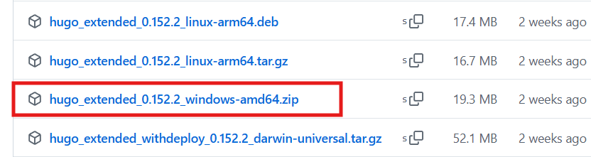

1. 下载完成后，将其解压到一个你便于操作的目录，我是直接放在了`D:\HugoBlog`下，你会得到一个hugo.exe执行文件，该执行文件可以帮助你生成一个静态网站的全部内容。

	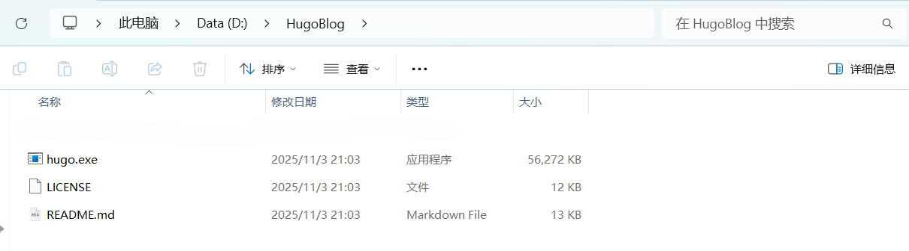

2. 添加系统环境变量，将hugo.exe所在的目录放在系统环境变量path中。（不懂的去百度或者AI一下，很简单的）

3. 点击进入命令行（这种方式进入默认就在当前文件夹下），输入`hugo version`测试hugo是否安装成功

	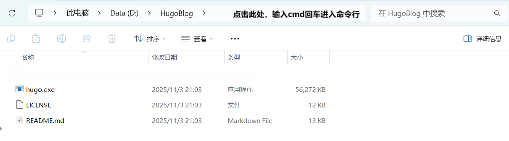

  如果输出如下则说明安装成功

  ```bash
  D:\HugoBlog>hugo version
  hugo v0.152.2-6abdacad3f3fe944ea42177844469139e81feda6+extended windows/amd64 BuildDate=2025-10-24T15:31:49Z VendorInfo=gohugoio
  
  D:\HugoBlog>
  ```

### 创建新站点

1. 还是上一步命令行所在位置，创建在`D:\HugoBlog`目录下，输入下方命令

	```bash
	hugo new site yoursitename # yoursitename 是你的站点文件夹名称，自定义即可 
	```

	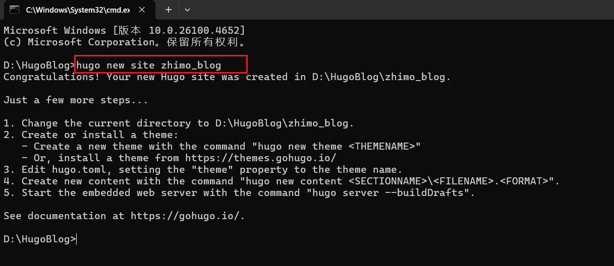

	此时可以发现，该目录下出现了一个新的文件夹

	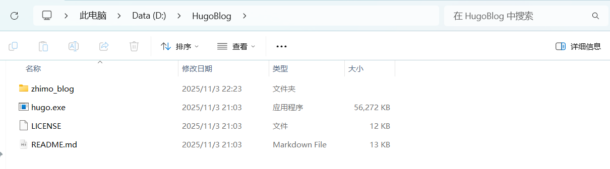

2. 进入zhimo_blog目录，后面统一称为==站点目录==

	```bash
	cd zhimo_blog
	```

3. 挑选主题并下载

  我这里使用的是[Stack](https://themes.gohugo.io/themes/hugo-theme-stack/)，很经典的主题，关于它的各种文档和魔改都很多，而且到目前为止作者仍在更新维护，后面也都以这个主题为例，当然你也可以自己去Hugo官网挑选一个自己喜欢的（[Hugo Themes](https://themes.gohugo.io/)），作为一个老宅男，我觉得这个主题（[reimu](https://d-sketon.github.io/hugo-theme-reimu/)）也蛮好看的，就是有点花哨，改起来可能要费点功夫，感兴趣的也可以去看看

4. 先根据上面第2步进入站点目录，然后根据图示命令先初始化git仓库，再从GitHub下载主题并将其添加为子模块，子模块是指一个Git仓库作为另一个Git仓库的子目录。使用子模块，可以将一个项目嵌入到另一个项目中，同时保持两者的独立性。

	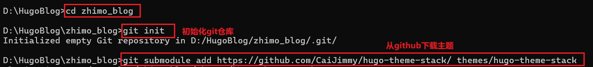

	```bash
	git submodule add https://github.com/CaiJimmy/hugo-theme-stack/ themes/hugo-theme-stack
	```

	这里我第三步连接超时下载失败了，不清楚为啥，我也开了魔法，后面使用git自带的命令行工具执行成功了，如果你也遇到了这种情况，可以用这种方式，同样在**站点目录**下空白处直接右键，点击open git bash here，重新输入上面的命令即可。

	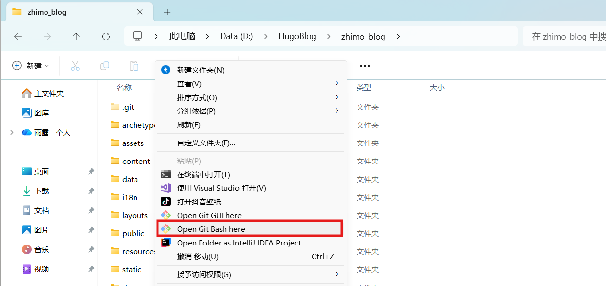

	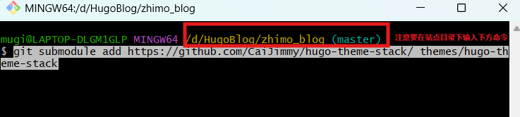

	如果你右键没有，可能是你安装时没有配置，点击键盘win搜索git bash打开同样可以

	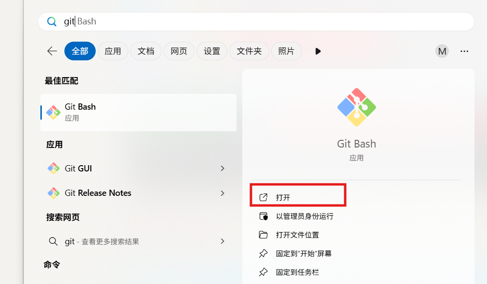

	 通过这种方法打开的**别忘了先切换到目标目录下**，切换目录命令如下

	```bash
	cd D:/HugoBlog/zhimo_blog # 替换成你自己的站点目录位置
	```

	  成功后，在themes下会多出来一个hugo-theme-stack文件夹

	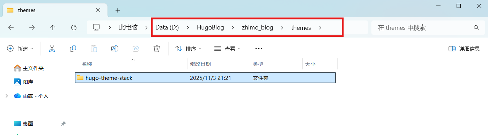

### 配置Stack主题

这里还是以Stack主题为例，说一下简单的配置和初始化，后续大家可以根据自己喜好进行美化，之后我也会出一篇Stack主题的魔改教程，大家可以参考参考，至于其他主题方法大同小异，大家自己摸索一下或上网搜素即可，一般主题作者提供的教程也比较全面。

1. 在`hugo-theme-stack`下，有一个样例站点文件夹exampleSite，点击进入后，将content文件夹和hugo.yaml配置文件复制出来，然后粘贴在**站点目录**下，并将原本的默认配置文件hugo.toml删除

	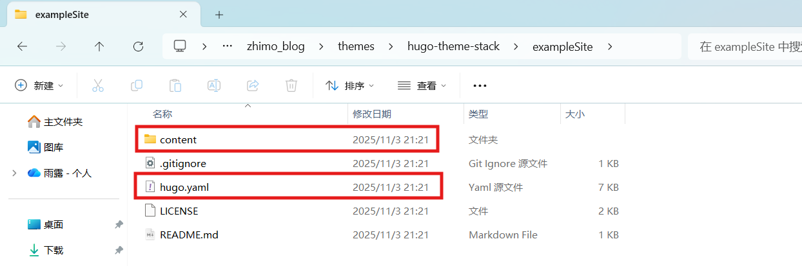

	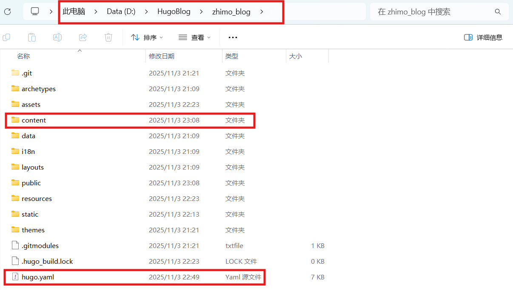

  > 注意：
  >
  > 请将content/post/目录下的rich-content文件夹==删掉==，post目录下一个文件夹就相当于一篇博客，该篇博客中做了一些引用Youtube的样例操作，可能会导致你运行失败

2. 本地调试

	同上述方法，在站点目录下打开cmd命令行，执行下列命令，访问http://localhost:1313/，即可看到我们的初始博客，方便我们在本地调试，当我们修改了站点目录下的文件后，不需要重新执行该命令，保存后直接刷新浏览器页面即可，非常的方便

	```bash
	hugo server -D
	```

	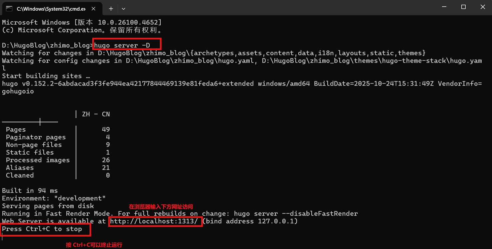

3. 修改配置

	请注意，==不要修改不要修改不要修改==themes文件夹下的主题源代码，可以将要修改的文件先复制到站点目录下，然后再修改站点目录下的同名文件，后面提到的修改操作都是在站点目录下进行，这是因为hugo会自动覆盖主题文件中的同名文件，优先使用我们复制过来编写的文件

	用打开刚才复制过来的hugo.yaml（用记事本、vscode、notepad++等等都可以），需要注意yaml是缩进敏感的，需要保证格式正确，后面看不懂的可以去问AI，简单了解一下就行

	我这里就不截图了，直接放我修改的部分，其他部分可以参考[==Stack主题官方文档==](https://stack.jimmycai.com/)进行修改

	```yaml
	baseurl: https://example.com/ # 后面部署后再来改
	languageCode: zh-cn # 中文
	theme: hugo-theme-stack # stack主题
	title: 芝麻凛的博客 # 博客主页左上角名称
	copyright: zhim00 # 著作权，位于页脚，指的是博客的著作权，非hugo和该主题
	```

	将默认语言修改为中文

	```yaml
	DefaultContentLanguage: zh-cn
	```

	据说可以更精确的计算读文章的时长

	```yaml
	hasCJKLanguage: true
	```

	这里修改的是主页左上角部分，有中英两个版本，在博客左下角可以切换，我懒得搞英文，所以我把它注释掉了

	```yaml
	languages:
	    # en:
	        # languageName: English
	        # title: zhim00's Blog
	        # weight: 1
	        # params:
	            # sidebar:
	                # subtitle: Birthday Cake is the Grave of Youth
	    zh-cn:
	        languageName: 中文
	        title: 芝麻凛的博客 # 和最上面那个title是一样的，但这个优先级更高
	        weight: 2
	        params:
	            sidebar:
	                subtitle: 生日蛋糕就是青春的墓碑 # 个性签名
	```

	这个参数用于指定一页展示多少篇文章

	```yaml
	pagination:
	    pagerSize: 4
	```

	一些参数配置，这里简单说一下，有兴趣可以后面自己折腾折腾

	```yaml
	params:
	    mainSections:
	        - post
	    featuredImageField: image
	    rssFullContent: true
	    # 修改网站的图标，将图标放到`static`目录下，图标名称改为favicon.ico
	    favicon: /favicon.ico
	    # e.g.: favicon placed in `static/favicon.ico` of your site folder, then set this field to `/favicon.ico` (`/` is necessary)
	
	    footer:
	        since: 2025 # 页脚处开始时间
	        customText: # 自定义文本
	
	    dateFormat:
	    # 日期展示的格式，go比较迷惑的一点，设置日期格式必须用这个时间，可改可不改
	        published: 2006-01-02
	        lastUpdated: Jan 02, 2006 15:04 MST
	
	    sidebar:
	        emoji: 👾 # 头像处的emoji表情包，复制粘贴过来就行
	        # 依旧个签，但是优先级没有上面的高
	        subtitle: Lorem ipsum dolor sit amet, consectetur adipiscing elit.
	        avatar:
	            enabled: true
	            local: true
	    # 设置头像，图片名称改为avatar，并添加到assets\img\目录下，如果没有img目录可自行创建
	            src: img/avatar.png
	
	    article:
	        math: false # 文章数学公式格式，默认false
	        toc: true # 目录
	        readingTime: true # 阅读时间
	        license:
	            enabled: true # 应该是开源证书之类的东西
	            default: Licensed under CC BY-NC-SA 4.0
	
	    comments: # 评论区，搞起来比较麻烦，我设为false了（主要是免费的不好用，又只想白嫖）
	        enabled: false
	        provider: disqus
	```

	修改头像下面的快捷导航链接，我这里改成了github和稀土掘金主页的快捷链接，也可以复制新增一个

	图标以SVG格式存放在assets\icons\目录下。图标我们可以在[Tabler Icons](https://tabler.io/icons)中去找，Stack主题的作者使用的就是这里面的图标，中文搜不到就换英文、拼音

	```yaml
	menu:
	    main: []
	
	    social:
	        - identifier: github
	          name: GitHub
	          url: https://github.com/zhim00
	          params:
	              icon: brand-github # 不需要带.svg后缀
	
	        - identifier: juejin
	          name: Juejin
	          url: https://juejin.cn/user/168640214217658
	          params:
	              icon: brand-juejin
	```

4. 修改`D:\HugoBlog\zhimo_blog\content`目录下部分内容

	这里我稍微改了一点东西，这里介绍一下，后面自己按照这个方式操作即可

	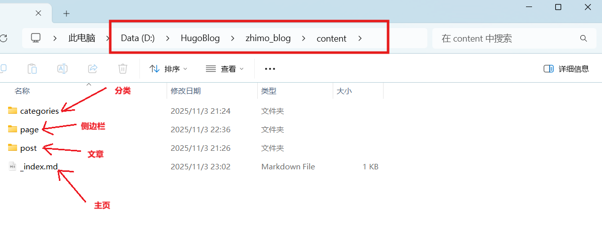

	_index.md：主页的一些配置信息

	page：侧边栏，参考原文档修改即可，我这里把它们都改成了中文

	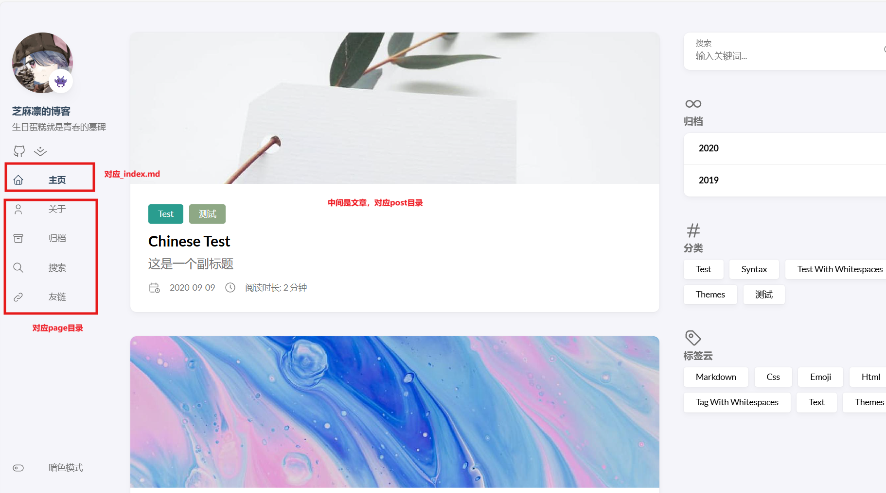

	categories：进去后，一个文件夹即是一个分类，可自定义分类，.md文档是配置信息，照着改就行

	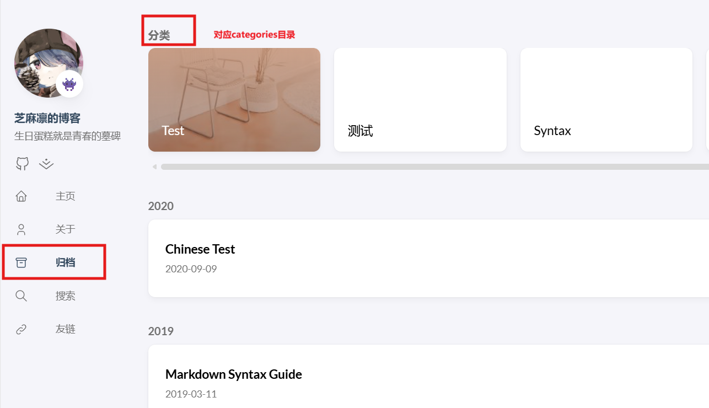

	post：同样，一个文件夹就相当于一篇博客，md就是你博客的内容，涉及到的图片就放在该文件夹下

5. 创建第一篇博客

	依旧在站点目录下打开命令行，执行下方命令后就会在post目录下创建一个文件夹和md文档，然后我们就可以用我们熟悉的md编辑器来写博客，相关的图片则需要放到目录下或者使用图片外链，**需要注意图片路径不能包含空格**

	```bash
	hugo new post/first-blog/index.md # 这里建议用英文名，目录名可以自定义
	```

	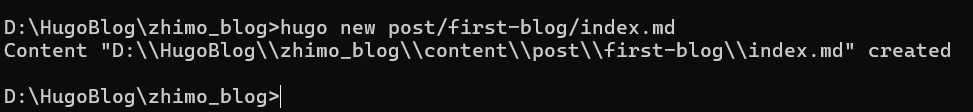

	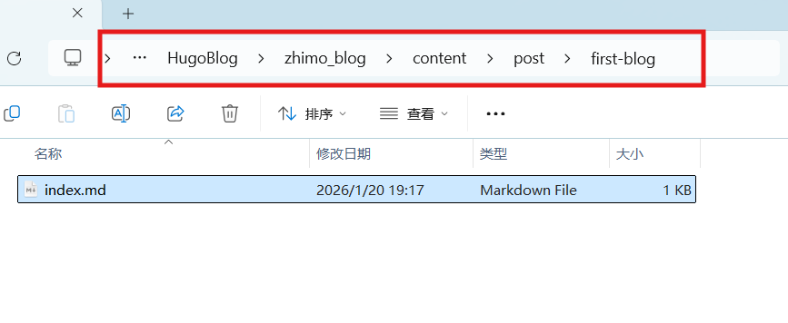

  >   需要注意的是：
  >
  > 博文采用markdown格式，命名规则为：==index.语言.md==，这里因为我没有搞英文版本，默认是中文，就不用携带语言，即：‘zh-cn’，因此只需要命名为 index.md即可。


6. 配置文章模板

	当我们使用上述命令生成md时，打开文档后会发现，它自动在开头给我们生成了一些配置信息，它有个专门的名称叫**Front Matter**，但是它自带的默认格式不太全，而且它默认用的是toml格式（+++包围），但我们常用的是则yaml格式（---包围），看不到+++或者---的，记得把编辑器改成源代码模式

	所以我们要修改它默认的生成模板，修改位置在`D:\HugoBlog\zhimo_blog\archetypes\default.md`，打开后将下述内容全部复制（包括---），然后替换掉原有内容

	其中draft表示草稿，默认为true，不会发布到主页，改成false才会发布，如果懒得每次手动修改，这里可以改成false，一劳永逸

	tags表示标签，对应主页右下角标签云，categories代表分类，也就是上述提到的归档，当我们创建好分类之后，就可以在这里给文章添加相应的分类；默认都是[]，表示暂时没有分类和标签

	如果要修改，请在需要修改的文章中的头部进行修改，这个是通用模板，当然你也可以在这里添加，不过在这里则表示你生成的所有文章默认都属于这个分类或标签

	这里需要注意，如果tag和categories都有多个，要用英文逗号分隔，例如：["test1","test2"]，一个表示为["test1"]
	
	```markdown
	---
	date: {{ .Date }}
	draft: true # 草稿
	title: {{ replace .File.ContentBaseName "-" " " | title }}
	tags: [] # 标签，对应主页右下角标签云
	description: 这是一个副标题
	image: # 封面图片，eg：自定义名称.jpg
	categories: [] # 分类
	---
	```

	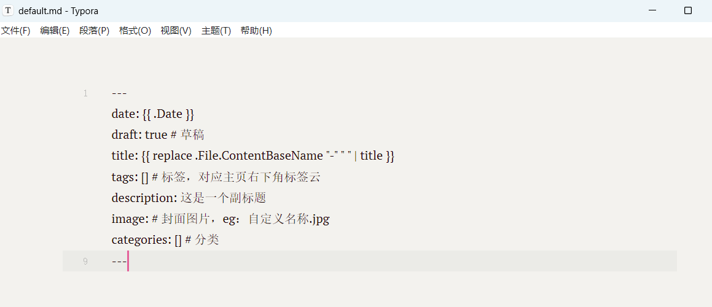

	下面是修改模板后，再使用hugo new命令生成的文档的Front Matter，#后的注释也会一起生成，可以将模板中的注释删掉，会简洁很多
	
	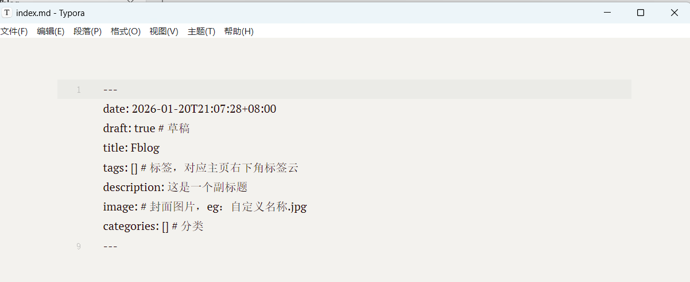
	

### 托管到Github仓库

做好了一些简单的配置后，下一步就是将代码托管到GitHub仓库


### 部署到Cloudflare

之所以选用Cloudflare Pages（后续皆简称==cf==）而不是Github Pages是因为，cf国内也可以访问，而且cf自带hugo命令，可以自动构建部署，不像GitHub还要配置一大堆，而且而且而且后续我们有了自己的域名以后，还可以白嫖cf的CDN加速
